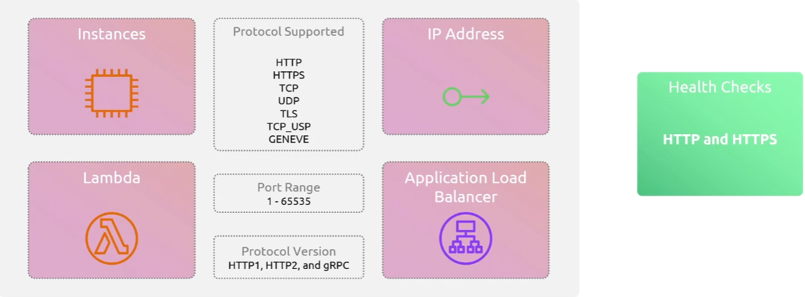
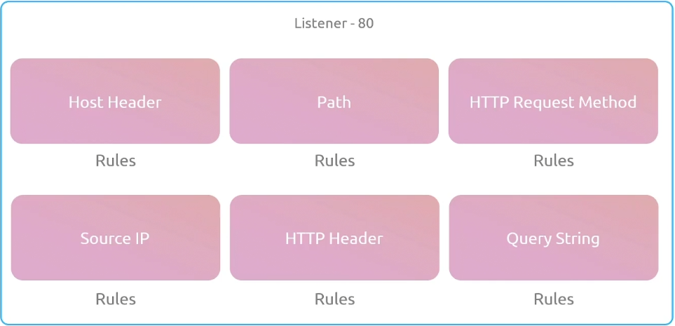
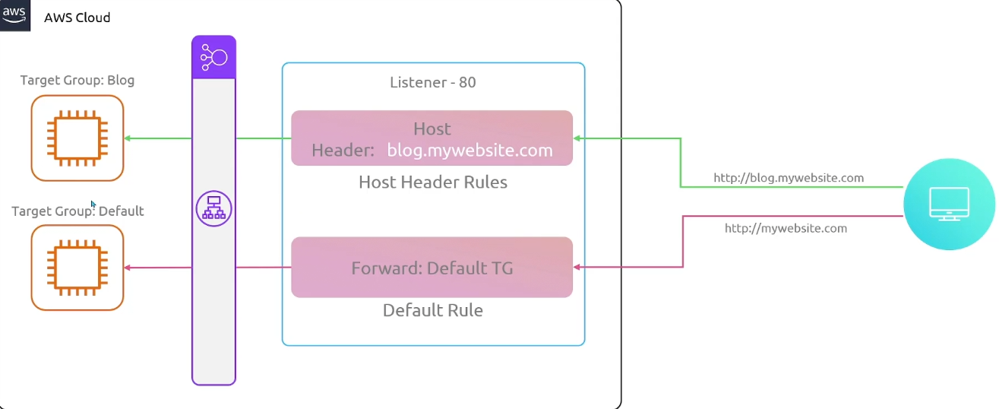
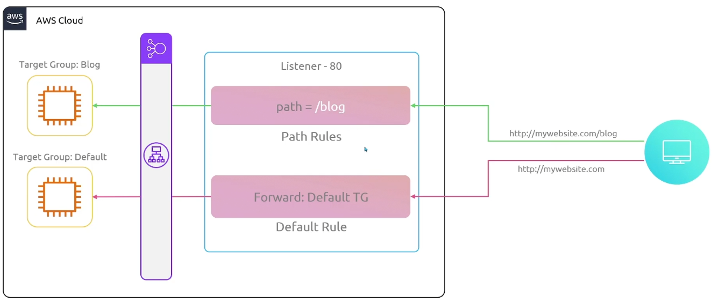
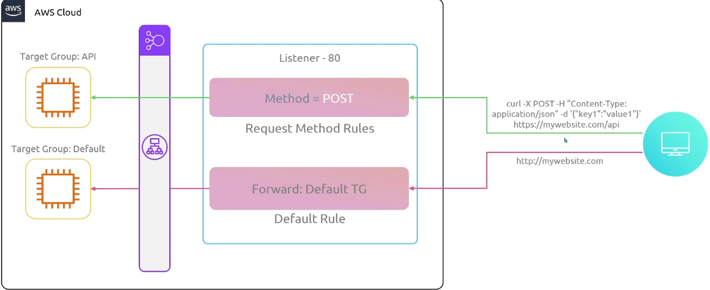
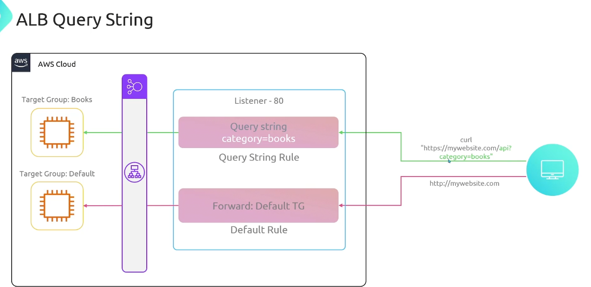
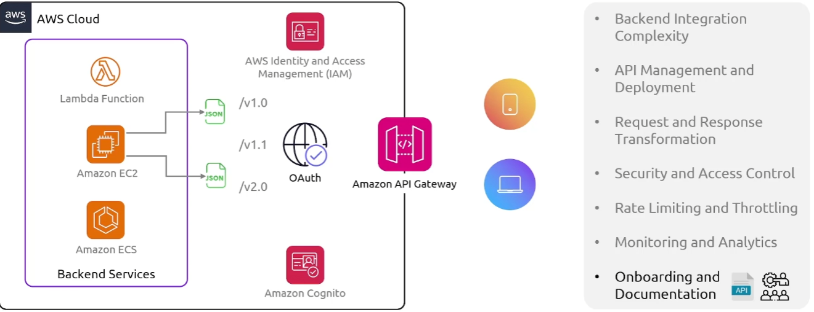
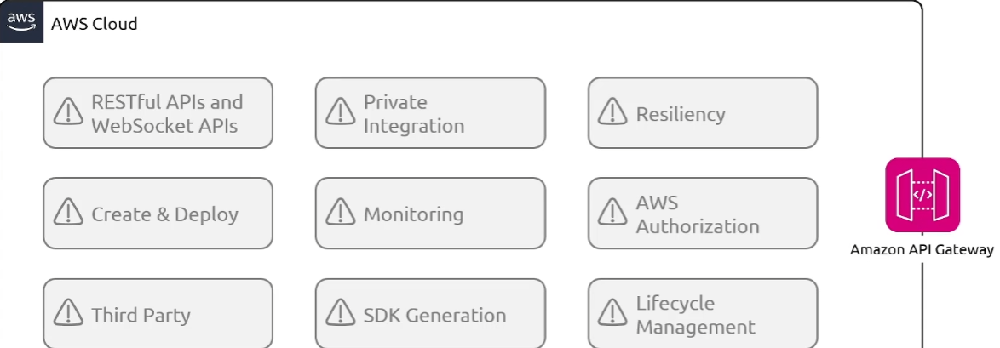
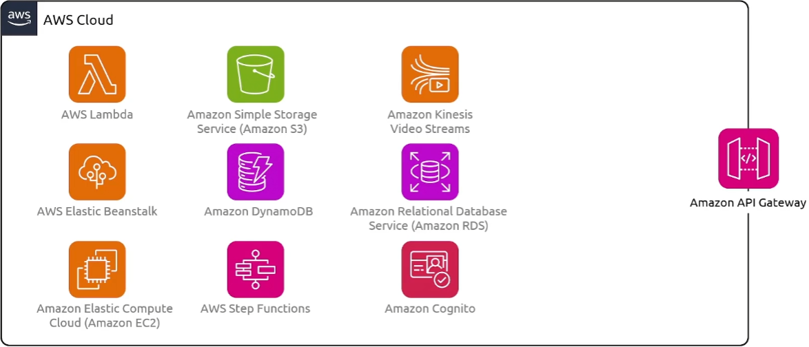
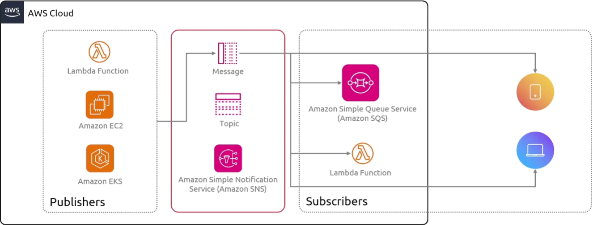

## Autoscaling

### 特性

当一个EC2被认为不健康的时候，根据你的配置，我们可以对EC2实例进行定期健康检查，自动扩展组会终止该实例并启动一个新的实例以匹配配置。

现在，当你配置一个自动扩展组时，你需要提供三个不同的特性:

+ 最小值

  你在自动扩展组中可以拥有的绝对最小实例数量。

+ 最大值

  在技术上可以扩展到最大值

+ 期望值

  基本上是在告诉 AWS 你理想中希望拥有多少。可以和最小值是相同的

我的理想的情况是希望AWS足够智能，能够检测到额外的流量或EC2实例下的高CPU负载，并自动扩展。只需设置期望值为任何想要的值

### 动态扩展策略

- Target Tracking Scaling

  基于某些指标进行操作

  - Average CPU utilization                                                                                                                                                                                                                                                                                                                                                                                                                                                                                                                                                                                                                                                                                                                                                                                                                                                                                                                                                                                                                                                                                                                                                                                                                                                                                                                                                                                                                                                                                                                                                                                                                                                                                                                                                                                                                                                                                                                                                                                                                                                                                                                                                                                                                                                                                                                                                                                                                                                                                                                                                                                                                                                                                                                                                                                                                                                                                                                                                                                                                                                                                                                                                                                                                                                                                                                                                                                                                                                                                                                                                                                                                                    
  - Average Network In (Bytes)
  - Average Network Out (Bytes)
  - Application Load Balancer Request Count per Target

+ Simple Scaling

  我们有固定的条件来决定何时扩展和缩减。我们实际上做到这一点的方法是通过使用 CloudWatch 警报，所以我们需要设置 CloudWatch 警报，来告诉我们的 autoscaling 组什么时候该扩展，什么时候该缩减

  你可以使用任何你喜欢的指标，但你必须设置警报，以便你的autoscaling group知道何时进行扩展

  例如某个警报被触发，你可以添加一定数量的实例

- Step Scaling

  与简单扩展非常相似，提供了一个额外的选项来扩展，所以我们再次设置一个警报。我们在CloudWatch中设置了一些值，来决定何时扩展和何时缩减。

### How Schedules Scaling Works

现在通过调度扩展策略，我们可以设置一个触发器，只触发一次,或者通过使用 cron 作业，可以设计为每天运行。所以你可以在这些时间段内,设置这个策略，以便每大批这样的时间段进行扩展和缩减

### EC2 Autoscaling

现在，当您使用 EC2 Auto Scaling Groups 时，您必须指定一个启动模板,这是一项必须的配置

我们为什么需要启动模板呢?

+ 实现标准化
+ 根据模板创建多个你需要的实例
+ 启动模板
  + **Instance Config**
    1. AMI
    2. EBS volume
    3. Security group
    4. IAM profile
    5. Network settings
    6. Instance tag
  + 版本控制
  + 启动模板支持参数化，可以在启动的时候，自定义或者覆盖参数
  + 指定不同的实例类型
  + 可以在启动模板中包含标签和元数据，这使得得组织、管理和分类实例用于费用、监控和组织管理更容易。 
  + Launch templates也可以通过控制台，CLI,和SDK通过自动化工具管理
  + 还可以获得实例终止保护
  + 支持用户数据，可以在实例启动的时候传递脚本和数据

### 集成

可以与其他的AWS服务集成，可以通过ELB将流量负载均衡到as中的所有实例

### Demo

+ give name
+ 选择启动模板（创建模板）
+ 指定想要使用的VPC
+ 是否需要负载均衡器
+ 设置扩展策略

## Elastic Load Balancers

### 工作原理

+ Target Groups

  + 负载均衡器应该转发到的服务

  + 目标组的服务可以是如下的类型

  

  + 会接受来自负载均衡器的健康检查，其中一个健康检查失败，流量将不再转发到这个节点

+ Listen

  监听器就是一个规则，用来告诉负载均衡器你希望负载均衡器查找符合条件的某些流量，如果我想为某个域名设置一个监听器（我想监听任何发送到这个网站的HTTP请求），然后你需要指定一个目标组

现在当你部署负载均衡器的时候，你需要指定可用区，也就是子网，会在可用中部署一些负载均衡器节点。发生的事情是，当你收到请求的时候，会在所有节点之间均匀分配（**跨可用区负载均衡**）

### 类型

**Application Load Balancer (ALB)**

- Supports HTTP and HTTPS

- Advanced routing（匹配特定的头部信息，重定向）

  

  + Host Header

    

  + Path

    

  + HTTP method

    

  + Query String

    

**Network Load Balancer (NLB)**  

- Supports TCP, UDP, and TLS  
- 可以处理每秒数百万的请求  （比ALB要快的多）
- Static IP for each AZ
  + 每个可用区创建一个网络接口，所以每个负载均衡器节点在可用区内使用这个网络接口

## API Gateway

当人们在架构一个应用程序时，面临的一个挑战是,将各种后台服务、数据源和功能集中到一个统一的 API 中可能是具有挑战性和耗时的。API Gateway为我们提供了与多种不同后端服务的无缝集成，包括 AWS Lambda、AWS EC2，ECS等。它允许你集成其他 HTTP 端点。

总体来说，它帮助简化了连接不同系统在一个**中心点聚合数据的过程**。最终，管理 API 以及所有的版本控制和发布API.

另一个可能遇到的问题是，你的客户可能需要特定格式的数据，而你的后端可能会以完全不同的格式生产数据。因此，API Gateway提供了帮助整个转换过程的功能，你可以将请求和响应转为不同的格式。你还可以执行验证和不同模型之间的映射，因此，无论你的后端服务如何运行，以及你的客户期望什么，你都可以利用 API Gateway 来转换请求和响应。以便转化为双方都期望的正确格式

构建 API 的**另一个挑战**是确保你的 API 的访问实施了适当的身份验证和授权机制。你需要确保在不同身份的客户请求中正确的访问权限和验证。因此，API Gateway 提供了多种不同的操作。

要额外处理流量控制以及对你的 API 的监用，API Gateway 允许你配置速率限制和节流策略

### 类型

+ HTTP API

  你可以使用 HTTP API 向 AWS Lambda 函数或任何可路由的 HTTP 端点发送请求。例如，你可以创建一个 HTTP API，它在后端与 Lambda 函数集成。当客户端调用你的 API 时，API Gateway 会将请求发送到 Lambda 函数，并将响应分会给客户端

  + 假设你在开发一款 H5 游戏，玩家需要：

    - **登录** 游戏
    - **获取排行榜信息**
    - **保存游戏进度**

    这些操作的特点是：
     ✅ **玩家触发请求**，然后服务器返回数据（服务器不会主动发数据）。
     ✅ **每次请求都是新的，服务器不记得上次的状态**（无状态）。
     ✅ **适用于不需要实时更新的数据**。

+ Websocket API

  它非常适合双向通信，客户端可以向服务发送消息，服务也可以独立地向客户端发送消息。这种双向行为使得客户端和服务之间的交互更加丰富，因为服务端现在可以向客户端推送数据，而不需要客户端发出明确的请求。WebSocket API 通常用于实时应用。例如聊天应用、协作平台、多玩家游戏和金融交易平台。

  有时候后端系统需要更新，需要发送通知类的东西给客户端

+ REST API

  是一组资源和方法，这些资源和方法与后端 HTTP 端点、Lambda 函数或其他 AWS 服务集成在一起。因此，您可以使用 API Gateway的功能能帮助您管理 API 生命周期的多个方面。从创建到监控您的生产API。因此，API Gateway 的 REST API 使用请求-响应模型，其中客户端向服务发送请求，服务端同步地响应。这种模型适用于许多依赖于同步通信的不同类型的应用程序。。

**summary：**

| API 类型      | 适用场景          | 服务器是否能主动推送数据 | 适合的游戏功能               |
| ------------- | ----------------- | ------------------------ | ---------------------------- |
| HTTP API      | 传统请求-响应模型 | ❌ 不能                   | 登陆、存档、排行榜、购买道具 |
| REST API      | 结构化的 HTTP API | ❌ 不能                   | 角色信息、任务管理、商业交易 |
| WebSocket API | 双向实时通信      | ✔️ 可以                   | 实时 PVP、多人游戏同步、聊天 |

### 特性

通过 API Gateway，你可以将请求路由到你 VPC 中的私有资源。你可以把 API Gateway 想象成一个工具，它也可以用于暴露一些你现在不对互联网开放的私人资源。

API Gateway 的一个伟大功能是 SDK 生成。因此，API Gateway 可以自动为多个平台生成客户端 SDK，你可以用它快速测试来自你应用的新 API，并将 SDK 分发给第三方开发者。生成的 SDK 将自动处理 API 密钥，并使用 AWS 认证签署请求。你可以使用API Gateway 为 Java、JavaScript、Android 的 Java、Objective-C 或 Swift生成客户端 SDK，也可以为 iOS 和 Ruby 生成。

**总结：**

+ 如果你自己开发 API，就需要手动编写 SDK
+ SDK 主要是封装 API 调用，减少重复代码
+ 不同语言的 SDK（JavaScript、Python、Java）可以帮助不同平台的客户端调用 API
+ 如果 API 很简单（比如只有 1-2 个接口），可以直接调用 API，不用 SDK
+ 如果 API 复杂（比如有身份认证、WebSocket），建议封装 SDK 让开发更方便

### 集成

## AppFlow

用例：

营销数据整合（Marketing Analytics）:

市场团队使用 Marketo 或 Google Analytics 进行广告和用户行为追踪。
需要将数据整合到 AWS 进行 ROI（投资回报率）分析。
AWS AppFlow 解决方案：

连接 Marketo/Google Analytics，将营销数据流入 Amazon S3 或 Amazon Redshift，结合 AWS ML 进行用户行为分析。
预测最佳广告投放策略，提高转化率。
实际应用效果：
✅ 精准营销，提升广告投放 ROI
✅ 跨平台数据整合，避免数据孤岛
✅ 自动化数据流，减少数据管理成本

## SNS(Simple Notification Service)

在分布式架构中，涉及到很多不同的阿服务，很多不同的后端端点，很多不同的客户端进行通信的时候，实时通信就会变成一个真正的挑战

所 SNS 的整个理念是 AWS 会处理你应用程序中所有不同组件之间的实时通信，这样你和你的组织就不需要自己去实现这些功能。

### 组件

主题是一个可以添加订阅者的通信频道。消息会发布到一个主题，并且会发送给所有该主题的订阅者。所以主题是 SNS 的一个重要核心部分，它们构成了不同服务之间沟通的基础。所以每当有新用户注册你的应用时，你可以为此创建一个主题，新的用户主题。所以每当有新用户注册时，如果有人发布一条消息到这个主题，然后其他服务可以做出必要的操作，所以你可以让你的邮件客户端给新用户发送一封邮件，告诉他成功注册了

发布者是向主题发送消息的实体。消息可以是不同的格式，例如JSON、纯文本，以及许多其他支持的格式。所以，你的应用程序可以直接使用 AWS SDK 来发布消息，使用 SNS API，这样你就可以将消息发送到主题上。

### Topic 类型

+ 标准主题

+ FIFO主题

  先进先出，它们旨在增强应用程序之间的消息传递，在操作和事件的顺序至关重要的情况下，或者在无法容忍重复的情况下

## SQS

## Amazon MQ

## Simple Email Service

## Step Functions

## Simple Workfolw Service

## Managed Apache Airflow

