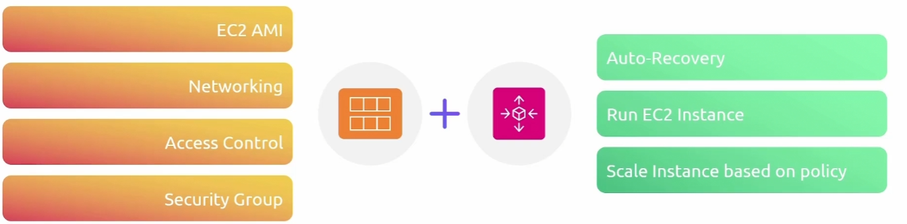

## Autoscaling

### 特性

当一个EC2被认为不健康的时候，根据你的配置，我们可以对EC2实例进行定期健康检查，自动扩展组会终止该实例并启动一个新的实例以匹配配置。

现在，当你配置一个自动扩展组时，你需要提供三个不同的特性:

+ 最小值

  你在自动扩展组中可以拥有的绝对最小实例数量。

+ 最大值

  在技术上可以扩展到最大值

+ 期望值

  基本上是在告诉 AWS 你理想中希望拥有多少。可以和最小值是相同的

我的理想的情况是希望AWS足够智能，能够检测到额外的流量或EC2实例下的高CPU负载，并自动扩展。只需设置期望值为任何想要的值

### 动态扩展策略

- Target Tracking Scaling

  基于某些指标进行操作

  - Average CPU utilization                                                                                                                                                                                                                                                                                                                                                                                                                                                                                                                                                                                                                                                                                                                                                                                                                                                                                                                                                                                                                                                                                                                                                                                                                                                                                                                                                                                                                                                                                                                                                                                                                                                                                                                                                                                                                                                                                                                                                                                                                                                                                                                                                                                                                                                                                                                                                                                                                                                                                                                                                                                                                                                                                                                                                                                                                                                                                                                                                                                                                                                                                                                                                                                                                                                                                                                                                                                                                                                                                                                                                                                                                                    
  - Average Network In (Bytes)
  - Average Network Out (Bytes)
  - Application Load Balancer Request Count per Target

+ Simple Scaling

  我们有固定的条件来决定何时扩展和缩减。我们实际上做到这一点的方法是通过使用 CloudWatch 警报，所以我们需要设置 CloudWatch 警报，来告诉我们的 autoscaling 组什么时候该扩展，什么时候该缩减

  你可以使用任何你喜欢的指标，但你必须设置警报，以便你的autoscaling group知道何时进行扩展

  例如某个警报被触发，你可以添加一定数量的实例

- Step Scaling

  与简单扩展非常相似，提供了一个额外的选项来扩展，所以我们再次设置一个警报。我们在CloudWatch中设置了一些值，来决定何时扩展和何时缩减。

### How Schedules Scaling Works

现在通过调度扩展策略，我们可以设置一个触发器，只触发一次,或者通过使用 cron 作业，可以设计为每天运行。所以你可以在这些时间段内,设置这个策略，以便每大批这样的时间段进行扩展和缩减

### EC2 Autoscaling

现在，当您使用 EC2 Auto Scaling Groups 时，您必须指定一个启动模板,这是一项必须的配置

我们为什么需要启动模板呢?

+ 实现标准化
+ 根据模板创建多个你需要的实例
+ 启动模板
  + **Instance Config**
    1. AMI
    2. EBS volume
    3. Security group
    4. IAM profile
    5. Network settings
    6. Instance tag
  + 版本控制
  + 启动模板支持参数化，可以在启动的时候，自定义或者覆盖参数
  + 指定不同的实例类型
  + 可以在启动模板中包含标签和元数据，这使得得组织、管理和分类实例用于费用、监控和组织管理更容易。 
  + Launch templates也可以通过控制台，CLI,和SDK通过自动化工具管理
  + 还可以获得实例终止保护
  + 支持用户数据，可以在实例启动的时候传递脚本和数据

### 集成

可以与其他的AWS服务集成，可以通过ELB将流量负载均衡到as中的所有实例

### Demo

+ give name
+ 选择启动模板（创建模板）
+ 指定想要使用的VPC
+ 是否需要负载均衡器
+ 设置扩展策略

