## EC2

### Instance Type

+ General Purpose

  提供计算，内存和网络资源的平衡

+ Compute Optimized

  需要高性能处理器的计算密集型应用

+ Memory Optimized

  处理大数据集的工作负载

+ Storage Optimized

  高IO操作的应用，频繁读写磁盘的应用程序

+ GPU Instance

  利用高性能GPU的应用程序,像机器学习，深度学习的东西

### AMI

可以在启动实例的时候，安装其他内容

同时我们可以在目前启动的实例，创建一个AMI

### Instance lifecycle

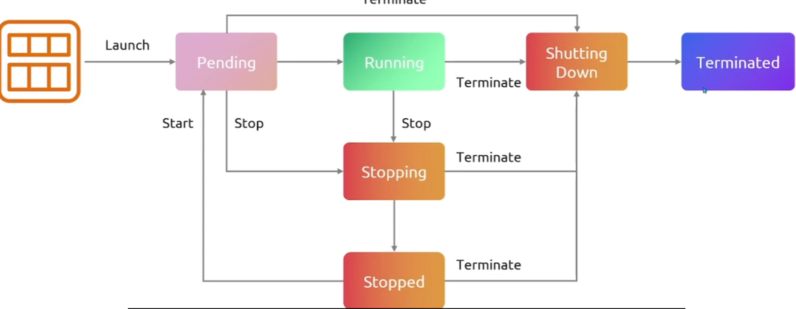

### User Data

用户数据有16kb的限制

### Security Group

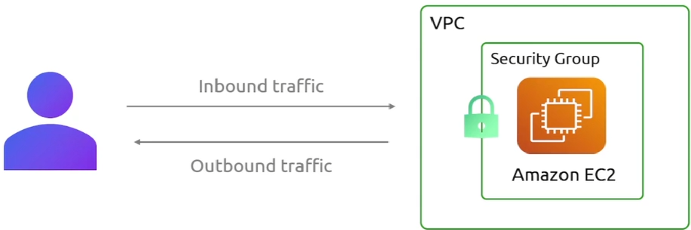

### Starage with EBS

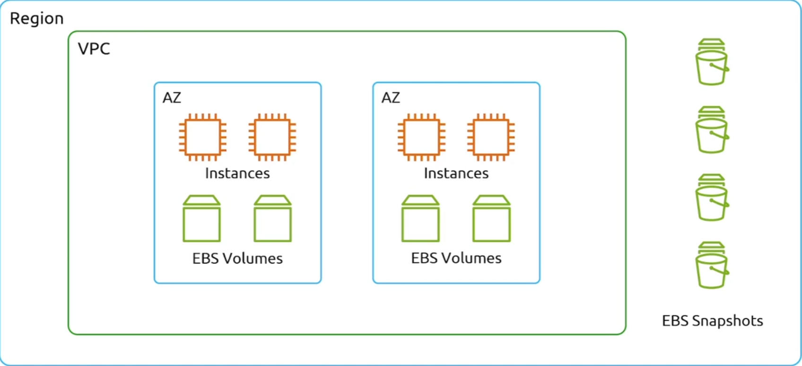

### Elastic IP

保留IP

### Launch Template

在auto scaling group中，aws会根据流量的增加动态扩展你的应用程序的EC2数量，为了做到这一点它需要知道，新EC2实例需要什么配置，所以你需要指定一个Lunach Template

### Instance Placements

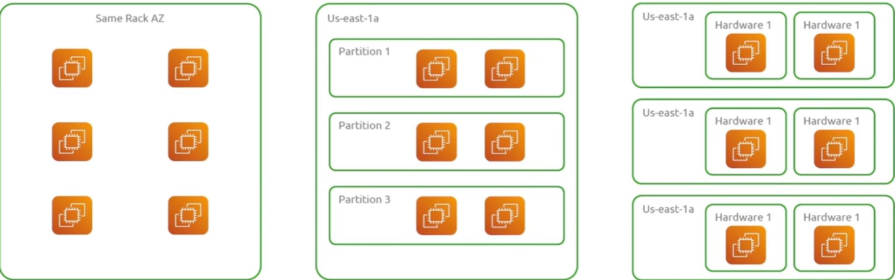

### 实例定价

- On Demand

- Spot

- Saving Plans

- Reserved Instances

  承诺固定的一段时间会买多少服务

- Dedicated Hosts

- Dedicated Instances

## EC2 Image Buiider

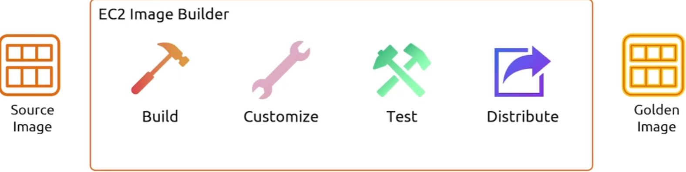

允许你自动化创建，管理和部署AMI镜像的服务

Golden Image 包含了所有需要的软件应用和配置

**构建步骤：**

## Elastic Network Interfaces(ENIs)

其实就是一个附加到vpc中EC2实例的虚拟网络接口，将网络接口与EC2实现分离

是VPC中的一个虚拟网络组件，代表一个虚拟网卡

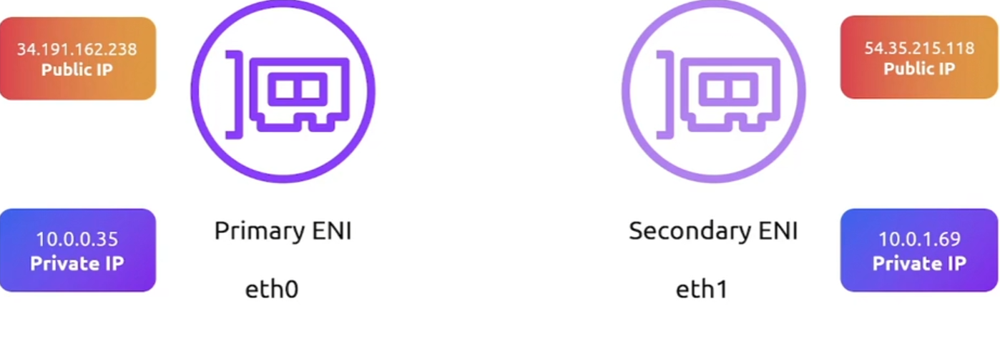

次ENI可以从一个实例中分离并附加到另一个实例，同时可以与不通的安全组进行关联，可以在单个实例上实现网络的多样性

好处是EIP与EIP的动态关联

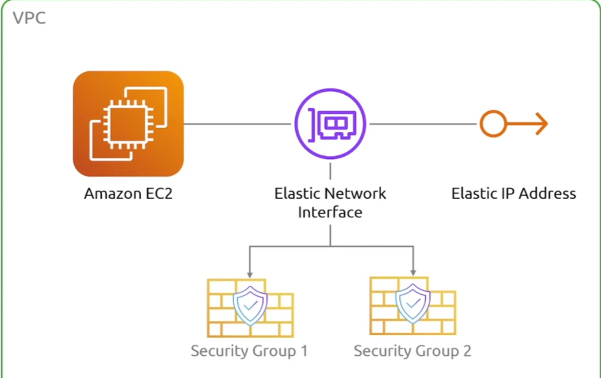

### Demo

+ 选择创建ENI的子网（不一定与EC2同一个子网，但是必须在同一个可用区）
+ 选择想分配的安全组到这个ENI
+ 创建EC2时，编辑高级网络选项

## Elastic Beanstalk

自动化我们的应用程序的部署，而不必详细了解AWS上的基础设施

所有必要的基础设施都由EB自动部署

有一个**环境**的概念，每个环境都会包含运行你应用程序的所有服务

## LightSail

类似于腾讯云当中的轻量级应用服务器

## ECS

+ EC2 Launch

  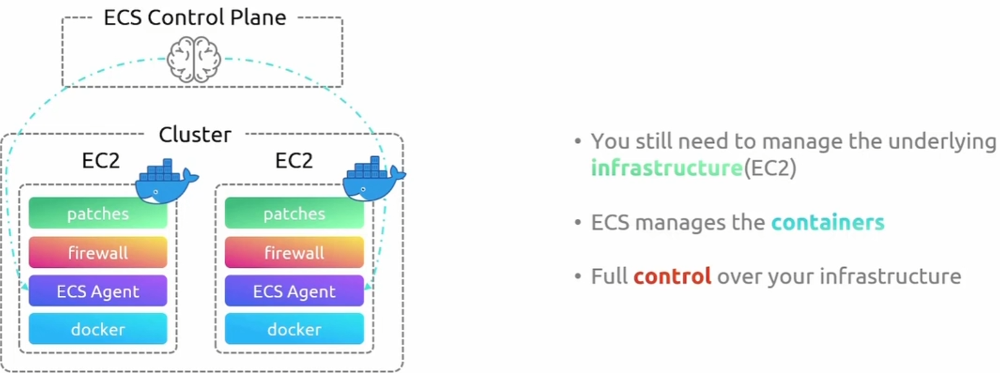

+ Fargate

  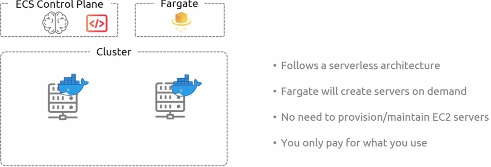

### ECS task

task将是你用来与ecs交互和工作的第一个构造，用来告诉ecs该怎么做的配置之一

我们可以把task想象成容器，把任务定义详细想象成容器的配置

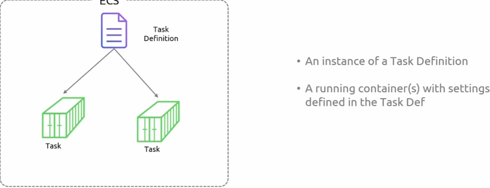

### ECS Service

每个task的管理者和监控者

### Demo

+ 在创建文件系统的时候，需要创建安全组，与ECS的安全组相关联

## EKS

**Worker Nodes**

+ Self-managed Nodes

+ Managed Node Group

  + 实现 EC2 节点的自动配置和生命周期管理
  + 托管节点运行 EKS 优化镜像
  + 使用单一 AWS/EKS API 调用管理节点生命周期的简化方法
  + 每个节点都是 EKS 为您管理的Auto Scaling group的一部分

+ Fargate

  Serverless

**创建集群：**

提取的文本如下：

- Cluster name, k8s version
- IAM role for cluster
  - ✓ provisioning nodes
  - ✓ Storage
  - ✓ secrets
- Select VPC & Subnets
- Define security group for cluster

## ECR

镜像仓库

## App Runner

自动化部署应用程序，并自动设置CI/CD管道

## Batch

批量处理作业或者任务

**生命周期：**

- Submitted
- Pending
- Runnable
- Starting
- Running

## Lambda

它是一个无服务器事件驱动计算服务，允许你运行任何类型的代码的应用程序，而无需预配置或管理服务器。因此，Lambda的优势在于，你只需编写代码，上传到AWS，然后设置代码运行的规则。AWS将处理你其他的事情。它会处理底层基础设施的扩展。所以如果你的程序出现问题，你有一个面向电商网站的后端。无论你收到多少请求，AWS Lambda都会根据你的流量需求自动扩展。所以你无需预配置任何EC2服务器，不需要担心RAM、内存或有多少CPU，你只需上传代码，然后告诉AWS Lambda什么情况下希望代码运行，它会自动为你运行。

有很多很酷的功能可以用Lambda实现，我们有很多不同的触发器和集成。例如，用户上传一个文件到S3存储，可以是类似YouTube类型应用的视频。如果用户上传视频到S3存储，我们可以有一个Lambda函数的触发器，它会处理那个文件，然后将其转发到网站上期望的语言格式。

你只需要告诉它触发条件时什么（每当有文件上传到特定的存储桶之后，它就会运行）。

我们还可以与其API Gateway集成，这样我们就可以构建自己的API.也就是使用不同的lambda函数处理不同的服务

### 特点

1. 只需上传代码，会自动构建计算资源和可观测性
2. 基于事件的驱动，例如数据库表的更新，触发lambda函数的执行
3. 支持多种不同的语言，并提供了一个运行时API供其他语言使用，并允许使用第三方库

### Demo

+ create function

  + Layers 允许你包含需要的其他依赖项，例如将第三方依赖库打包成一个层级，这样在lambda函数运行时就可以访问到他们

+ Add trigger

  定义函数何时运行，所以必须有某种触发器与函数相结合（这可以是对API Gateway的请求，也可以是文件上传到S3）

+ Add destination 

  用于异步 Lambda 调用（Async Invocation）场景，增强 Lambda 任务的可靠性和事件追踪能力。

  调用方不会等待 Lambda 执行完成，而是直接返回，Lambda 在后台执行任务。

  适用于**不需要立即返回结果**的任务，例如日志处理、批量数据处理、事件驱动架构。

  例如：S3 事件触发 Lambda 处理上传的文件，Lambda 执行后，S3 不会等待结果，而是继续处理其他请求。

## Step Functions

 执行workflows

例如有一个不该出现的人出现在你家门口，它会根据我们的工作流执行各种操作。

+ 我们有多个lambda函数，运行其中一个函数来检测威胁，也就是第一个执行步骤（危险检测）
  + 配置workflow的详细信息（输入，回调等信息）

+ 然后配置剩下的多个步骤

## Serverless Application Framework

构建无服务器应用程序的时候，你会有多个不同的lambda函数,你需要创建不同的基础设置，无论是数据库还是API Gateway之类的，事情变的非常复杂

无服务器应用模型意在帮助简化开发者的体验，让你快速搭建基础设施并将代码部署到AWS Lambda。

所以当你使用SAM时，你需要定义SAM模板

## Serverless Application Repository

是无服务器应用程序的托管库

作为开发者的你创建一个应用程序，你使用SAM模板来定义这个应用程序，然后将应用程序和模板打包在一起，这个包会发布到Serverless Application Repository

## Amplify

是一个完整的解决方案，用于构建网页和移动应用程序。这使得网页和移动开发者非常容易构建可扩展的和模块化的应用程序

## Outposts

是硬件产品

现在企业正在迅速采用云计算来实现可扩展性、成本节约和快速交付。不管公司的规模如何，无论是大公司还是小公司，所有公司都或多或少地在使用云计算。但问题是，由于合规性和安全原因，一些数据处理仍然在本地进行。所以完全在云端运行时很难的

现在企业正在迅速采用云计算来实现可扩展性、成本节约和快速交付。不管公司的规模如何，无论是大公司还是小公司，所有公司都或多或少地在使用云计算。但问题是，由于合规性和安全原因，一些数据处理仍然在本地进行。所以云在全局运行是很棒的，有些情况下你必须在本地运行某些计算或存储应用程序。这就引出了 AWS Outposts。

## EKS/ECS Anywhere

你可以在你的本地基础设施上部署EKS

好处是即使它托管在本地，用户仍然可以通过AWS提供的EKS集群仪表板与其进行交互

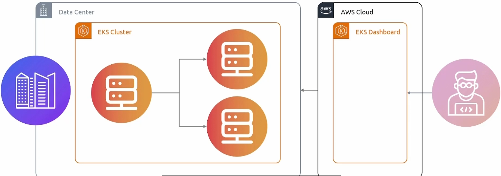

ECS Anwhere甚至可以在其他云上部署它

## VMware Cloud on AWS

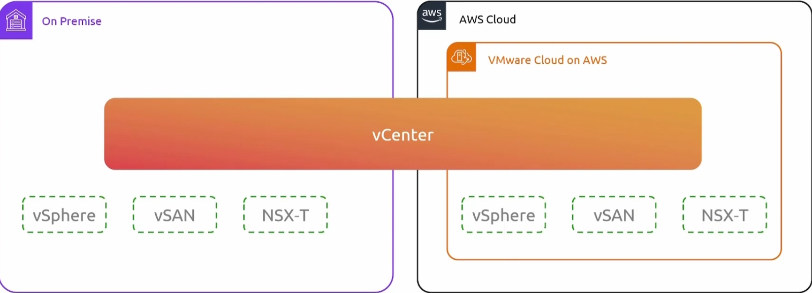

## Snowcone

大多数情况下是用来存储和传输数据的

AWS Snow家族的产品是物理存储设备，用于在AWS中进出大量数据，所以如果你需要将大量数据传输到AWS,可以通过互联网来做，而且不是安全的

所以它是一个数据传输工具

Snowcone是有计算能力的，可以在存储设备上运行一些不同的服务，可以运行lambda函数来执行某些计算
