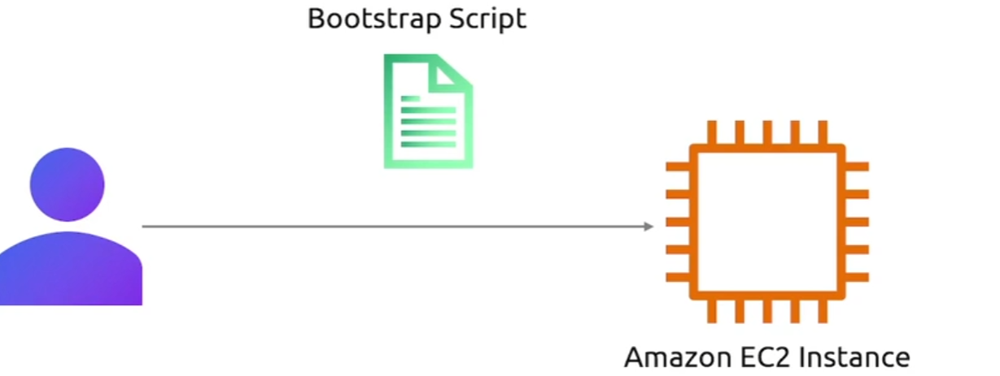
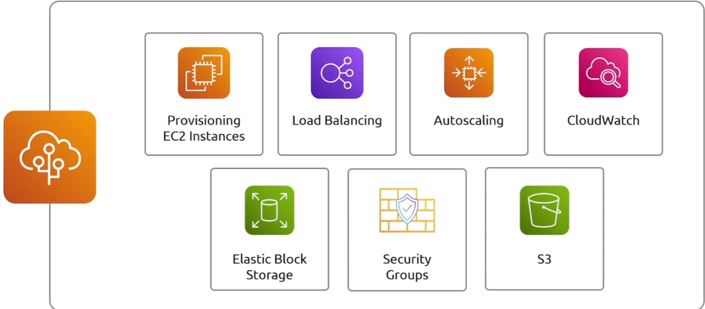

## EC2

### Instance Type

+ General Purpose

  提供计算，内存和网络资源的平衡

+ Compute Optimized

  需要高性能处理器的计算密集型应用

+ Memory Optimized

  处理大数据集的工作负载

+ Storage Optimized

  高IO操作的应用，频繁读写磁盘的应用程序

+ GPU Instance

  利用高性能GPU的应用程序,像机器学习，深度学习的东西

### AMI

可以在启动实例的时候，安装其他内容

同时我们可以在目前启动的实例，创建一个AMI

### Instance lifecycle

### User Data

用户数据有16kb的限制

### Security Group

### Starage with EBS

### Elastic IP

保留IP

### Launch Template

在auto scaling group中，aws会根据流量的增加动态扩展你的应用程序的EC2数量，为了做到这一点它需要知道，新EC2实例需要什么配置，所以你需要指定一个Lunach Template

### Instance Placements

### 实例定价

- On Demand

- Spot

- Saving Plans

- Reserved Instances

  承诺固定的一段时间会买多少服务

- Dedicated Hosts

- Dedicated Instances

## EC2 Image Buiider

允许你自动化创建，管理和部署AMI镜像的服务

Golden Image 包含了所有需要的软件应用和配置

**构建步骤：**

## Elastic Network Interfaces(ENIs)

其实就是一个附加到vpc中EC2实例的虚拟网络接口，将网络接口与EC2实现分离

是VPC中的一个虚拟网络组件，代表一个虚拟网卡

次ENI可以从一个实例中分离并附加到另一个实例，同时可以与不通的安全组进行关联，可以在单个实例上实现网络的多样性

好处是EIP与EIP的动态关联

### Demo

+ 选择创建ENI的子网（不一定与EC2同一个子网，但是必须在同一个可用区）
+ 选择想分配的安全组到这个ENI
+ 创建EC2时，编辑高级网络选项

## Elastic Beanstalk

自动化我们的应用程序的部署，而不必详细了解AWS上的基础设施

所有必要的基础设施都由EB自动部署

有一个**环境**的概念，每个环境都会包含运行你应用程序的所有服务

## LightSail

类似于腾讯云当中的轻量级应用服务器

## Elastic Container Service(ECS)

+ EC2 Launch

  

+ Fargate

  

### ECS task

task将是你用来与ecs交互和工作的第一个构造，用来告诉ecs该怎么做的配置之一

我们可以把task想象成容器，把任务定义详细想象成容器的配置

### ECS Service

每个task的管理者和监控者

### Demo

+ 在创建文件系统的时候，需要创建安全组，与ECS的安全组相关联

