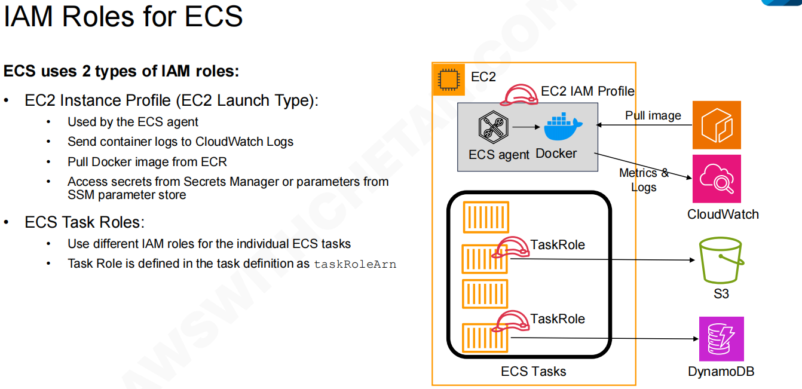
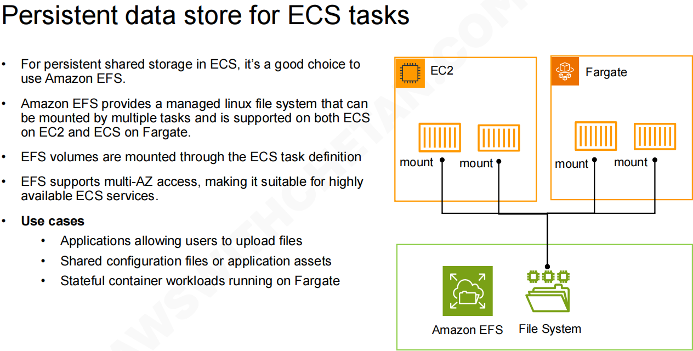
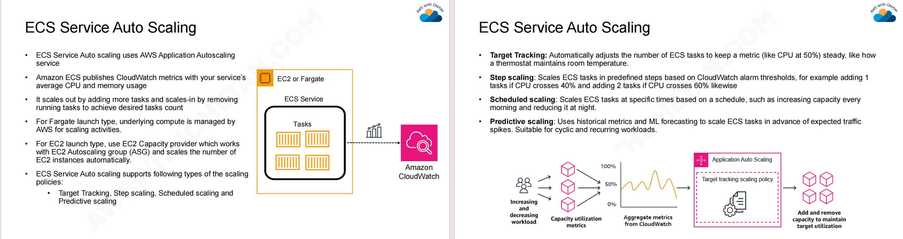

## ECS Features

### IAM Roles

上边的图片揭示了 Amazon ECS 中极其重要的安全和权限管理概念：**ECS 环境下的两种不同的 IAM 角色 (IAM Roles)**。

#### 1. 管“底座”的权限：EC2 实例配置文件

- **对应图片位置：** 右上角灰底框内的 `EC2 IAM Profile`，它戴在 `ECS agent` (ECS 代理) 的头上。
- **是谁在使用它？** 运行在你 EC2 服务器上的 ECS Agent (管家程序)。
- **它需要权限来做什么？** 它负责的是**基础设施级别**的工作。为了让容器能够顺利启动并运行，这个管家需要：
  - **Pull image (拉取镜像)：** 从 Amazon ECR (镜像仓库) 下载你应用的 Docker 镜像。
  - **Metrics & Logs (指标和日志)：** 将容器运行时的日志收集起来，发送给 Amazon CloudWatch 集中管理。
  - **获取机密：** 从 AWS Secrets Manager 或 SSM 参数存储中安全地拉取密码或配置信息。
- **总结：** 这个角色的权限是给**底层运行环境**用的，不涉及你的应用程序具体的业务逻辑。

#### 2. 管“应用”的权限：ECS 任务角色 

- **对应图片位置：** 右下角黑框内的 `ECS Tasks`，里面有多个正在运行的容器组（任务）。你可以看到每个任务旁边都有一个独立的 `TaskRole` 帽子。
- **是谁在使用它？** 你**实际部署的应用程序**（也就是运行在容器里的代码）。
- **它需要权限来做什么？** 它负责的是**业务级别**的工作。如果你的应用代码需要和其他 AWS 服务交互，就需要这个角色。图例中展示了：
  - 上面的 Task 被赋予了访问 **Amazon S3** (对象存储) 的权限，也许是去读取一些图片或文件。
  - 下面的 Task 被赋予了访问 **Amazon DynamoDB** (NoSQL 数据库) 的权限，去进行数据的读写。
- **核心优势（隔离性）：** 仔细看图，同一个 EC2 实例上运行了多个 Task，但它们可以拥有**完全不同的 Task Role**。这意味着你可以做到极细粒度的权限控制（最小权限原则）。任务 A 只能看 S3，它绝对无法触碰任务 B 的 DynamoDB 数据库，即使它们住在同一台服务器上。

### Data Store 

+ 无论你的任务是跑在传统的 **EC2** 上，还是跑在无服务器的 **Fargate** 上，它们都可以完美连接（Mount / 挂载）到同一个 EFS 文件系统。
+ **一对多共享（核心亮点）：** 仔细看图中的黑线，**多个不同的容器任务可以同时挂载同一个 EFS 目录**。这意味着，如果是多台服务器上的多个游戏服实例或业务节点，它们可以实时读取同一份配置文件，或者把日志写入到同一个共享文件夹中。

+ **Multi-AZ（多可用区）高可用：** EFS 的数据在底层会自动跨多个物理机房（可用区）进行冗余备份。即使某个机房断电，你的容器仍然可以从其他机房读取到这份数据，非常适合要求高可用性的业务。
+ **在 Fargate 上运行有状态的工作负载 (Stateful container workloads running on Fargate)：** 因为 Fargate 是 Serverless 架构，你甚至接触不到底层的宿主机硬盘。对于那些必须要把数据写在本地目录（比如某些需要指定本地数据存储目录的轻量级数据库引擎）的程序，挂载 EFS 是让它们在 Fargate 上存活下来的唯一标准途径。

### Auto Scaling

#### 1：ECS 自动扩缩容的基础逻辑

- **核心机制：** ECS 的自动扩缩容是由 **AWS Application Autoscaling** 服务驱动的。它通过不断增加（Scale-out）或减少（Scale-in）正在运行的容器任务（Tasks）数量，来匹配当前的业务需求。
- **监控大脑：** ECS 会把服务的平均 CPU 和内存使用率等关键指标（Metrics）实时发送给 **Amazon CloudWatch**。CloudWatch 就是自动扩缩容的“眼睛”，一发现指标超标，就会触发警报。
- **底层计算引擎的区别：**
  - **Fargate 模式：** 极度省心。AWS 会自动在底层帮你管理计算资源的扩缩，你只需要关心容器数量即可。
  - **EC2 模式：** 稍微复杂一点。你需要使用“EC2 容量提供程序 (Capacity Provider)”。当你的容器数量增加，现有的 EC2 服务器装不下时，容量提供程序会联动 EC2 Auto Scaling Group (ASG)，自动帮你购买并启动新的 EC2 物理/虚拟机。

#### 2：四种自动扩缩容策略详解

根据不同的业务场景，AWS 提供了四种扩缩容策略。您可以把它们想象成四种不同性格的“管家”：

**1. 目标跟踪策略 (Target Tracking)** —— *“像恒温空调一样智能”*

- **原理：** 您只需设定一个目标值（例如：保持平均 CPU 使用率在 50%）。剩下的全交给 AWS。当流量上涨导致 CPU 超过 50% 时，它自动加容器；流量下降导致 CPU 低于 50% 时，它自动减容器。
- **适用场景：** 大多数常规的 Web 服务或 API 服务。

**2. 步进扩展策略 (Step Scaling)** —— *“基于规则的精准阶梯控制”*

- **原理：** 您可以定义更精细的梯度报警规则。例如：如果 CPU 达到 40%，我只加 1 个任务；如果突然飙升超过 60%，情况紧急，我直接加 2 个任务。
- **适用场景：** 对指标波动比较敏感，或者启动任务需要一定缓冲时间，需要提前按梯度干预的业务。

**3. 计划扩展策略 (Scheduled Scaling)** —— *“按时上下班的定时任务”*

- **原理：** 完全基于时间表来扩缩容，不看 CPU 指标。例如：每天早上 8 点自动扩容迎接早高峰，半夜 12 点自动缩容省钱。
- **适用场景：** 流量规律极度确定的业务。比如某些游戏服在晚上固定有活动，可以在活动开始前 10 分钟定时把服务器数量翻倍。

**4. 预测扩展策略 (Predictive Scaling)** —— *“拥有 AI 大脑的先知”*

- **原理：** 使用机器学习（ML）分析您过去几周的流量历史数据，预测未来的流量趋势，并**在流量洪峰真正到来之前**，提前为您扩容。
- **适用场景：** 具有周期性、重复性流量模式的工作负载（比如每周末必定爆满的电商网站或游戏），它可以完美解决“扩容响应不及时”的问题。
