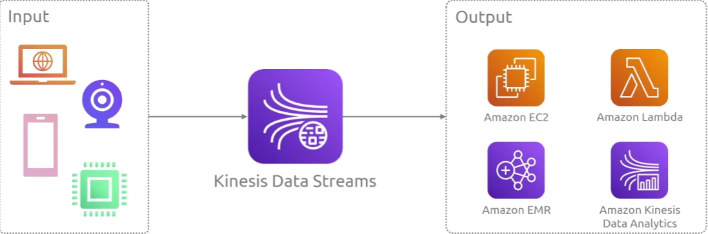

## Kinesis

是一个实时流式数据获取工具。可以把它想象成一条数据河流，你将数据放在上面，而这条河流将被下游的人们消费。Kinesis 的作用是实时数据处理

### Data Streams

### Data Firehose

## Managed Service for Kafka

是一个数据流传输总线，你可以创建主题，把数据放在主题上，然后下游的消费者消费。

可以想象成一个个人数据广播电台，就像你在实时广播数据一样

## Glue

它的工作室提取，转换和加载

## EMR

### Glue Databrew

## Lake Formation

## Athena

是一个读取数据集的工具，如果你有一堆数据源，这些数据源可以是非结构化数据

客户可能有像客户ID这样的标签，购买金额，日期，AWS Gule摄取数据，转换数据。Athena从Glue数据目录读取数据，然后构建复杂的查询

## QuickSight

制作漂亮的仪表板和分析数据的展示

你可以直接使用S3中数据，然后你使用Athena查询数据，并在quicksight中可视化这些数据

## SageMaker

它涵盖了整个机器学习生命周期，包括数据准备、模型训练、超参数调优、推理部署和持续监控。

## Rekognition

它使用机器学习和深度学习技术来分析和解释图像和视频。

## Polly

## Lex

聊天机器人

## Comprehend

## Forecast

 Amazon 提供的全托管时间序列预测服务，基于与 Amazon.com 内部预测系统相同的机器学习技术。它用于帮助企业进行高准确度的需求预测，如库存管理、财务规划、销售预测等。

提取的文本是：

## Augmented AI

是一项用于在机器学习（ML）流程中引入**人工审核（Human Review）**的服务。它适用于需要人工介入验证的 AI 任务，比如文档审核、内容审核、医疗诊断等。

## Fraud Detector

用于帮助企业检测和防止在线欺诈活动。它通过机器学习（ML）技术，自动分析用户行为模式，识别可能的欺诈行为，并提供实时欺诈风险评分。

## Transcribe

它利用机器学习和自然语言处理（NLP）技术，将音频文件中的语音转换为文本。该服务可以处理各种类型的音频文件，包括电话录音、会议记录、客户支持对话等，支持多种语言

## Translate

旨在帮助用户将文本从一种语言翻译成另一种语言。它使用神经机器翻译（NMT，Neural Machine Translation）技术，能够提供高质量、快速的翻译，支持多种语言。

## Textract

它可以从扫描的文档、表单、PDF 文件或图片中提取文本、表格、字段数据和其他结构化信息，帮助企业自动化文档处理流程。