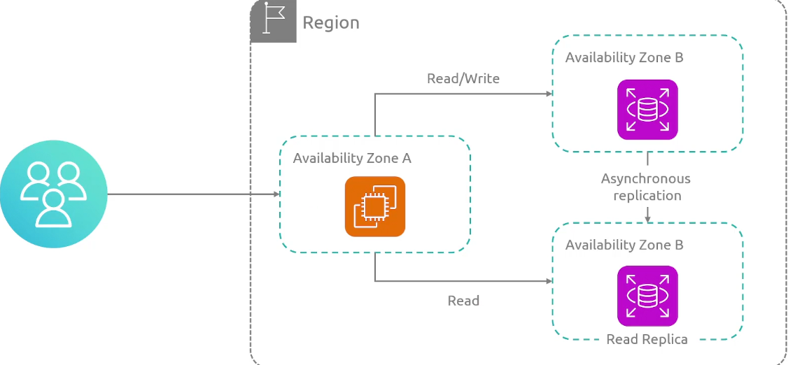
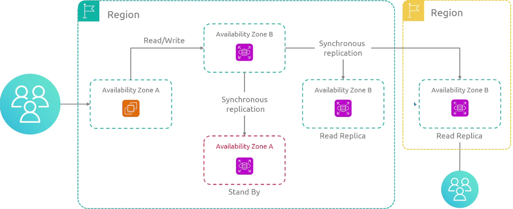
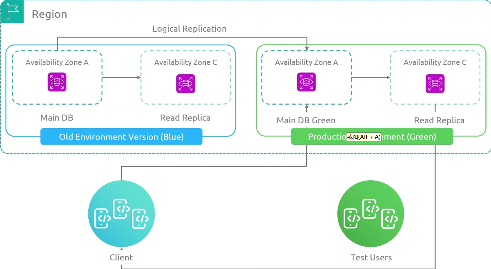
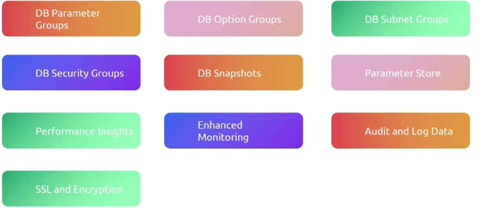
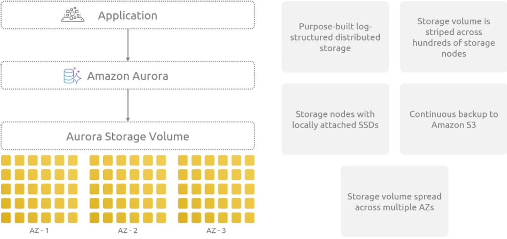
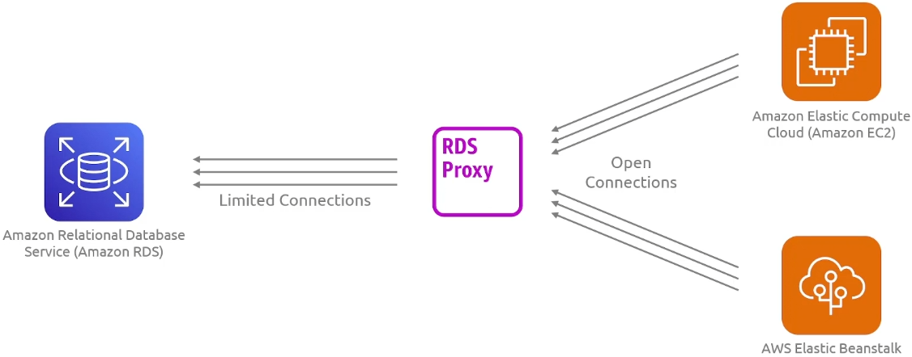
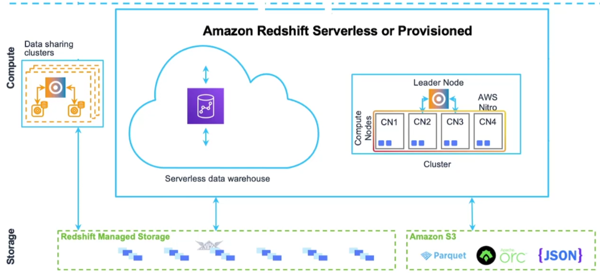
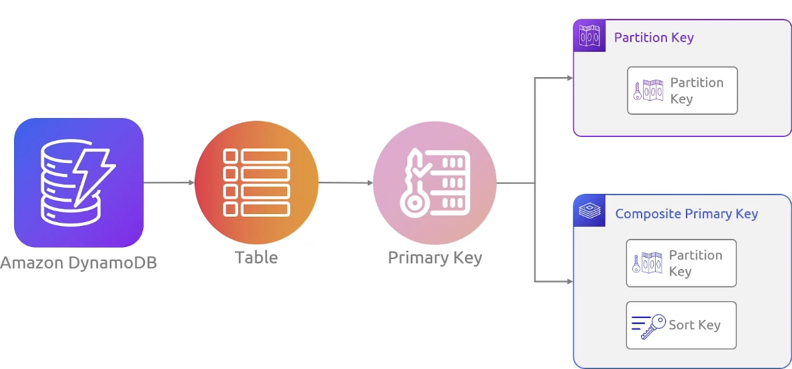
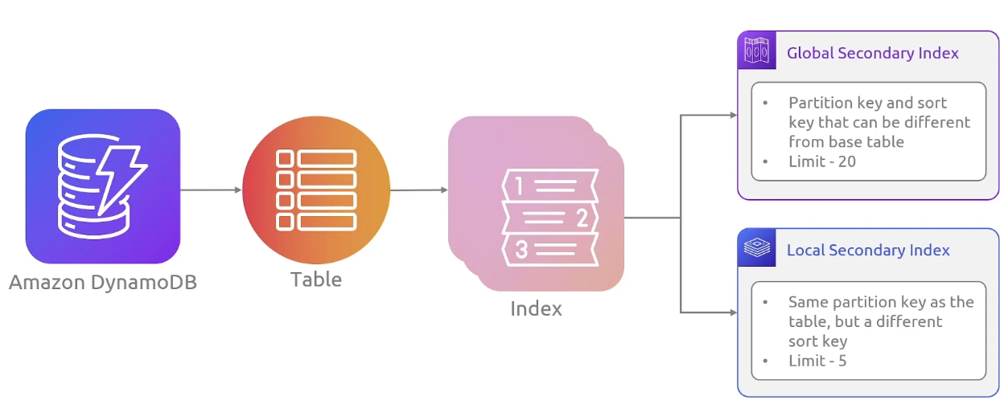

## RDS

AWS支持多种数据库引擎（MySQL, PostgreSQL, MariaDB,Oracle, Microsoft SQL Server）

**实例类型:**

+ General Purpose
+ Memory Optimized

**部署模式：**

+ Single instance

+ Multi-AZ Instance

  

  

  + 读取副本是数据库实例的只读副本
  + 通过将应用程序的查询路由到读取副本，减少主数据库实例的负载。
  + 对于读取量大的数据库工作负载，可弹性扩展，超出单个数据库实例的容量限制。
  + 将读取副本升级为独立实例，作为主数据库实例发生故障时的灾难恢复解决方案。

  **支持跨region读副本,主库在新加坡，但是读副本可以在上海**

+ Multi-AZ Cluster

  

  我们有一个主节点可以进行读写操作，我们还将数据复制到一个读副本， 以便我们可以将读请求分配给多个实例，从而减轻主数据库的负载

  然后我们还在另一个可用区有一个备用服务器，以防止主数据库宕机

  **此外我们还将数据复制到另一个region，所以特定的用户可以就近读取副本**

+ 蓝/绿部署

  

  由于数据在两个环境之间是同步的，一但我们确定绿色环境运行正常而且没有问题，我们就可以将客户转移到green环境作为生产

  **限制：**

  + 蓝绿环境必须在同一个AWS账户

**存储类型：**

+ 通用型SSD

  适用于开发/测试环境

+ Provisioned IOPS SSD

  Provisioned IOPS 存储旨在满足 I/O 密集型工作负载的需求，并以 SSD 支持的存储为后盾。

  特别适合需要低 I/O 延迟和稳定 I/O 吞吐量的数据库工作负载。

  Provisioned IOPS 存储最适合生产环境。

  最小存储容量为 100GB，最大为 16TB。

+ Magnetic Storage

  逐渐被淘汰

**RDS 配置:**



## RDS Aurora

完全兼容MySQL和PostgreSQL

数据库通常是计算和存储的组合，使用附加存储，尤其是大型的数据库，所以要将**计算和存储解耦**

### 优势



Aurora 的核心存储层，它是一个**分布式的、高可用的存储系统**。

+ Aurora 不是简单地存储表和行，而是**日志结构化的存储系统**，它能更高效地管理写入和恢复数据。
+ Aurora 的存储不是一个单独的磁盘，而是分布在**多个存储节点（Storage Nodes）\**上，形成\**分布式存储**，提高了吞吐量和容错能力。
+ Aurora 的存储节点采用本地 SSD，确保高性能。
+ 持续备份到亚马逊 S3
+ 存储容量分布在多个 AZ 上

### 架构


### 类型

+ Provisioned(预配置的)
+ Serverless

### 全球数据库集群

由一个主数据库集群组成，这个集群位于一个特定的region,其他的只读集群组成，主数据库集群到读集群是异步复制的（专门构建的低延迟和高吞吐量）

## RDS proxy



是一个完全托管的高可用性的数据库代理，它会建立一个数据库连接池，它对你的数据库有一个有限数量的连接，并且会重复使用这些连接。因此每当你的应用程序需要执行SQL,Proxy会使用已经存在的连接，这种方法有助于避免过度订阅

## Redshift - Main

为各种不同来源的数据而设计的，这将包括不同的数据库 ，你的日志系统，云存储以及其他各种地方，整个目标是提供统一的数据视图（传统数据库是为事务操作而设计的）

Redshift优化了数据存储和查询

+ Fully Managed, Petabyte-Scale Data Warehouse Service in the Cloud
+ Enterprise-Class Relational Database Query and Management System
+ Supports Client Connections With BI, Reporting, Data, and Analytics Tools
+ Efficient Storage and Optimum Query Performance

### 组件



一个集群由一个或者多个计算节点组成，如果一个集群配置了两个或者多个计算节点，一个额外的领导节点协调计算节点进行通信，所以你的客户端应用程序直接与领导节点进行交互

领导节点编译代码并将编译后的代码分发给计算节点，并将一部分数据分配给每个计算节点。领导节点仅在查询引用存储在计算节点上的表时，才会将 SQL 语句分发给计算节点。所有其他查询仅在领导节点上运行。

## Redshift - Serverless

- Your data warehouse capacity automatically scales up or down
- It measures data warehouse capacity in RPUs
- You pay for the workloads you run in RPU-hours on a per-second basis

## DynamoDB

解决了扩展和管理NoSQL数据库的问题，它提供了一个完全托管的无服务器和高可用性的数据库，解决方案以消除数据库管理的复杂性。解决了数据库管理的复杂性

它支持 **键值存储（Key-Value）** 和 **文档存储（JSON）**，并具备**自动伸缩、高可用性、多区域复制**等特性。

### 核心特点

+ 无服务器架构（Serverless）：
  + 不需要管理服务器，AWS 负责所有底层的基础设施，自动扩展和缩减容量。

+ 高可用 & 持久性：
  + 数据会在 多个可用区（AZs） 内部自动复制，即使某个节点发生故障，数据也不会丢失。
+ 低延迟 & 高吞吐：
  + 单位查询可以在 毫秒级别 内完成，适合高并发读写。
+ 支持灵活的 Schema：
  + 你可以存储 JSON 格式的数据，无需像传统关系型数据库（如 MySQL）那样定义固定的表结构。
+ 内置缓存（DAX）：
  + DynamoDB Accelerator (DAX) 是一个完全托管的缓存层，可提供 亚毫秒级 查询性能。

+ 按需计费：
  + 你可以选择 按需模式（On-Demand）或 预置吞吐量模式（Provisioned Capacity），按实际使用量付费，避免资源浪费。

### 主键

唯一的标识表中的每个items，没有两个items拥有相同的key



+ Partition Key

  + 具有简单主键的表，主键值的hashi和存储有关

    ```
    People
    {  
      "PersonID": 101,  
      "LastName": "Smith",  
      "FirstName": "Fred",  
      "Phone": "555-4321"  
    }  
    {  
      "PersonID": 102,  
      "LastName": "Jones",  
      "FirstName": "Mary",  
      "Address": {  
        "Street": "123 Main",  
        "City": "Anytown",  
        "State": "OH",  
        "ZIPCode": 12345  
      }  
    }  
    ```

+ composite 主键

  + 在一个有分区键和排序键的table中，多个items可以拥有 相同的分区键值，但是必须具有不同的排序键值

  + 可以使用两个属性来确定唯一性

    ```json
    Music
    {  
      "Artist": "No One You Know",  "SongTitle": "My Dog Spot",  
      "AlbumTitle": "Hey Now",  
      "Price": 1.98,  
      "Genre": "Country",  
      "CriticRating": 8.4  
    }  
    {  
      "Artist": "No One You Know",  "SongTitle": "Somewhere Down The Road",  
      "AlbumTitle": "Somewhat Famous",  
      "Genre": "Country",  
      "CriticRating": 8.4,  
      "Year": 1984  
    }  
    ```

    主键由两个属性组成

### 二级索引



你可以在表上创建一个或者多个二级索引，可以让你使用备用键查询数据，**除了主键查询之外，dynamoDB并不要求你使用索引，但他们为你的应用程序查询数据时提供了更多的灵活性**

在上边的例子中我们使用Artist作为分区key,而歌曲作为排序键，将他们组合起来可以查询到到唯一的数据

但是如果你还想按照类型和标题查询数据呢

### Summary

1. Fully managed NoSQL database service provided by AWS, known for its fast and predictable performance with seamless scalability.
2. Components
   - Tables: The fundamental unit of data storage, similar to other database systems.
   - Items: Each table contains multiple items, and an item is a single data record in a table.
   - Attributes: Each item is composed of one or more attributes, which are the data elements associated with the item.
3. Primary Key
   - Single Attribute (Partition Key): Unique identifier for each item in the table, determined by a single attribute.
   - Composite (Partition Key and Sort Key): A two-part key, where two attributes together make up the primary key of the table.
4. Secondary Index
   - Global Secondary Index (GSI): Allows querying on any attribute, not just the primary key.
   - Local Secondary Index (LSI): Must be created at the time of the table creation and allows additional query flexibility for items with the same partition key.
5. Table Classes
   - Standard Tables: Default setting offering the full performance of DynamoDB.
   - Standard-Infrequent Access (Standard-IA): Optimized for tables where data is accessed less frequently, offering a lower storage cost.
   - On-Demand: No capacity planning needed; you pay per read/write with automatic scaling.