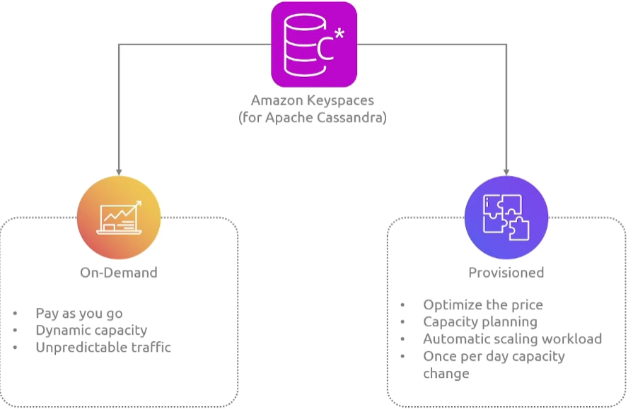

## RDS

AWS支持多种数据库引擎（MySQL, PostgreSQL, MariaDB,Oracle, Microsoft SQL Server）

**实例类型:**

+ General Purpose
+ Memory Optimized

**部署模式：**

+ Single instance

+ Multi-AZ Instance

  

  

  + 读取副本是数据库实例的只读副本
  + 通过将应用程序的查询路由到读取副本，减少主数据库实例的负载。
  + 对于读取量大的数据库工作负载，可弹性扩展，超出单个数据库实例的容量限制。
  + 将读取副本升级为独立实例，作为主数据库实例发生故障时的灾难恢复解决方案。

  **支持跨region读副本,主库在新加坡，但是读副本可以在上海**

+ Multi-AZ Cluster

  

  我们有一个主节点可以进行读写操作，我们还将数据复制到一个读副本， 以便我们可以将读请求分配给多个实例，从而减轻主数据库的负载

  然后我们还在另一个可用区有一个备用服务器，以防止主数据库宕机

  **此外我们还将数据复制到另一个region，所以特定的用户可以就近读取副本**

+ 蓝/绿部署

  

  由于数据在两个环境之间是同步的，一但我们确定绿色环境运行正常而且没有问题，我们就可以将客户转移到green环境作为生产

  **限制：**

  + 蓝绿环境必须在同一个AWS账户

**存储类型：**

+ 通用型SSD

  适用于开发/测试环境

+ Provisioned IOPS SSD

  Provisioned IOPS 存储旨在满足 I/O 密集型工作负载的需求，并以 SSD 支持的存储为后盾。

  特别适合需要低 I/O 延迟和稳定 I/O 吞吐量的数据库工作负载。

  Provisioned IOPS 存储最适合生产环境。

  最小存储容量为 100GB，最大为 16TB。

+ Magnetic Storage

  逐渐被淘汰

**RDS 配置:**


## RDS Aurora

完全兼容MySQL和PostgreSQL

数据库通常是计算和存储的组合，使用附加存储，尤其是大型的数据库，所以要将**计算和存储解耦**

### 优势


Aurora 的核心存储层，它是一个**分布式的、高可用的存储系统**。

+ Aurora 不是简单地存储表和行，而是**日志结构化的存储系统**，它能更高效地管理写入和恢复数据。
+ Aurora 的存储不是一个单独的磁盘，而是分布在**多个存储节点（Storage Nodes）\**上，形成\**分布式存储**，提高了吞吐量和容错能力。
+ Aurora 的存储节点采用本地 SSD，确保高性能。
+ 持续备份到亚马逊 S3
+ 存储容量分布在多个 AZ 上

### 架构


### 类型

+ Provisioned(预配置的)
+ Serverless

### 全球数据库集群

由一个主数据库集群组成，这个集群位于一个特定的region,其他的只读集群组成，主数据库集群到读集群是异步复制的（专门构建的低延迟和高吞吐量）

## RDS proxy


是一个完全托管的高可用性的数据库代理，它会建立一个数据库连接池，它对你的数据库有一个有限数量的连接，并且会重复使用这些连接。因此每当你的应用程序需要执行SQL,Proxy会使用已经存在的连接，这种方法有助于避免过度订阅

## Redshift - Main

为各种不同来源的数据而设计的，这将包括不同的数据库 ，你的日志系统，云存储以及其他各种地方，整个目标是提供统一的数据视图（传统数据库是为事务操作而设计的）

Redshift优化了数据存储和查询

+ Fully Managed, Petabyte-Scale Data Warehouse Service in the Cloud
+ Enterprise-Class Relational Database Query and Management System
+ Supports Client Connections With BI, Reporting, Data, and Analytics Tools
+ Efficient Storage and Optimum Query Performance

### 组件


一个集群由一个或者多个计算节点组成，如果一个集群配置了两个或者多个计算节点，一个额外的领导节点协调计算节点进行通信，所以你的客户端应用程序直接与领导节点进行交互

领导节点编译代码并将编译后的代码分发给计算节点，并将一部分数据分配给每个计算节点。领导节点仅在查询引用存储在计算节点上的表时，才会将 SQL 语句分发给计算节点。所有其他查询仅在领导节点上运行。

## Redshift - Serverless

- Your data warehouse capacity automatically scales up or down
- It measures data warehouse capacity in RPUs
- You pay for the workloads you run in RPU-hours on a per-second basis

## DynamoDB

解决了扩展和管理NoSQL数据库的问题，它提供了一个完全托管的无服务器和高可用性的数据库，解决方案以消除数据库管理的复杂性。解决了数据库管理的复杂性

它支持 **键值存储（Key-Value）** 和 **文档存储（JSON）**，并具备**自动伸缩、高可用性、多区域复制**等特性。

### 核心特点

+ 无服务器架构（Serverless）：
  + 不需要管理服务器，AWS 负责所有底层的基础设施，自动扩展和缩减容量。

+ 高可用 & 持久性：
  + 数据会在 多个可用区（AZs） 内部自动复制，即使某个节点发生故障，数据也不会丢失。
+ 低延迟 & 高吞吐：
  + 单位查询可以在 毫秒级别 内完成，适合高并发读写。
+ 支持灵活的 Schema：
  + 你可以存储 JSON 格式的数据，无需像传统关系型数据库（如 MySQL）那样定义固定的表结构。
+ 内置缓存（DAX）：
  + DynamoDB Accelerator (DAX) 是一个完全托管的缓存层，可提供 亚毫秒级 查询性能。

+ 按需计费：
  + 你可以选择 按需模式（On-Demand）或 预置吞吐量模式（Provisioned Capacity），按实际使用量付费，避免资源浪费。

### 主键

唯一的标识表中的每个items，没有两个items拥有相同的key


+ Partition Key

  + 具有简单主键的表，主键值的hashi和存储有关

    ```
    People
    {  
      "PersonID": 101,  
      "LastName": "Smith",  
      "FirstName": "Fred",  
      "Phone": "555-4321"  
    }  
    {  
      "PersonID": 102,  
      "LastName": "Jones",  
      "FirstName": "Mary",  
      "Address": {  
        "Street": "123 Main",  
        "City": "Anytown",  
        "State": "OH",  
        "ZIPCode": 12345  
      }  
    }  
    ```

+ composite 主键

  + 在一个有分区键和排序键的table中，多个items可以拥有 相同的分区键值，但是必须具有不同的排序键值

  + 可以使用两个属性来确定唯一性

    ```json
    Music
    {  
      "Artist": "No One You Know",  "SongTitle": "My Dog Spot",  
      "AlbumTitle": "Hey Now",  
      "Price": 1.98,  
      "Genre": "Country",  
      "CriticRating": 8.4  
    }  
    {  
      "Artist": "No One You Know",  "SongTitle": "Somewhere Down The Road",  
      "AlbumTitle": "Somewhat Famous",  
      "Genre": "Country",  
      "CriticRating": 8.4,  
      "Year": 1984  
    }  
    ```

    主键由两个属性组成

### 二级索引


你可以在表上创建一个或者多个二级索引，可以让你使用备用键查询数据，**除了主键查询之外，dynamoDB并不要求你使用索引，但他们为你的应用程序查询数据时提供了更多的灵活性**

在上边的例子中我们使用Artist作为分区key,而歌曲作为排序键，将他们组合起来可以查询到到唯一的数据

但是如果你还想按照类型和标题查询数据呢

### Summary

1. Fully managed NoSQL database service provided by AWS, known for its fast and predictable performance with seamless scalability.
2. Components
   - Tables: The fundamental unit of data storage, similar to other database systems.
   - Items: Each table contains multiple items, and an item is a single data record in a table.
   - Attributes: Each item is composed of one or more attributes, which are the data elements associated with the item.
3. Primary Key
   - Single Attribute (Partition Key): Unique identifier for each item in the table, determined by a single attribute.
   - Composite (Partition Key and Sort Key): A two-part key, where two attributes together make up the primary key of the table.
4. Secondary Index
   - Global Secondary Index (GSI): Allows querying on any attribute, not just the primary key.
   - Local Secondary Index (LSI): Must be created at the time of the table creation and allows additional query flexibility for items with the same partition key.
5. Table Classes
   - Standard Tables: Default setting offering the full performance of DynamoDB.
   - Standard-Infrequent Access (Standard-IA): Optimized for tables where data is accessed less frequently, offering a lower storage cost.
   - On-Demand: No capacity planning needed; you pay per read/write with automatic scaling.

## DynamoDB Accelerator

DynamoDB Accelerator (DAX) 是 AWS 提供的一个**全托管**的**缓存加速服务**，用于提升 Amazon DynamoDB 的查询性能。DAX 通过**内存缓存**的方式，可以**将 DynamoDB 读取性能从毫秒级提升至微秒级**，适用于对延迟敏感的应用

## OpenSearch


大多数数据应用程序，都会生成它们自己所需的各种型态的数据,它们会生成大量文本数据，登录事件，地理空间数据，时间序列数据，JONS和半结构化数据。提

传统的关系型数据库，虽然适用于具有预定义模式的结构化数据，但在处理上述类型的数据所需的灵活性、可扩展性和速度方面可能会有困难

### component(组件)


### 特性

1. **Application Analytics**
2. **Anomaly Detection**
3. **Cross-Cluster Replication**
4. **3 PB storage**
5. **SQL Query Syntax**
6. **Trace Analytics**

### 集成

+ opensearch service Domains会自动将指标发送到CloudWatch,这样你就可以监控域的健康状态和性能

+ AWS CloudTrail 会记录您帐户的 OpenSearch 服务配置 API 调用和相关事件的历史。
+ 我们可以利用 Amazon Kinesis 将数据加载到 OpenSearch 中。
+ OpenSearch 可以使用 S3 来存储索引，同时用 IAM 管理对集群的访问

+ Lambda 函数可以与 OpenSearch 结合使用，在数据被放入 OpenSearch 之前对其进行转换。
+ 我们还可以将插入 DynamoDB 表中的数据自动上传到opensearch集群
+ 可以通过aws QuickSight来实现数据的可视化

### 适用场景

任何你的应用程序或基础设施生成的日志、指标或追踪，将它们存储在 OpenSearch 中是一个常见的用例。它也非常适合存储安全和事件信息。因此，你可以将其用于实时监测和事件管理

你的最佳用例之一是在你的应用程序或网站中实现搜索体验

## ElasticCache

在应用程序架构中，你有你的数据库，这将包含你所有用户的数据，所以当用户注册时，数据库会存储用户的用户名信息

你的应用程序代码会运行在你的服务器上

在大多数情况下，数据库会成为瓶颈，为了避免每一个请求都发送到数据库，就产生了如下的架构


缓存集群是一个或多个缓存节点的组合

### Redis

基于redis的缓存集群可以有一个或者多个只读副本


### Memcached


### 集成


## MemoryDB for Redis


我们有一个主节点，同时处理读写请求，现在如果我们的主节点出现故障，可以随时切换到副本节点成为主节点

### 用例

1. Build Web and Mobile Applications
2. Quickly Access Customer Data
3. Online Games
4. Stream Media and Entertainment

## DocumentDB


**有一个全球集群的功能**，全球集群可以通过自动复制数据来帮助你支持关键的全球工作负载，**在多个 AWS 区域之间实现亚毫秒级延迟。**

### 特性

1. MongoDB-Compatible
2. Storage Auto-Repair
3. Cache Warming
4. Crash Recovery
5. Write Durability

我们可以利用读取偏好，实现不同的功能

### 用例

提取的文本如下：

1. Store and Query Content Management Data
2. Manage User Profiles, Preferences, and Requests
3. Scale Mobile and Web Applications

### Summary

+ **Amazon DocumentDB (with MongoDB compatibility)** is a fully managed document database service that supports MongoDB workloads. It is designed to be compatible with MongoDB, a popular NoSQL database known for storing data in a flexible, JSON-like format.
+ **Storage Replication:** DocumentDB automatically replicates six copies of your data across three Availability Zones (AZs). This replication ensures high availability and durability.
+ **Global Clusters** in DocumentDB allow you to deploy a database across multiple AWS regions. This is critical for achieving low-latency global reads and providing disaster recovery across regions.
+ **Read Preferences:** DocumentDB offers flexible read preferences, allowing you to optimize for read latency, throughput, or consistency.
  - You can direct read traffic to the primary instance for strongly consistent reads or to replica instances for eventually consistent reads.
  - This can help balance the load and reduce the read latency if the application can tolerate some level of data staleness.

## Keyspaces



### 架构


### Summary

+ **Amazon Keyspaces (for Apache Cassandra)** is a scalable, highly available, and managed Apache Cassandra-compatible database service. It offers the performance, elasticity, and enterprise features of Cassandra with the added benefits of being an AWS managed service.

+ It handles the deployment, management, and scaling of Cassandra tables, without the user needing to provision, patch, or manage servers.

+ The service offers on-demand capacity that requires no capacity planning and scales automatically with the workload's actual read and write throughput.

+ Predictable workloads, provisioned capacity mode allows you to specify the number of reads and writes per second that you expect your application to require.


+ Designed to be compatible with Cassandra Query Language (CQL), which is the primary language for interacting with Apache Cassandra databases.

## Neptune

想象一下警察局的调查板，正在处理一个备受关注的案件，所有的证书都盯在了一个板子上。关系非常复杂

### 用例

1. **Personalization With Customer 360**
2. **Detect Fraud Patterns**
3. **ML Predictions**
4. **Improve IT Security**

### Summary

+ **Fast, reliable, and fully managed graph database service.** It is built for handling complex, highly connected datasets, and is optimized for storing billions of relationships and querying the graph with milliseconds latency.

+ Fully managed, automating time-consuming tasks such as hardware provisioning, database setup, patching, and backups.

+ It provides high performance with support for graph models like Property Graph and W3C's RDF (Resource Description Framework), along with their respective query languages Apache TinkerPop Gremlin and SPARQL

+ With Amazon Neptune, you can create a global database that spans multiple AWS Regions. This is designed to deliver fast read and write performance to your users around the world, and to withstand regional outages.

+ Neptune ML is an integration of Amazon Neptune with machine learning, making it possible to build and train machine learning models on graphs for tasks such as node classification, link prediction, and entity resolution.

## QLDB

+ Fully managed ledger database that provides a transparent, immutable, and cryptographically verifiable transaction log owned by a central trusted authority.

+ QLDB offers an immutable transaction log known as the journal, where all changes are recorded sequentially and cryptographically chained.

+ The journal is the core of QLDB, acting as an append-only log of all the changes in the database. Every transaction is recorded with a unique identifier, along with a timestamp, ensuring that the data lineage can be traced and verified at any point in time.
+ In QLDB, data is organized into two types of tables: current and history.
  - **Current**: The current table always reflects the latest state of the data.
  - **History**: The history table maintains a comprehensive and immutable record of all the changes over time.

+ This dual structure allows for quickly accessing the current state of the data while preserving a full, verifiable history of changes for audit purposes.

+ Amazon QLDB is designed for use cases where data integrity, transparency, and auditability are paramount.

## Timestream

时间序列数据库一个1常见的用例是物联网设备和监控设备、

+ Fast, scalable, and serverless time series database service designed to track and manage data that changes over time.

+ It is built specifically to handle the scale and performance requirements of time series data for IoT and operational applications.

+ Fully managed, eliminating the need to monitor the health of the server or manage database clusters. It automates the management of time series data at scale, such as the collection, retention, and aging of data.

+ As a serverless database, Timestream automatically scales up or down to adjust to the workload demands.
+ It offers a flexible data model that evolves as new fields are added to your data, accommodating the dynamic nature of time series data.
+ The schema can adjust to different types of data without needing predefined schemas or alterations to existing ones.
+ Amazon Timestream integrates with popular business intelligence tools to visualize and analyze time series data.
