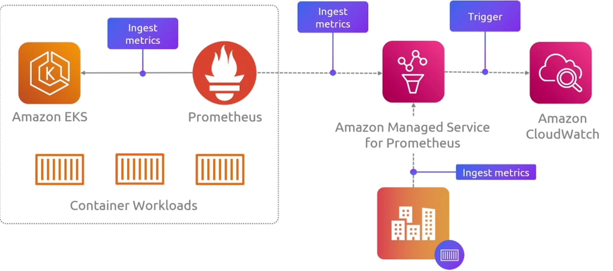
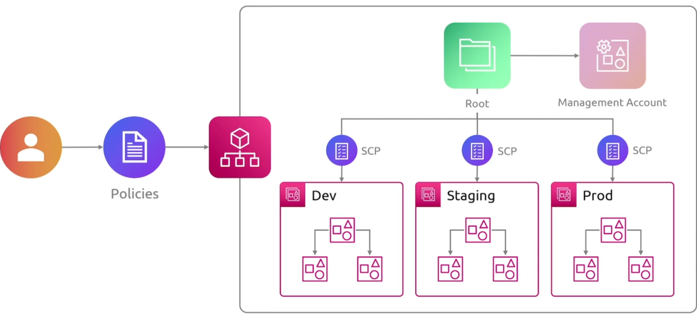
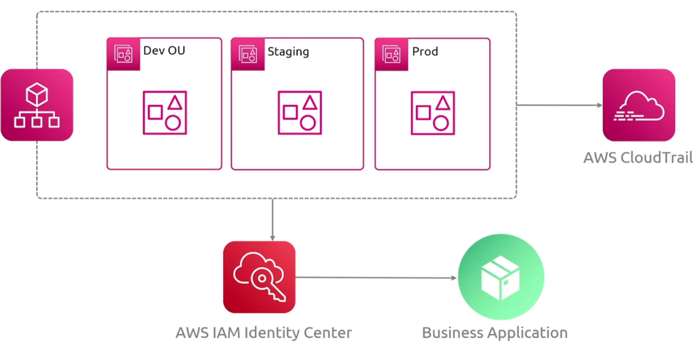

### CloudFormation

基础设施即代码工具

### CDK

它是另一个基础设置即代码工具

#### Features

- Declarative Approach
- Component Reusability
- AWS Construct Library
- Automated Synthesis
- Environment Agnosticism

### CloudWatch

#### CloudWatch Components

例如 EC2 autoscaling ,通过指标实现自动扩缩容

### X-Ray

可以按照分布式链路追踪理解

### Prometheus

### Trusted  Advisor

提供AWS资源使用的最佳实践的建议和指导

### Launch Wizard

+ 从AWS提供的目录中选择应用程序
+ 输入应用程序的规格

### Compute Optimizer

资源分析，给出优化建议

### AWS Organizations

多个aws账号都有自己的账单设置，你会希望整合所有的账单

为每个账号设置IAM

多个账号的资源并没有在一个池中共享

AWS Organizations可以想象为公司的总部

### Control Tower

轻松创建并部署一个新的账户

### Systemctl Manager

