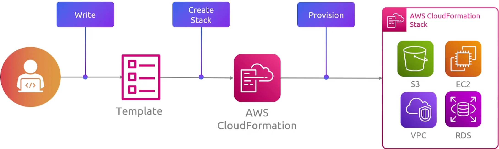
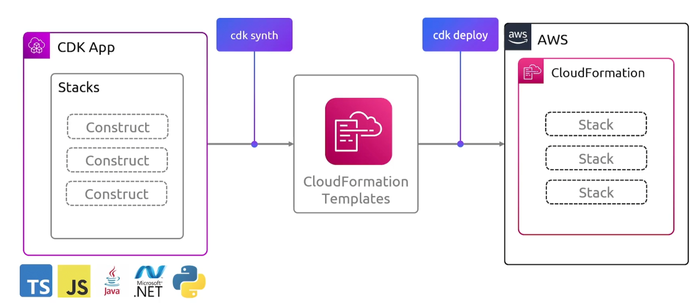
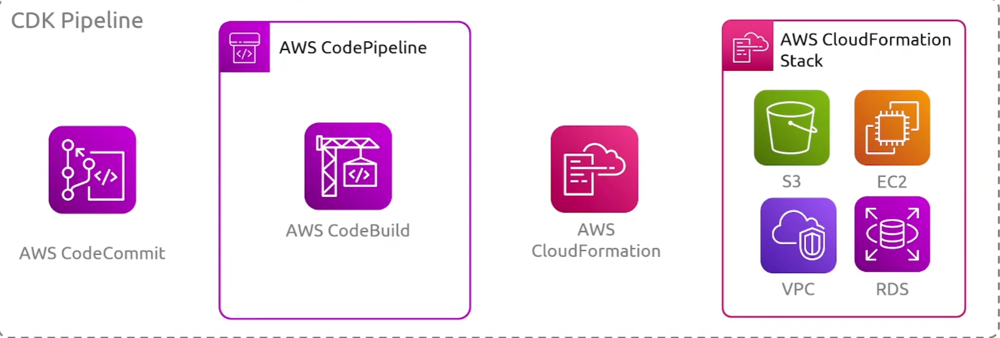
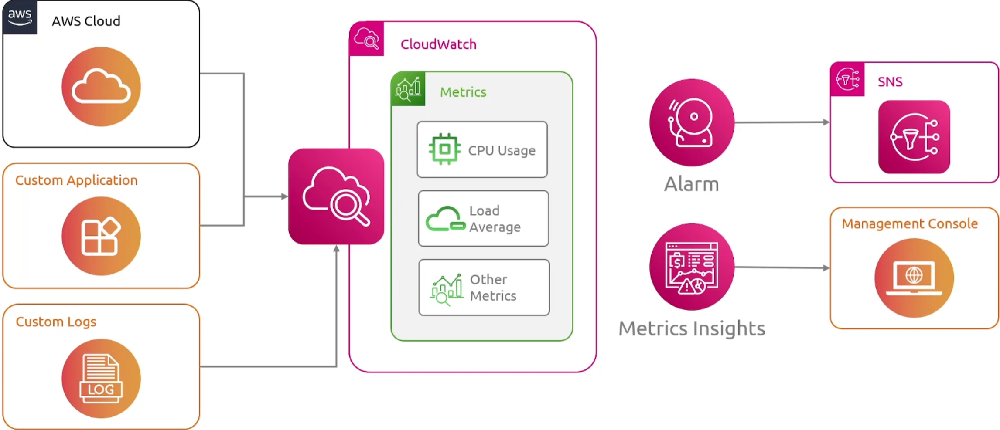
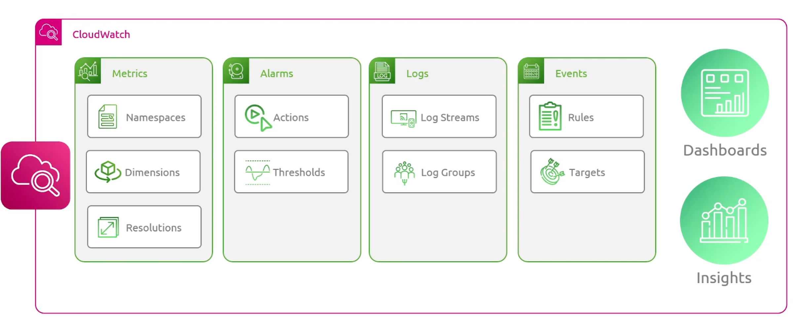

### CloudFormation

基础设施即代码工具

### CDK

它是另一个基础设置即代码工具

#### Features

- Declarative Approach
- Component Reusability
- AWS Construct Library
- Automated Synthesis
- Environment Agnosticism

### CloudWatch

#### CloudWatch Components

例如 EC2 autoscaling ,通过指标实现自动扩缩容

### X-Ray

可以按照分布式链路追踪理解

