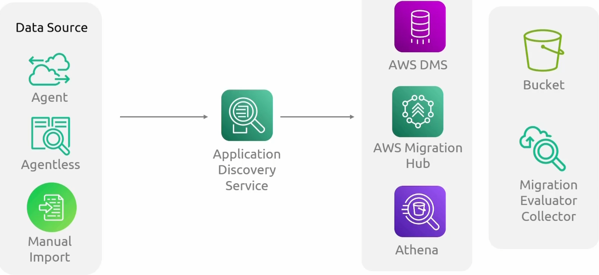
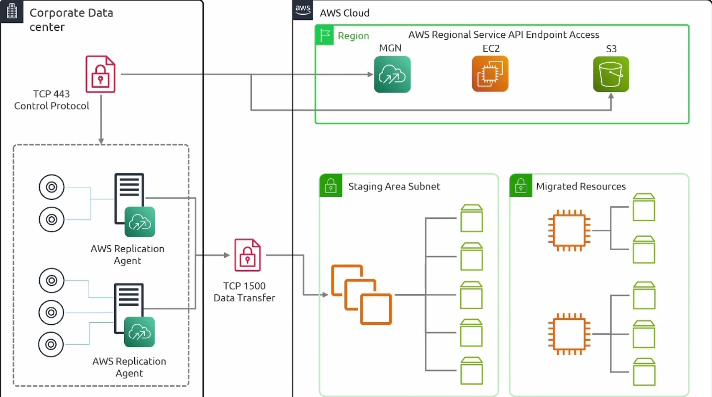
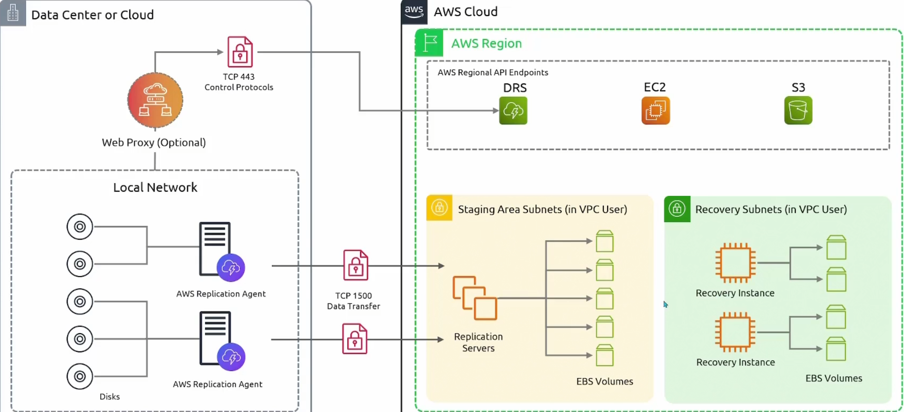
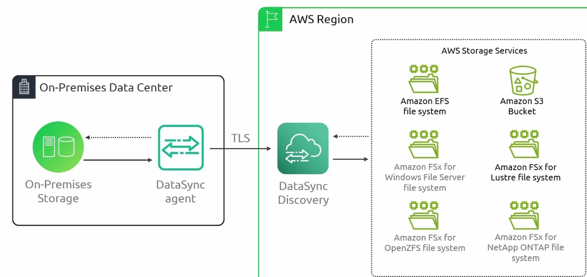
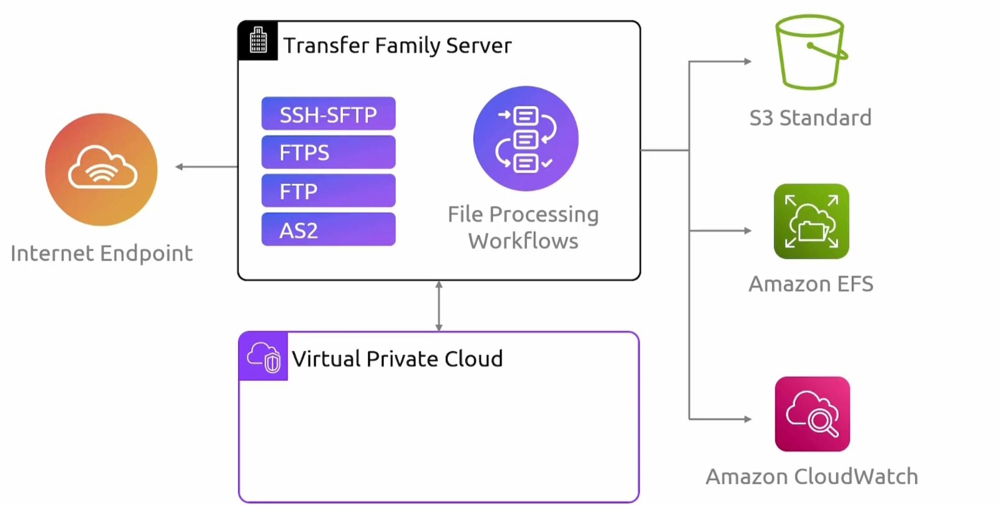
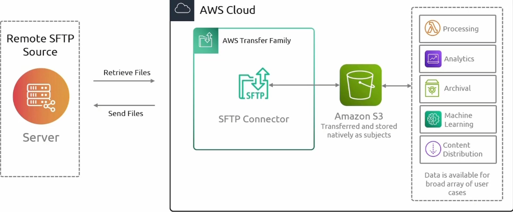

### AWS migration Hub

1. 提供迁移进度的集中视图，使您能够跟踪应用程序和工作负载在迁移到 AWS 过程中的状态。
2. 允许你发现并目录化本地应用程序、其依赖项及相关数据，以帮助规划迁移策略。
3. 支持将应用程序和工作负载组织成迁移组，便于管理和跟踪相关组件的迁移进度。
4. 与多种迁移工具和服务集成，便于采用不同的迁移方法。
5. 提供报告和分析功能，支持生成迁移进度报告并分析数据以优化迁移策略。

### Application Discovery Service

### Application Migration Service

### Database Migration Service

### Elastic  Disaster Discovery 

### AWS Mainframe Modernization  

将你的主机应用程序迁移到AWS管理的运行环境

### Datasync

### AWS Transfer Family

#### Transfer Family SFTP Connector

S

### AWS Snow Family

硬件设备