### Subnets

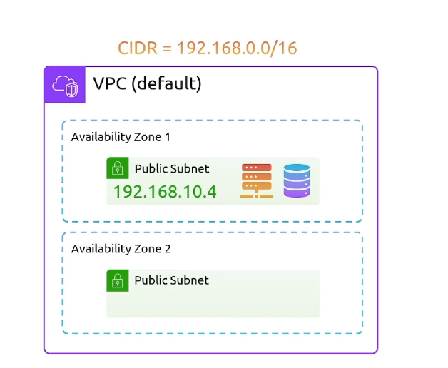

VPC 中的子网必须在 CIDR 范围内。

子网块大小必须在 /16 和 /28 之间。

The first 4 IP addresses of a subnet are reserved and cannot be used:

- 192.168.10.0 (Network address)
- 192.168.10.1 – 192.168.10.3 (for AWS)
  - 192.168.10.1 (VPC Router)
  - 192.168.10.2 (DNS)
  - 192.168.10.3 (For Future Use)

The last IP address of a subnet (192.168.10.255) is reserved as the broadcast address.

### Routing

目的是在子网之间路由流量

每个subnet都与一个route table相关联。创建一个新的vpc的时候，会生成一个默认的路由表

多个子网可以与一个路由表相关联

### Internet Gateway

要把子网变成public的第一件事就是要创建一个 Internet Gateway。将其附加到我们的 VPC 上。一旦它附加到 VPC 上，就需要创建一个自定义路由表。在这个路由表中，我们需要配置一个指向 Internet Gateway 的默认路由。这默认路由基本上是说，如果一个数据包进来并且没有匹配任何其他路由，它会自动匹配默认路由，把它发送到 Internet Gateway。因为如果它不匹配任何更具体的路由，这意味着它可能是要去互联网。

### Nat Gateway

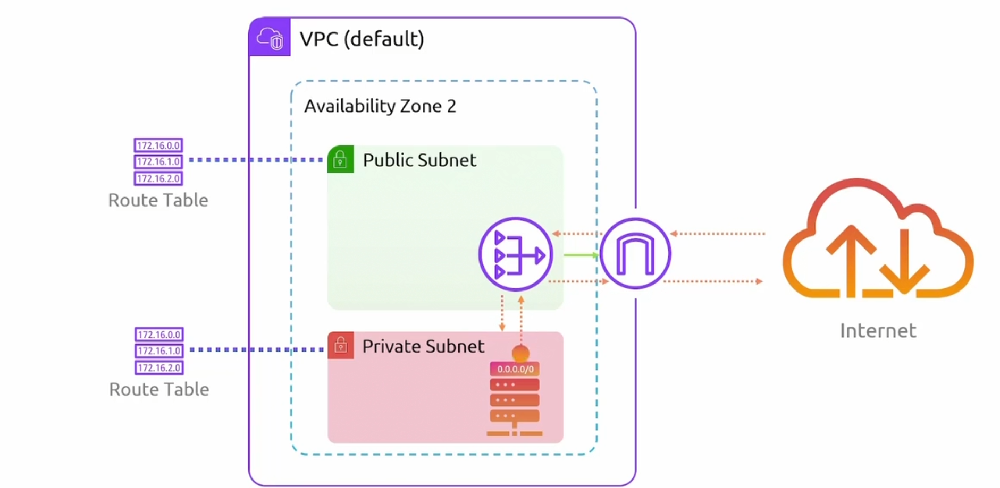

假设我们在一个私有网络中有一台服务器。我们需要为这个服务器提供互联网访问权限，这样它才能连接互联网并安全补丁。
现在我们可以做的是，我们可以将一个互联网网关附加到 VPC。然后，创建一条路由，让这条线路指向互联网网关，然后将这个网络变成公共网络，这样它就可以访问互联网，以下载任何需要的更新和安全补丁。

现在的问题是，服务器是一个内部服务器，只允许内部团队访问，我们该怎么办？我们不希望它对互联网开放。因此我们希望服务器能够自动发起与互联网的连接。
但是互联网网关永远不应该连接到我们的服务器。我们应该如何解决这个问题?要实际使用 NAT Gateway，你仍然需要一个 Internet Gateway。
所以要让 NAT Gateway 正常运行，您首先需要配置一个 Internet Gateway 并将其附加到您的 VPC，然后后续需要创建一个公共子网，并设置必要的路由指向互联网网关。

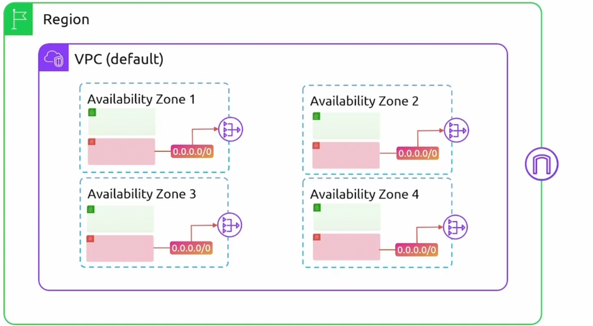

NAT Gateway是不具备弹性的，我们是将他部署在一个公有子网中，所以它特定于一个可用区，可以通过多可用区部署，实现冗余

#### demo

1. 创建vpc

2. 创建私有子网

3. 创建ec2实例（属于上边的私有子网，并且不分配公网IP）

4. 创建igw, Attach to vpc

5. 创建公共子网

6. 创建两个路由表（私有，公有）

   + 在公有路由表中定义一条路由

     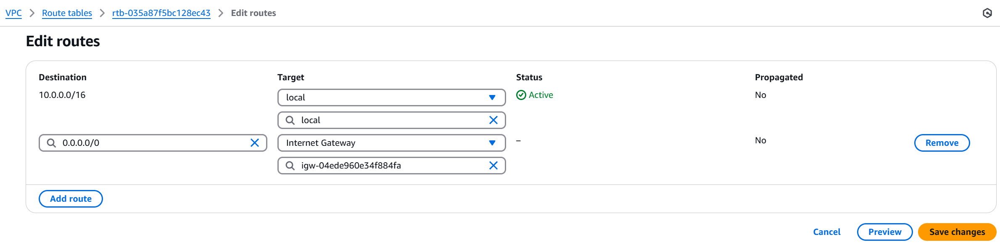

   + 将公有子网与这个路由表相关联

     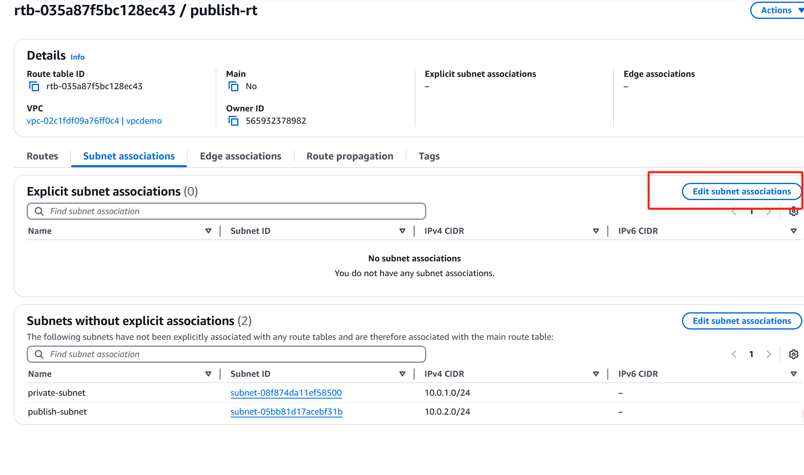

   + 对私有路由表做同样的关联（关联到私有子网）

7. 在公共子网上部署Nat  Gateway

   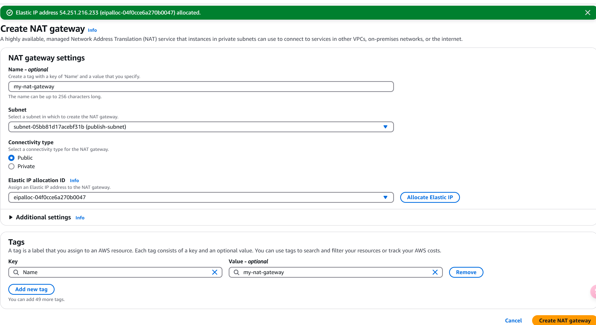

8. 然后我们去私有路由表，增加一条路由信息

   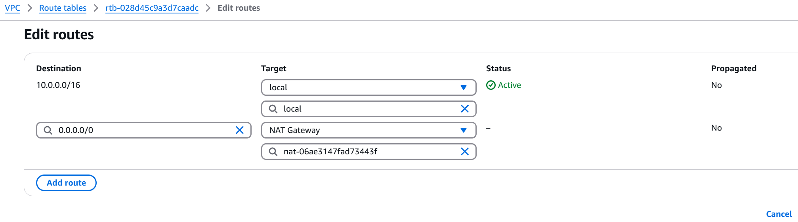

### DNS In Vpc

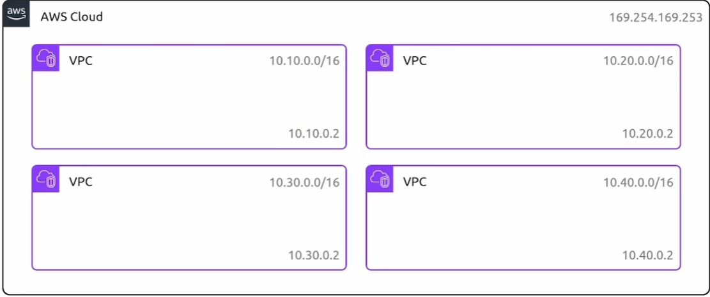

当你创建一个自定义 VPC 时，有两个选项会影响 DNS 的工作方式。默认情况下，只有私有 IP 会带有 DNS 记录，而公共 IP 则不会。如果你希望公共 IP 地址能够获得域名，你需要确保创建 VPC 时启用 DNS 主机名称。
这个属性的默认值是 false，除非 VPC 是默认 VPC。然后，为了实现在 VPC 中使用 DNS 解析，你可以使用 AWS DNS 服务。我们必须确保 DNS 支持选项。

启用 DNS 主机名称选择 VPC 是否支持为公共 IP 地址的实例分配 DNS 主机名。启用 DNS 支持选项决定了 VPC 是否支持通过 Amazon 提供的 DNS 服务器进行 DNS 解析。所以，如果启用 DNS 支持选项没有开启，那么你将不能使用 AWS 提供的域名进行通信。

假设我们之前的VPC中有一台ec2,但是没有公网DNS，我们编辑vpc,启用DNS 主机名就会获得DNS地址

### Elastic IP

固定的IP地址分配给账号，这个IP地址会被保留，不至于随着实例的重启或销毁而丢失。

同时最酷的地方是可以单独的分配安全组

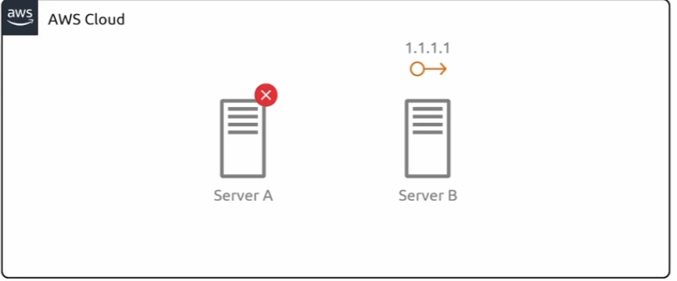

EIP是regison性的

### Security Groups &amp; NACLs

#### Stateless firewalls

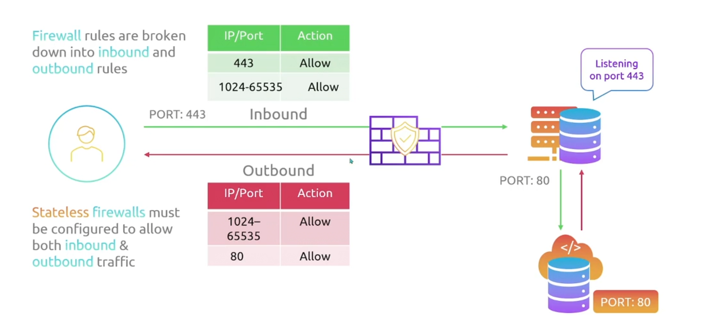

用户想访问web的443端口，所以必须放行，返回给用户的数据，端口是随机的，所以出站的端口范围是1024-65535

##### NACL

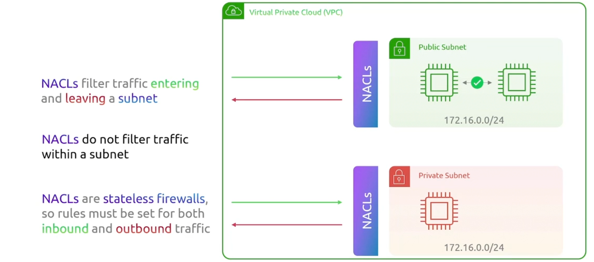

假设我们的EC2关联的安全组（入站和出站都是ALL 放行），现在在子网级别操作NACL

我们可以使用先安全添加，再删除的方式做到精细的控制

#### stateful firewalls

对于出站规则，允许所有的流量到临时的端口，但是有状态防火墙的特点是，足够智能，能知道请求和响应是一组的，实际上是跟踪TCP会话。也就是说我们只是配置入栈规则就可以，出站规则会自动添加（只添加入站的443）

对于更新服务器来说，我们的出站规则是80，入站也会智能的添加

##### 安全组

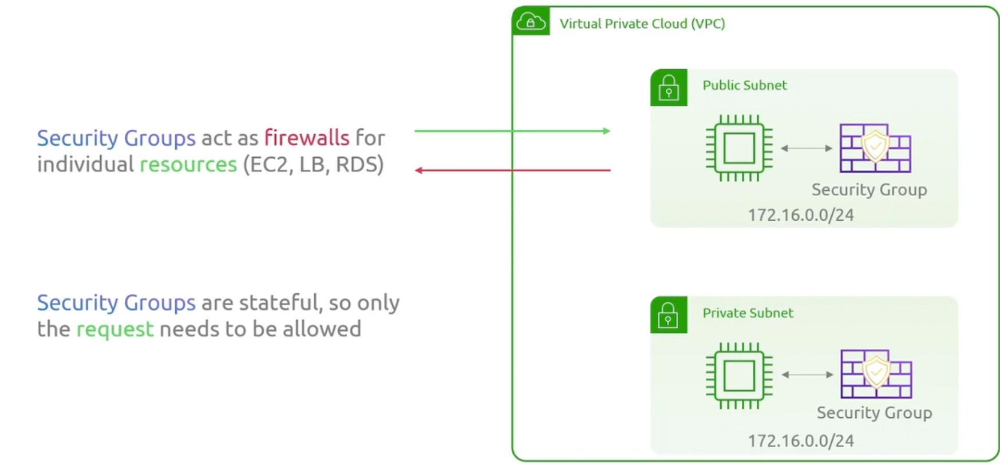

**特别说明：**假设我们有一个关于数据库的安全组，我们希望web服务器，可以访问（假设这个web服务器关联的安全组是http-sg）,那么我们设置数据库的安全组时，就可以选择source为http-sg,这样我们不用每次修改web服务器的IP

### Load Balancers

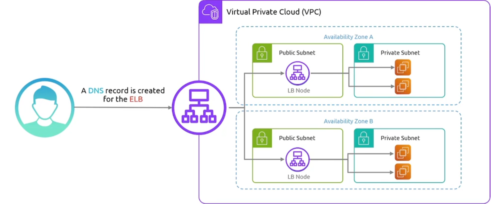

会在每个zone中生成一个物理资源LB，在VPC边缘的ELB中会创建一个DNS记录。

必须将LB部署在子网中

#### Classic Load Balancer

不建议使用

#### Application Load Balancer

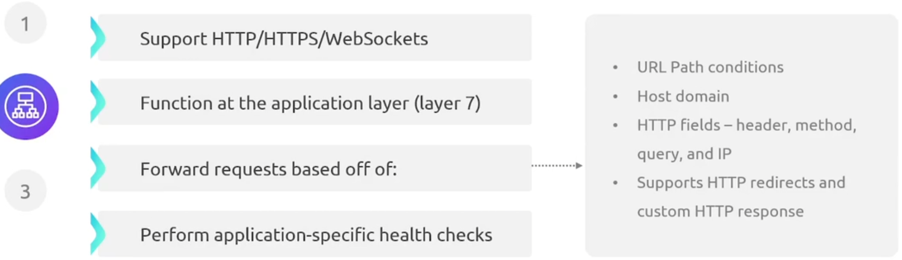

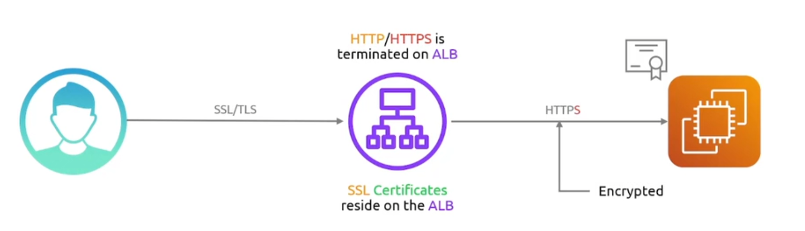

对于ALB与应用程序之间可以使用明文，因为是在AWS内部的。但是也可以自行管理他们之间的证书

#### Network Load Balancer

NLB会将TCP连接转发到你的EC2实例，所以在你的NLB没有任何的终止，而是客户端直接与ec2建立连接

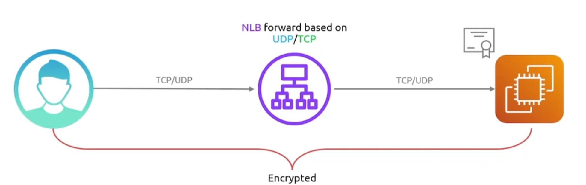

#### 跨可用区负载均衡

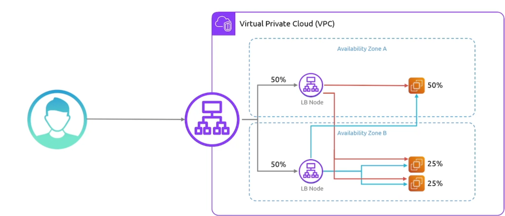

#### 部署模式

部署在公有子网或者私有子网中

#### 监听器和目标组

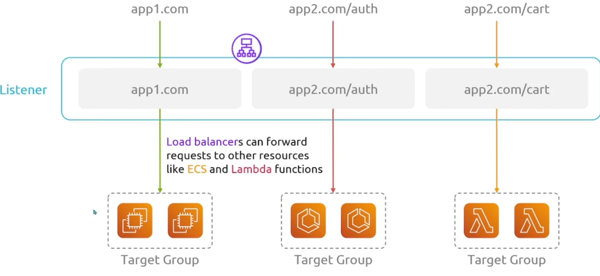

#### Demo

+ 在两个不同的可用区中创建EC2实例，属于公有子网（101/24，102/24）
+ 为两个负载均衡器创建两个公有子网（属于和上边一样的可用区）
+ 去EC2的页面，部署LB
  + 选择之前创建的lb公有子网
  + 配置监听器和目标组

### VPN

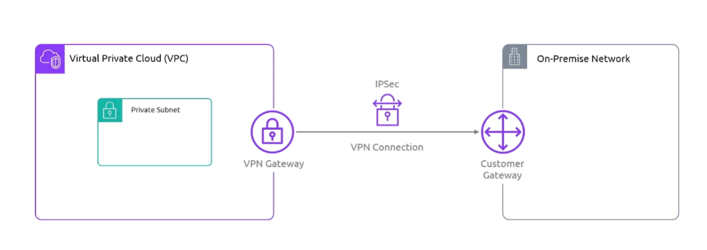

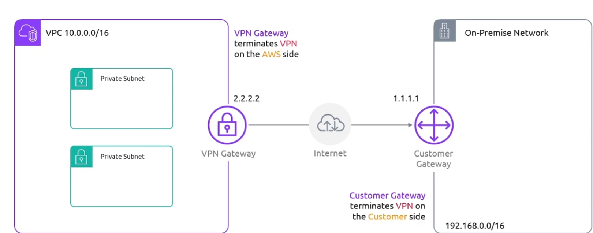

在本地网络上部署一个客户端网关，客户端网关将会获得一个公网IP 1.1.1.1。我的 VPN 网关也会获得一个公共 IP 2.2.2.2。这是 AWS 的一部分。
然后我们可以在互联网上建立一个 IPSec 隧道，1.1.1.1 在客户网关到 2.2.2.2 在 VPN 网关上。IPsec 隧道将会通过互联网传输。就是我们日常使用的普通互联网。这就是我们将建立一个 IPSec 隧道的基础。

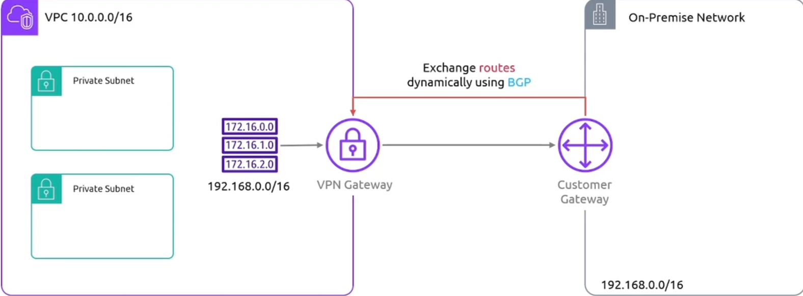

**客户端也可以动态的使用BGP将这些路由发送到VPN网关，也可以使用静态的方法来手动定义**

vpn每小时收费，并且EC2的出站流量付费

### Direct Connect

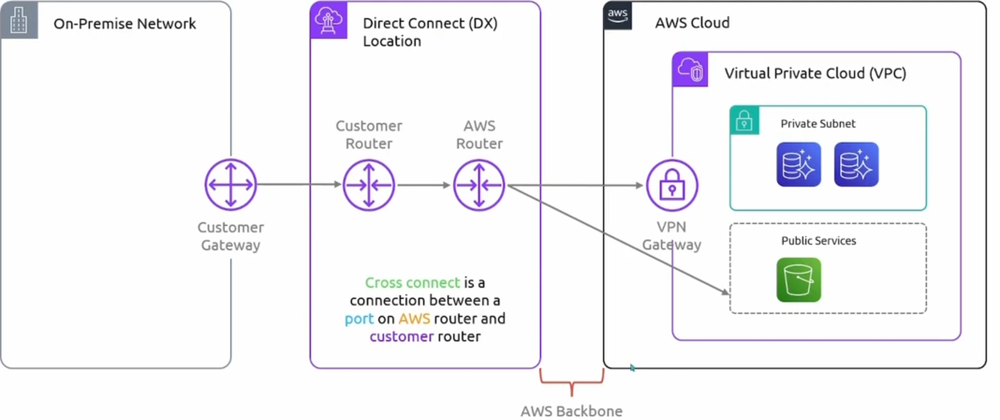

### VPC Peering

默认情况下，当你在一个vpc与名一个vpc是无法通信的

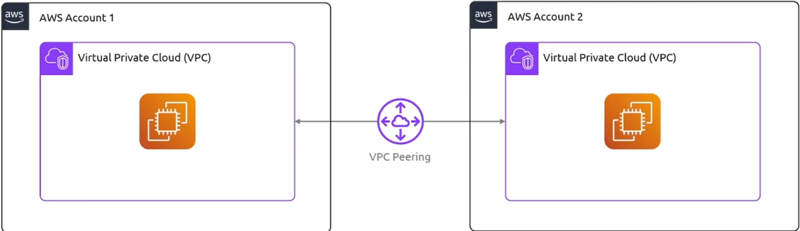

现在vpc1不知道如何到达vpc2，更重要的是它不知道如何到达vpc2的CIDR Block

#### Demo

1. VPC-A(10.1.0.0/16) VPC-B(10.2.0.0/16)

2. 上边的每个vpc中都有一个EC2(默认情况下两个vpc是无法进行通信的)

3. 创建一个pvc peer （例如A-to-B）

4. 在另一个账号（或者同一个账号）接受请求

   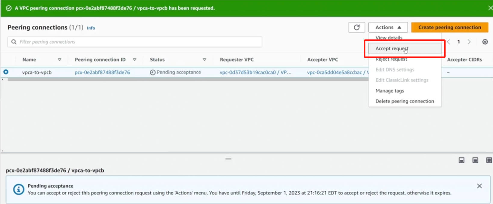

5. 在VPC-A和VPC-B中编辑路由表

   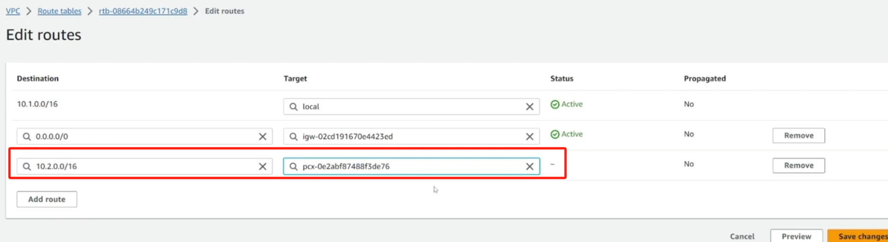

### Transit Gateway

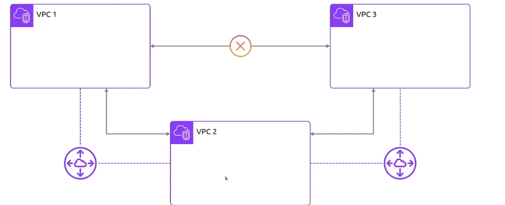

VPC peer默认是无法传递的

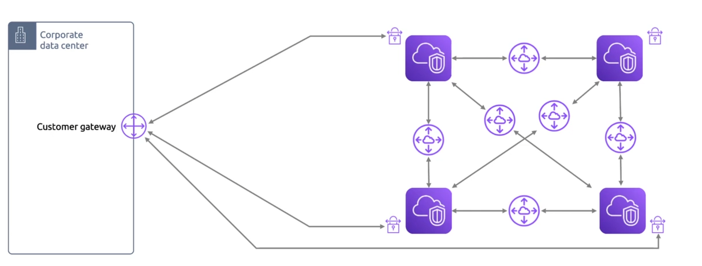

Transit Gateway避免必须建立全网状的vpc peer

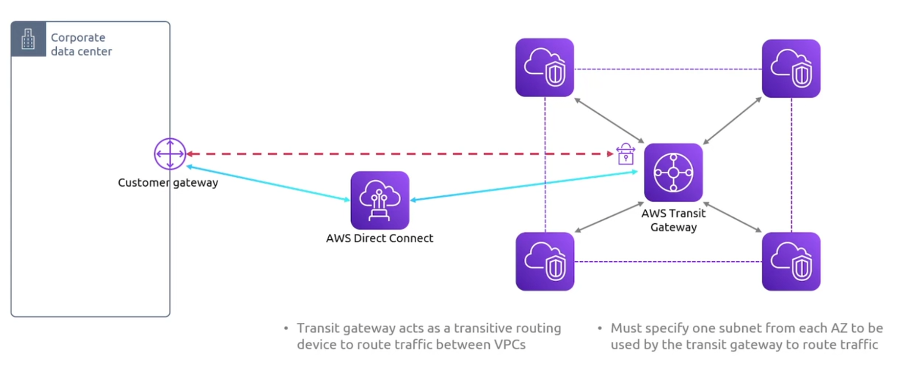

**现在真正酷的地方是，如下图的结构**

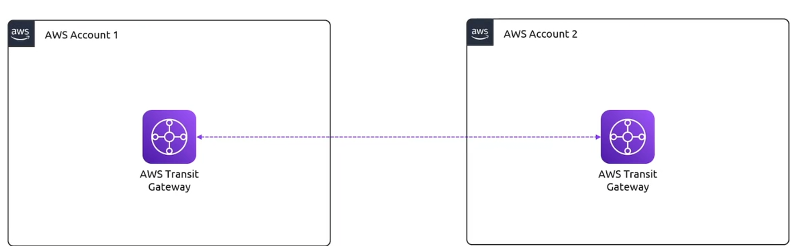

### Privatelink

如下的结构图将EC2暴露在了互联网中

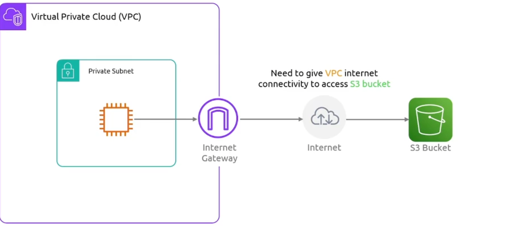

还可以使用私有地址连接到其他VPC中的服务

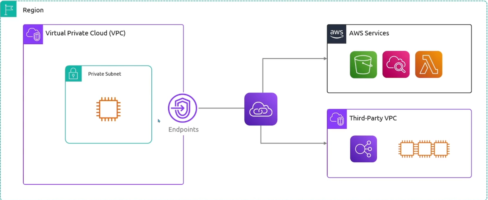

### CloudFront

location在cloudfront是一个非常重要的概念，本质上是一个cdn,它的全部内容就是在这些edge location中缓存文件，以减少延迟

是一种加速静态内容分发的web服务，以及动态内容。如html,css,javascript,图像，音频等

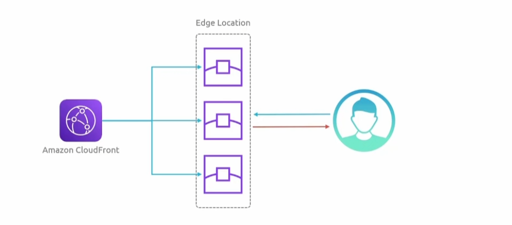

#### Architecture

origin 是内容的源位置，即cloudFront 缓存的内容的位置。也允许您有一些图像或文件存储在 S3 bucket 中，那就是 origin，基本上您是在告诉 CloudFront，嘿，这些是我想分发到 edge locations 的文件。因此，它是源。请记住，S3 不是唯一的源。

您可以使用自定义 origins。因此，您可以利用 load balancers (负载均衡器) 或者运行在 EC2 instance (EC2 实例) 上的 HTTP 服务器。因此，您有各种不同的源。因此，CloudFront 然后会从 origin 获取文件，并将其缓存到 edgelocation。
一旦它们被缓存，边缘位置的用户就可以直接从边缘位置获取内容，而不需要回到你的源

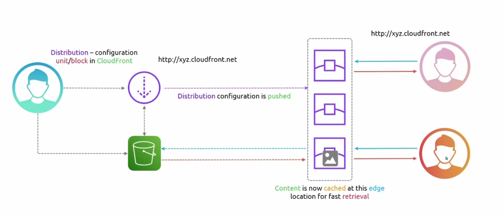

假设我们现在要配置 CloudFront，假设我们有一个 S3 存储桶，里面有几个媒体文件或图像。我们将这些文件存储在 S3 桶中。这将作为我们的源。那么我们该如何配置 CloudFront 呢？嗯，我们必须配置所需的 distribution。因此，distribution 是 CloudFront 中的一个配置单元或模块。所以任何时候你想缓存一个对象或一组对象，你将创建一个 CloudFront distribution。因此，在 distribution 中，你将告诉 CloudFront 可以在哪里找到源文件。然而 CloudFront 会为你创建一个域名。因此，你现在可以通过这个域名访问缓存的图像，它看起来像 xyz.cloudfront.net。然后它将所有 distribution 配置发送到 edge locations。最终，edge locations 这些是实际的边缘位置。如果用户从某个 edge location 发起请求时，它将向我们 CloudFront distribution 提供的域名发送请求，他们将发送请求。如果图片已缓存于 edge location，我们会立即响应它。  

不过，如果用户向其他 edge location 发出请求，而该 edge location 没有该内容，出于任何原因，那该 edge location 拥有 distribution 的配置。因此，它知道源的位置。所以它将向 origin 发出请求以实际检索内容。接着，该内容现在已缓存于 edge location，以便更快地检索。因此，如果这个  
用户或其他用户向这个相同的 edge location 发出请求，他们不需要再次向S3存储发发送完整的请求，因为它现在正是在缓存中，他们可以快速得到响应。

#### Time to Live(TTL)

设置缓存过期时间，默认时间是24h。

放我们在源站更新了新的版本时候，edge location仍然是旧的版本，我们可以手动将一个分发失效，并不是清空edge location的内容

#### SSL/TLS and ACM

默认情况下，SSL/TLS 也是说 HTTPS 默认启用。所以你会看到默认的域名已经有 HTTPS。而 AWS 会为你提供一个默认的 SSL 证书，即 *.CloudFront.net。但如果你想设置自己的自定义域名，那么你可以使用 AWS Certificate Manager，我们可以为我们的 CloudFront 分发创建证书，并为此使用自定义域名和自定义证书。

#### CloudWatch

在 CloudWatch 方面，CloudFront 会自动将发生的运营指标发送到 CloudWatch。因此，你可以在那里监控它。而且你也可以额外使用更参数，这会产生额外的费用

### Lambda@Edga

### Global Accelerator

加快与要访问位置的传输，跳过互联网传输的限制，AWS专用网络实现

### Route 53

首先它充当一个域名注册商，你可以购买域名

管理所有的DNS 记录

#### Hosted Zones

定义所有记录和规则的地方

### Application Recovery Controller

可以监控应用程序，根据指标监控，切换到备份regison。也可以手动切换

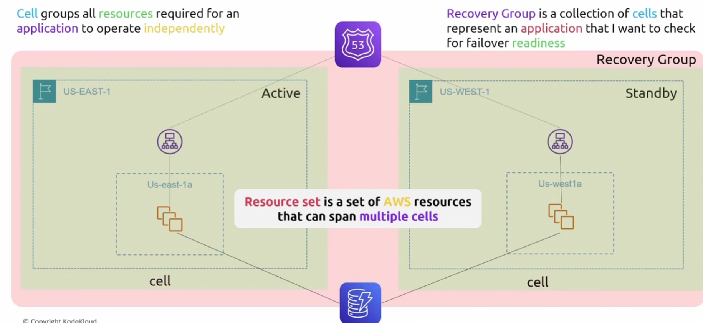

### 试题

1. An EC2 instance requires a static, public IP address that is reachable from the internet. What should a Solutions Architect assign to the instance?

   弹性IP

2. An enterprise wants to connect multiple VPCs and on-premises networks to a central hub, simplifying their network and reducing operational complexity. Which service should they implement?

   AWS Trans Gateway

3. Which AWS service can improve the performance of your users' traffic by optimizing the path to your application?

   AWS Global Accelerator

4. A Solutions Architect is designing a system where the load balancer must support host-based routing and SSL termination. Which AWS load balancer type is MOST suitable for these requirements?

   ALB

5. Two AWS accounts need to share resources within their VPCs while minimizing data transfer costs. What is the most cost-effective solution for this scenario?

   VPC peering

6. Which AWS feature allows a customer to consume AWS services and third-party services privately from their own VPC?

   AWS Private  Link

7. A company requires a dedicated and private connection between their on-premises network and their AWS VPC for compliance reasons. Which service should they use?

   AWS Direct connect

8. A company with multiple branch offices wants to securely connect their on-premises networks to their AWS VPC. Which AWS service provides a secure and private connection over the internet?

   AWS VPN site-to-site

9. A Solutions Architect needs to design a system where instances in a private subnet can access the internet without exposing their IP addresses. Which AWS service ensures high availability for this requirement?

   Nat Gateway

10. Which of the following are automatically configured in a default VPC?

    + Default security group rules that allow all inbound and outbound traffic.
    + An Internet Gateway attached to the VPC.
    + A set of subnets, one for each Availability Zone in the region.

11. A company wants to use Amazon Route 53 to direct users to different endpoints based on their geographic location to reduce latency. Which routing policy should they use?

    Geolcation routing policy

12. An organization is deploying a global application that requires DNS routing policies to direct traffic to the endpoint with the lowest latency for the user. Which Route 53 routing policy should they use?

    Latency routing

13. A company is looking to run their custom authentication logic at AWS edge locations to reduce latency and improve security. Which service should they use?

    AWS Lambda@Edge

14. A company has a legacy application that operates at the request level (Layer 7) and the connection level (Layer 4). They need a simple load balancer with flexible SSL/TLS termination. Which load balancer should they use?

    CLB
