## CIDR

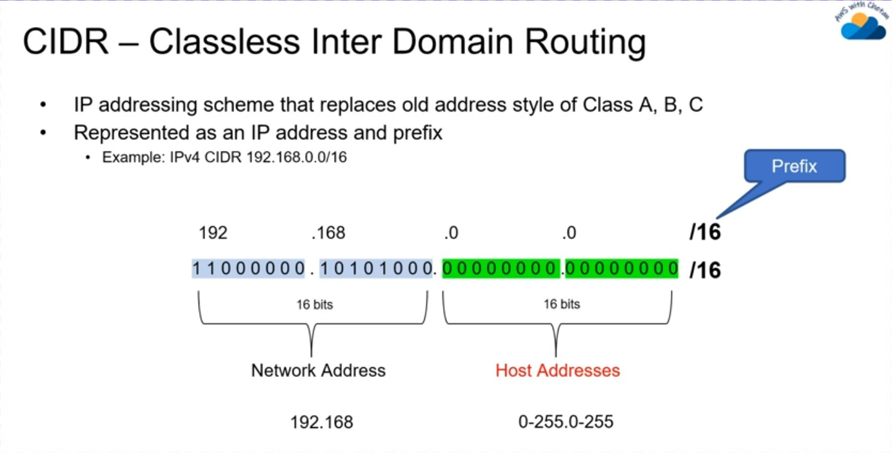

## subnet

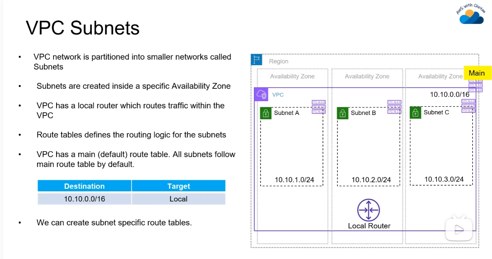

## internet gateway

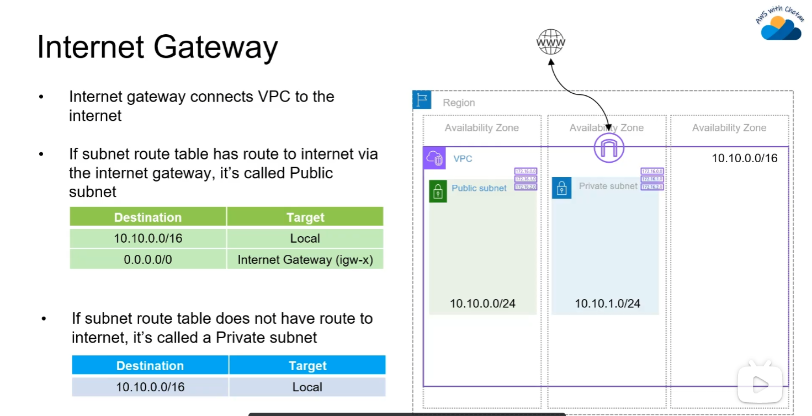

NAT Gateway

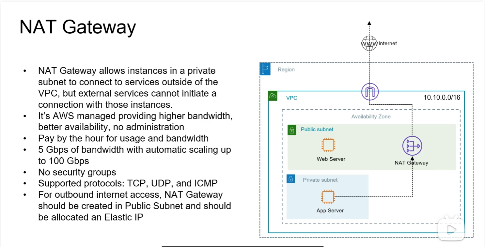

## Security and NACL

安全组是实例级别的防火墙， 然后在子网层级你你可以使用NACL 

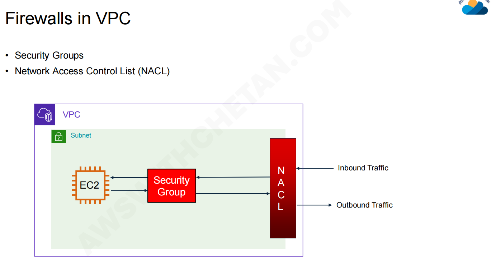

### NACL

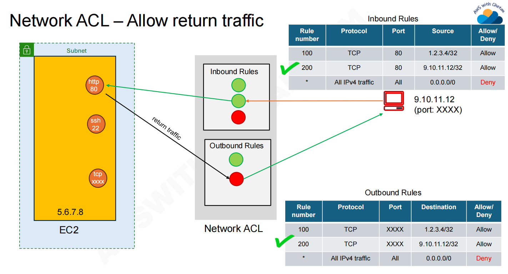

## VPC EP and Private Link 

在没有ep和link的场景下

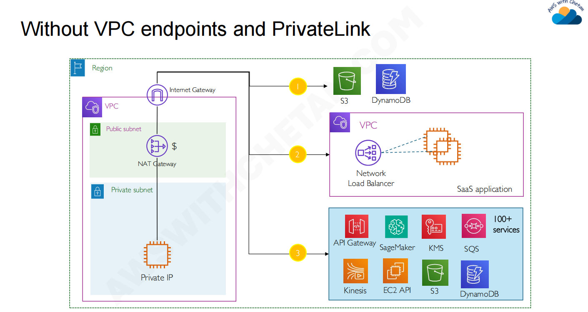

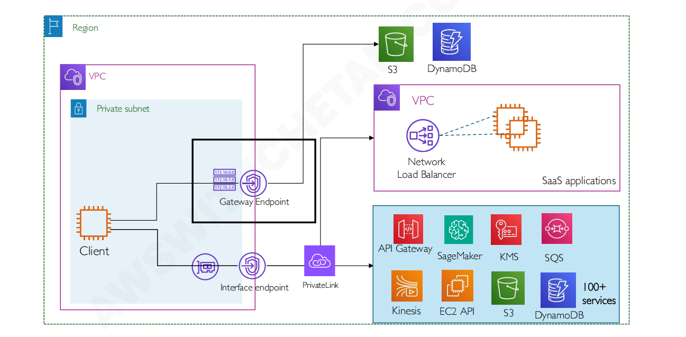

### VPC Gateway Endpoint

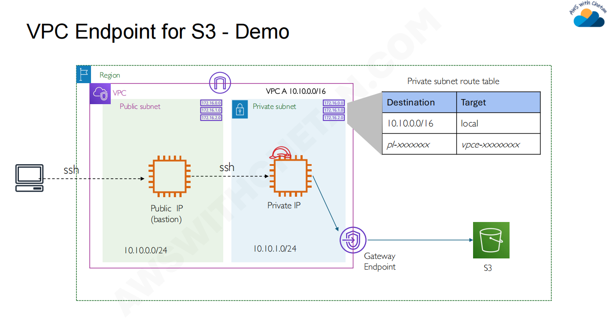

### VPC Interface endpoint

ENI会通过DNS获得一个私有IP,同时还有一个安全组

### VPC Endpoint Security 

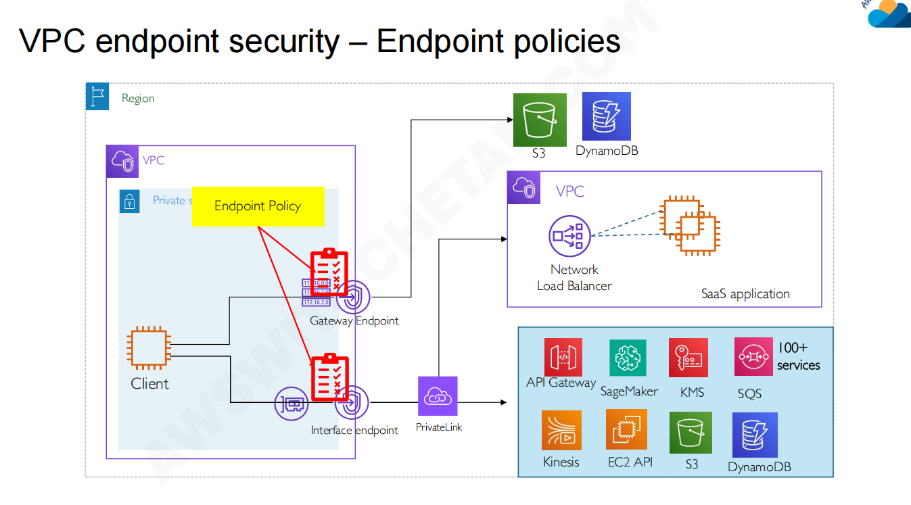

**Client (客户端):** 位于 VPC 的 **Private subnet (私有子网)** 中（通常是 EC2 实例或容器容器）。因为在私有子网中，它没有公网 IP，默认无法通过互联网网关 (IGW) 访问外部的 AWS 服务（如 S3、KMS 等）。

为了让私有子网中的 Client 访问 AWS 服务，图中展示了两种终端节点：

- **Gateway Endpoint (网关终端节点):**
  - **目标服务:** 仅支持 **Amazon S3** 和 **Amazon DynamoDB**（图右上方）。
  - **机制:** 它通过修改 VPC 的路由表来工作。当 Client 尝试访问 S3 时，流量会被路由到这个网关，直接进入 AWS 骨干网。
- **Interface Endpoint (接口终端节点 / 基于 AWS PrivateLink):**
  - **目标服务:** 支持绝大多数其他 AWS 服务（如右下方的 API Gateway, SageMaker, KMS, SQS 等 100 多种服务），以及跨 VPC 的第三方 **SaaS 应用程序**（图右侧中部，通过 Network Load Balancer 暴露）。
  - **机制:** 它会在你的私有子网中创建一个带有私有 IP 地址的弹性网络接口 (ENI)。Client 实际上是在与这个局域网内的私有 IP 进行通信，流量随后通过 PrivateLink 安全地转发到目标服务。

图中用醒目的黄色高亮了 **Endpoint Policy**，并用红色箭头指向了附加在两个终端节点上的“检查清单（策略规则）”。这是整张图的灵魂所在。

- **它是什么？** Endpoint Policy 是一种附着在 VPC 终端节点上的 IAM 资源策略 (Resource-based policy)。默认情况下，它是放行所有流量的 (`FullAccess`)。
- **它的安全作用 (纵深防御):** 它作为一个独立的网络边界网关，控制着**究竟哪些流量可以通过这个特定的网络出口**。
- **权限交集 (Least Privilege):** 终端节点策略**不会**取代 IAM 身份策略（附加在 Client 上的 Role）或目标资源的策略（如 S3 Bucket Policy）。一个请求要想成功，必须同时满足：
  1. Client 的 IAM Role 允许该操作。
  2. 目标资源的策略（如果有）允许该操作。
  3. **VPC Endpoint Policy 允许该流量通过。**

💡 典型的安全防御场景 (防数据外泄)

为什么需要 Endpoint Policy？假设你的 Client (EC2) 拥有 `s3:*` 的极宽泛 IAM 权限。 如果没有 Endpoint Policy，恶意程序或内部违规员工可以在该 EC2 上执行命令，将公司的敏感数据直接复制到**他们个人拥有的外部 AWS 账号的 S3 存储桶**中。因为流量走的是内网网关，传统的防火墙很难拦截。

**利用图中的 Endpoint Policy，你可以这样防御：** 你可以编写一个策略挂载在 Gateway Endpoint 上，明确规定：“通过此网关的流量，**只允许**访问属于我们公司账号的 `my-company-production-bucket`，拒绝访问任何其他 S3 存储桶”。

这样一来，即使客户端在 IAM 层面有极高的权限，只要数据试图离开 VPC 前往未授权的 S3 存储桶，就会在 VPC Endpoint 这一层级被直接拦截（图中的红色剪贴板进行校验并拒绝），从而实现了极强的数据防泄漏 (Data Exfiltration) 保护。

## Vpc Peering & Transit Gateway & VPC Endpoint (private Link)

当你需要跨vpc私密访问应用程序的时候，需要用到vpc peering 和 endpoint

### Using VPC Peering

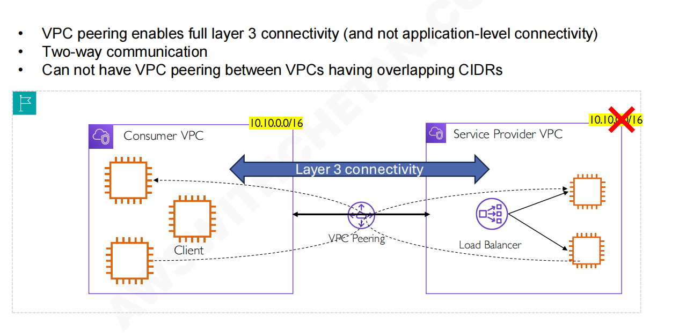

消费者和共给者的VPC的CIDR重合的，无法进行对等链接

### Using VPC endpoint (PrivateLink)

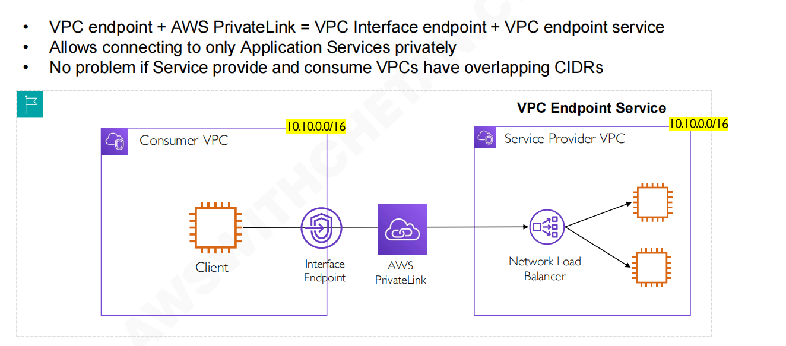

它是单向的，只有客户端才能发起请求

## Hybird Networking 

### AWS Site-to-Site VPN 

这种 VPN 旨在连接两个大型网络。它在你的本地数据中心（或另一个云 VPC）的网关与 AWS 的虚拟专用网关（Virtual Private Gateway）或 Transit Gateway 之间建立加密的 IPsec 通道。

### AWS Client VPN 

这种 VPN 旨在允许远程员工或个体通过互联网安全地访问 AWS VPC 中的私有资源。它本质上是一种托管的客户端 VPN 服务。

### AWS Direst Connect 

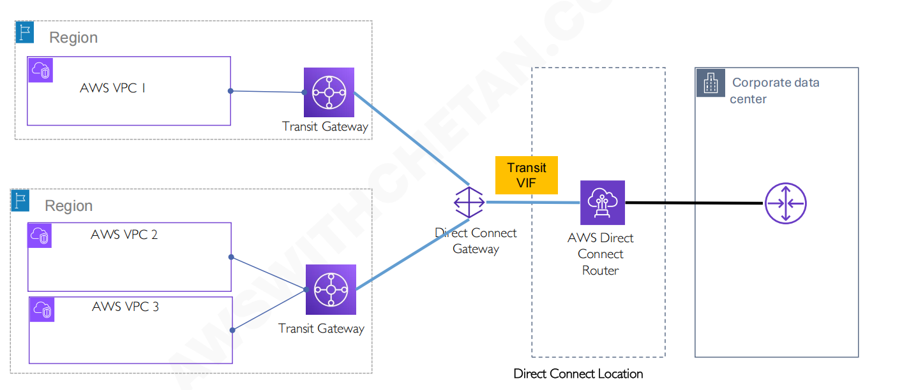

## VPC Traffic  Monitoring 

### VPC Flow Logs

捕获进出弹性网络接口（ENI）的 IP 流量信息：
+ 弹性网络接口流日志
+ 子网流日志
+ VPC 流日志

帮助监控和排查连接问题
+ 排查连接问题，例如：“为什么我的 EC2 无法连接到 RDS？”
+ 识别被安全组或网络 ACL（NACL）阻止的流量
+ 检测异常或可疑流量，例如异常高的出站流量
+ 验证跨子网 / 跨 VPC 的防火墙规则和网络配置
+ 通过检查高带宽使用情况进行成本分析

还可以捕获来自 AWS 托管接口的网络信息，例如：ELB、RDS、ElastiCache、Redshift、Amazon WorkSpaces 等。

启用 VPC 流日志不会影响网络性能。

流日志数据可以发送到 S3、CloudWatch Logs 或 Kinesis Data Firehose，用于存储和分析。

### Traffic Mirrorings 

