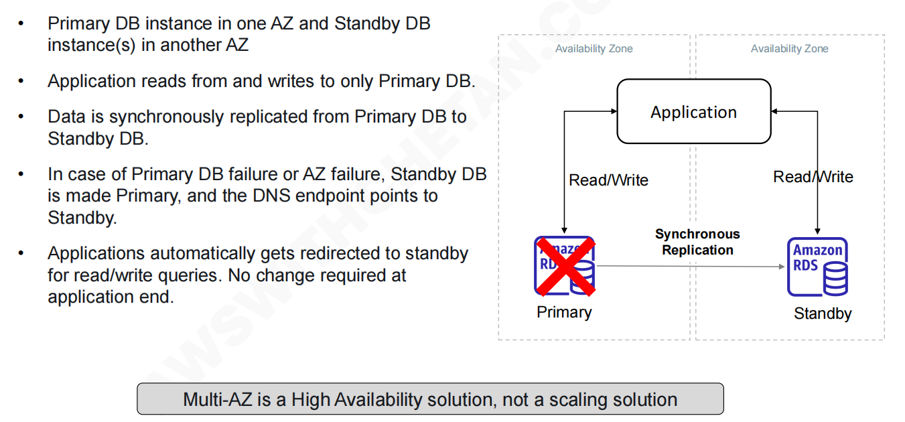
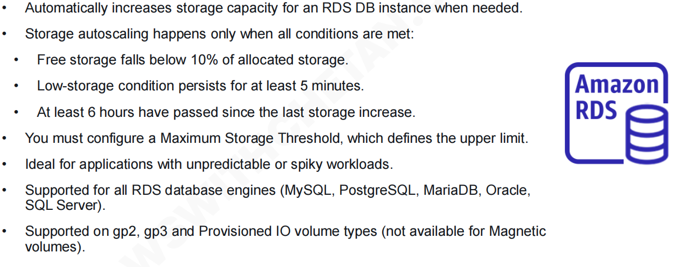
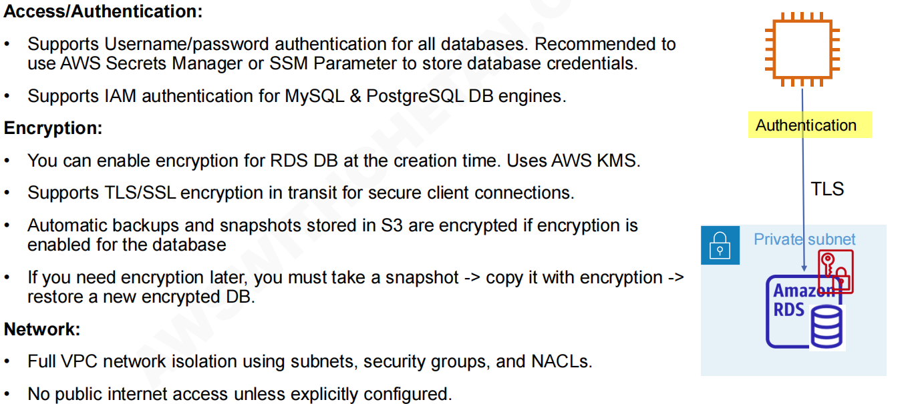
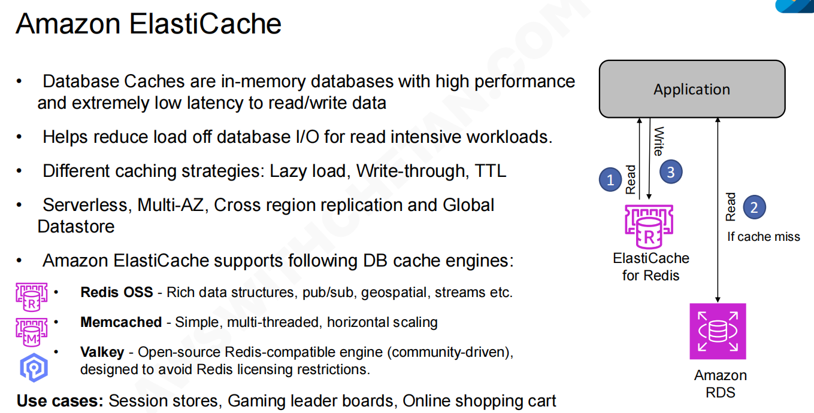

## RDS

### RDS - Multi-AZ Deploy	

### RDS - Read Replicas

### RDS - Storage autoscaling

### RDS - Custom

核心优势在于**在享受托管服务便利的同时，保留了对底层操作系统和数据库环境的极高控制权**。

### ⚠️ 重要操作提示 (Note)

- **停用自动化模式 (Automation Mode)**：当您准备对系统进行自定义修改（如安装软件或改配置文件）时，必须先将 RDS Custom 的“自动化模式”**暂停/停用**，以免 AWS 的自动化管理脚本与您的手动更改发生冲突。
- **最佳实践**：在进行任何底层更改之前，强烈建议先拍摄一个**数据库快照 (DB snapshot)**，以便在出现问题时可以快速回滚恢复。

### RDS - Backup

#### 手动快照 (Manual Snapshots)

- **持久化存储**：当您手动触发 RDS 数据库快照时，这些快照会被安全地存储在 **Amazon S3**（简单存储服务）中。
- **无限期保留**：与自动备份最多只能保留 35 天不同，手动快照**没有时间限制**，只要您不主动删除，它们可以一直保留下去 (retain as long as you want)。

### RDS - Security

## Amazon Aurora

### Aurora Global Database

### Aurora Cloning

### Aurora Serverless

### Aurora Machine Learning

## RDS Proxy

### 🛠️ 核心原理解析

**1. 连接池管理 (Connection Pooling)**

- **原理**：在传统的架构中，应用程序每次需要读写数据时，都会向数据库发起一个新的连接。建立和断开连接非常消耗数据库的 CPU 和内存资源。RDS Proxy 作为一个全托管的代理层，它会预先与后端的 RDS/Aurora 数据库建立并维护一批“长连接”（即连接池）。
- **作用**：当上层的应用程序（图中的 Lambda 或 ECS Tasks）需要访问数据库时，它们不再直接连接数据库，而是连接到 RDS Proxy。Proxy 会从自己的连接池中分配一个现有的连接给应用使用。用完后连接不销毁，而是放回池中。这就极大地减轻了数据库建立连接的压力。

**2. 极速故障转移 (Failover)**

- **原理**：在多可用区（Multi-AZ）架构中，如果主数据库发生故障，AWS 会自动将备用数据库提升为主库。如果没有代理，应用程序会立刻遭遇连接断开的错误，并需要自己编写代码来重试。
- **作用**：RDS Proxy 能够智能地感知底层数据库的故障。在故障转移期间（转移时间最高可缩短 66%），Proxy 会自动把应用程序的请求“排队”挂起（屏蔽底层错误）。等新的主库就绪后，Proxy 自动将请求发送过去。**对应用程序来说，它们不需要修改任何代码（no code changes）**，只会感觉到一次稍微长一点的查询延迟，而不会报错崩溃。

**3. 安全性增强 (Security)** 从图右侧的架构流向可以看出 RDS Proxy 的安全设计：

- **IAM 身份验证**：您的应用程序（Lambda/ECS）可以使用 **签名的 IAM 身份验证令牌 (Signed IAM authentication token)** 来连接 Proxy，这意味着开发人员再也不需要在代码里硬编码数据库密码了。
- **凭据管理集成**：Proxy 接收到应用的请求后，会向黄色的 **Secrets Manager**（AWS 的密钥管理服务）请求真实的数据库账号密码，然后再用这些真实的凭据去连接底层的 Amazon RDS 或 Aurora。
- **网络隔离**：RDS Proxy 永远部署在私有网络（VPC）内部，不提供公网访问，从网络层面保证了绝对的安全。

## Amazon ElastiCache

## Amazon DynamoDB

