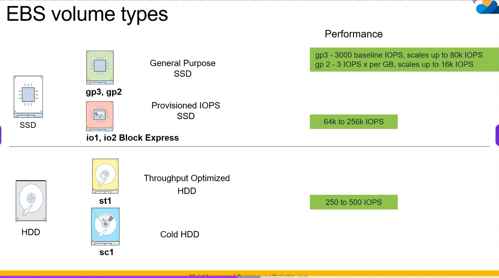
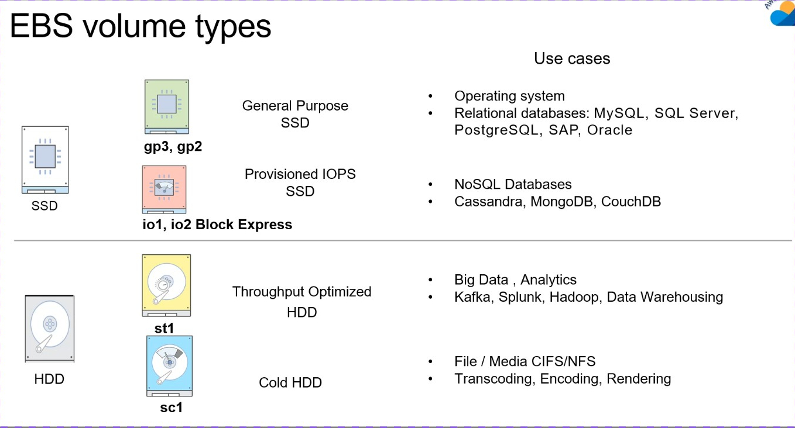
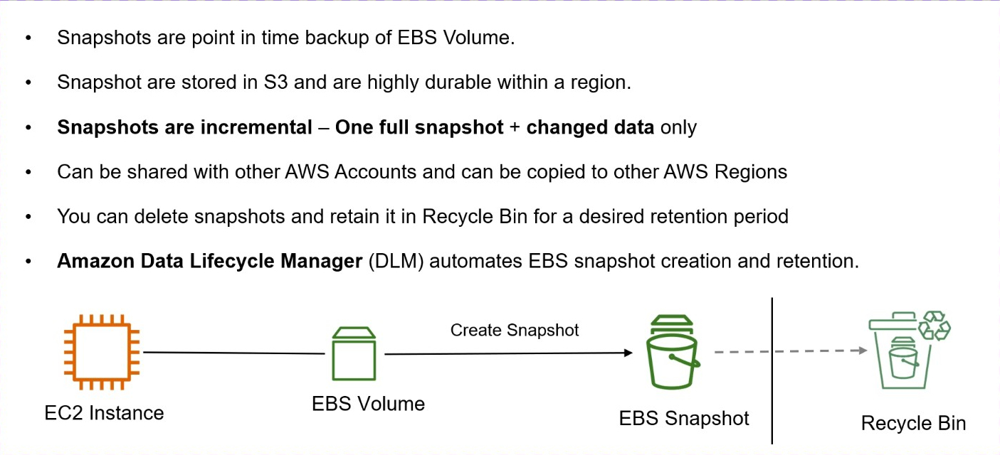

## EBS

### Volume Type



gp3 / gp2（通用型 SSD）,一般选gp3

io1 / io2（高端 SSD，PIOPS）

👉 **专门给“高性能数据库”用的**

- IOPS：**64,000 ～ 256,000**
- 可以精确设置（PIOPS）

io2 Block Express（更猛）

- 更高吞吐、更低延迟
- 企业级数据库（Oracle / SAP）

#### 场景



| 场景                    | IO模式      | 关键指标     |
| ----------------------- | ----------- | ------------ |
| 数据库（MySQL / Redis） | 随机 + 小IO | ✅ IOPS       |
| Web服务                 | 小文件多    | ✅ IOPS       |
| Hadoop / Spark          | 顺序 + 大IO | ✅ Throughput |
| 日志分析                | 顺序写      | ✅ Throughput |
| 视频/备份               | 大文件      | ✅ Throughput |

### 快照


### 术语




#### 1. IOPS（每秒读写次数）

- 全称：Input/Output Operations Per Second
- 表示：**每秒可以进行多少次读/写操作**

👉 可以理解为：

- IOPS = “一秒能处理多少个请求”

📌 举例：

- 数据库：大量小数据查询 → 非常依赖 IOPS

------

#### 2. Baseline IOPS（基础 IOPS）

- 系统默认保证给你的性能（最低性能）
- 不额外配置时的“保底速度”

👉 类似：

- 你买的云盘默认给你 3000 IOPS，这就是 baseline

------

#### 3. PIOPS（预配置 IOPS）

- 你可以**手动指定 IOPS**
- 比如直接设：10000 / 20000 IOPS

👉 适合：

- 数据库（MySQL / Redis）
- 高并发系统

📌 核心：

- 花钱买性能
- 稳定，不靠运气

------

#### 4. Burst（突发性能 / 积分机制）

这是很多人第一次最容易懵的👇

原理：

- 空闲时 → 积累“性能积分”
- 忙的时候 → 用积分换更高 IOPS

👉 类似：

- 平时省钱（积累积分）
- 高峰期疯狂花（爆发性能）

作用：

- 小盘也能应对**偶尔的高峰**

📌 但注意：

- 积分用完 → 掉回 baseline
- 不适合长期高负载

------

#### 5. Throughput（吞吐量 MB/s）

- 每秒能传输多少数据（单位 MB/s）

👉 可以理解为：

- Throughput = “一秒搬多少数据”

| 指标       | 关注点   | IO大小          |
| ---------- | -------- | --------------- |
| IOPS       | 操作次数 | 小IO（4K / 8K） |
| Throughput | 数据量   | 大IO（1MB+）    |

### EBS 性能监控 + 如何保证性能稳定（EBS-Optimized）

#### 常用指标解释

+ VolumeReadOps / VolumeWriteOps
  + 每秒读/写次数（ **IOPS 实际使用量**）
  +  用来判断：有没有打满 IOPS 上限

+ VolumeReadBytes / VolumeWriteBytes
  + 每秒读/写的数据量（字节）（**吞吐量（MB/s）**）
  + 用来判断：是否受限于带宽（吞吐）
+ VolumeQueueLength（重点！）
  + IO 队列长度（有多少请求在排队）
  + 非常关键：
    + 正常：接近 0
    + 异常：持续 > 1 / > 5
  + 含义： **磁盘忙不过来了（瓶颈出现）**

------

#### 一个排查套路（非常实用）

如果你线上服务卡顿：

1. 看 QueueLength
   - 高 → 肯定有问题
2. 看 IOPS
   - 已经打满 → 该升 IOPS（gp3 / io2）
3. 看 Throughput
   - 打满 → 提高带宽

------

#### EBS-Optimized 实例（很多人忽略的关键点）

📊 举个例子

- 带宽：100 MB/s
   👉 意味着：
- 一秒最多传 100MB 数据

不管你是：

- 磁盘读数据
- 还是网络发数据

👉 **都要走这条“路”**

#### ❌ 没有 EBS-Optimized 的情况

👉 结构是这样的：

```
        [EC2实例]
           |
   ┌───────┴────────┐
   |                |
磁盘IO          网络流量
   |                |
   └──── 共用一条带宽 ────>
```

#### EBS-Optimized 是怎么解决的？

👉 AWS 做了一件事：

```
        [EC2实例]
           |
   ┌───────┴────────┐
   |                |
磁盘IO          网络流量
   |                |
   |                |
专用带宽        专用带宽
```