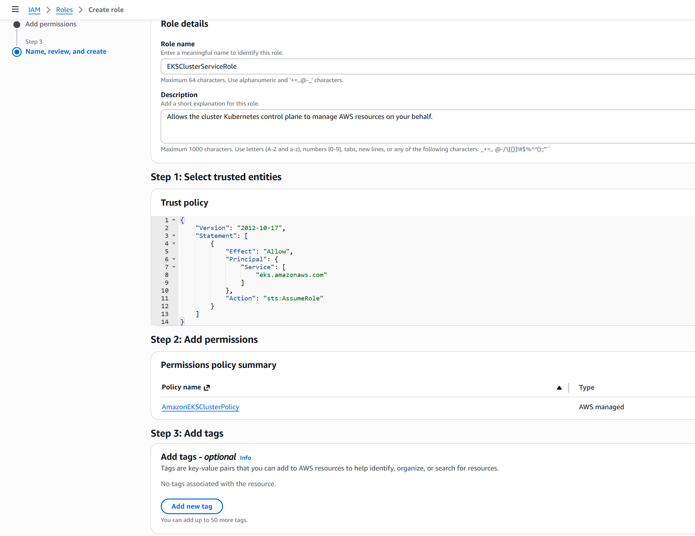
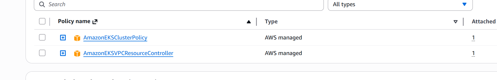

## 工具和权限配置

1. 安装aws eksctl   kubectl  helm 等工具
2. 创建用户 设置policy 生成access key  , 然后aws configure 生成配置
3. ssh key

## 创建VPC

使用CloudFormation

```
https://s3.us-west-2.amazonaws.com/amazon-eks/cloudformation/2020-10-29/amazon-eks-vpc-sample.yaml
```

## 创建IAM Role

之前创建的iam 用户是下达指令的“总指挥”，而底层自动运行的 EC2 机器和 EKS 控制平面则是具体的“执行者”。为了让这些“执行者”能够顺畅地与 AWS 其他系统（如 VPC、ECR、ELB）打交道，我们必须给它们颁发受限的“临时工作证”—— IAM Role  。



同时还需要另外一个policy



这样我们就拿到了`ARN`

```
arn:aws:iam::5659xxx:role/EKSClusterServiceRole 

arn:aws:：标准前缀，表示这是一个 AWS 云资源。

iam:：代表该资源属于 Identity and Access Management (IAM) 服务。

::：这两根冒号中间通常填写区域（如 us-east-1），但由于 IAM 是全球级别的服务，不区分地域，因此这里留空。

5659xxx：这是该角色所在的 AWS 账户 ID。这是非常关键的一环，确保了名称相同的角色在不同账户间不会混淆。

role/EKSClusterServiceRole：指明了资源的具体类型是“角色 (role)”，且该角色的名称为 EKSClusterServiceRole。
```

1. `AmazonEKSClusterPolicy` (集群大管家)
   + **核心作用：** 这是 EKS 最核心的基础策略。它授予了 Kubernetes 控制平面（Master Nodes）管理底层 AWS 基础设施的通用权限。
   + **具体职责：** 它允许 EKS 控制平面与 AWS 的计算和负载均衡服务打交道。例如，当您的集群需要向 EC2 Auto Scaling 注册节点，或者在您部署对外暴露的服务时去自动配置 Elastic Load Balancing (ELB) 负载均衡器，依赖的都是这个基础权限。

2. `AmazonEKSVPCResourceController` (Pod 网络特派员)
   + **核心作用：** 这个策略是专门针对 Kubernetes 内部网络（Amazon VPC CNI）的。
   + **为什么独立出来？** 早期 EKS 确实主要依赖第一个策略。但后来为了支持更高级的网络功能（例如为每个 Pod 独立分配 IP，以及为单个 Pod 绑定特定的安全组——Security Groups for Pods），AWS 在 EKS 控制平面中引入了一个专门的组件叫做 "VPC Resource Controller"。
   + **具体职责：** 这个策略专门授权该控制平面组件去调用 Amazon VPC API，为您的 Kubernetes Pods 分配 IP 地址和管理弹性网络接口（ENI）。

## 创建集群

```yaml
apiVersion: eksctl.io/v1alpha5
kind: ClusterConfig

metadata:
  name: eks-cluster-01
  region: ap-southeast-1

vpc:
  id: "vpc-aaaa"
  subnets:
    public:
      apsoutheast1a:
        id: subnet-xxxx
      apsoutheast1b:
        id: subnet-yyyy
      apsoutheast1c:
        id: subnet-zzzz

managedNodeGroups:
  - name: ng-1-workers
    labels: { role: workers }
    instanceType: t2.micro
    desiredCapacity: 2
    maxPodsPerNode: 100
    minSize: 1
    maxSize: 4
    ssh: 
      allow: true 
      publicKeyName: xxxx
    tags:
      k8s.io/cluster-autoscaler/enabled: "true"
      k8s.io/cluster-autoscaler/eks-cluster-01: "owned"

iam:
  withOIDC: true
  serviceRoleARN: arn:aws:iam::xxxxxxxxx:role/EKSClusterServiceRole
```

```shell
eksctl  create cluster   -f cluster.yaml

eksctl delete cluster --name=eks-cluster-01 --region=ap-southeast-1 --wait


eksctl get cluster
eksctl get nodegroup --cluster eks-cluster-01
aws eks update-kubeconfig --region ap-southeast-1 --name eks-cluster-01
```

