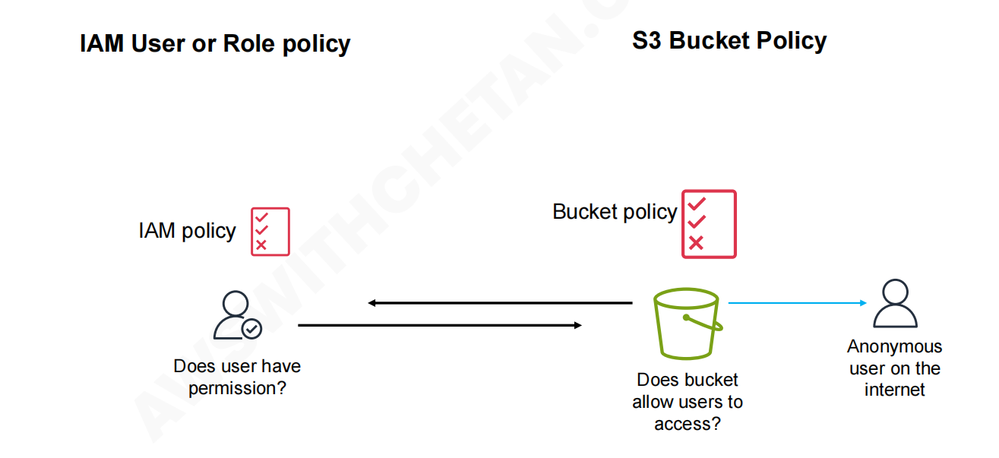
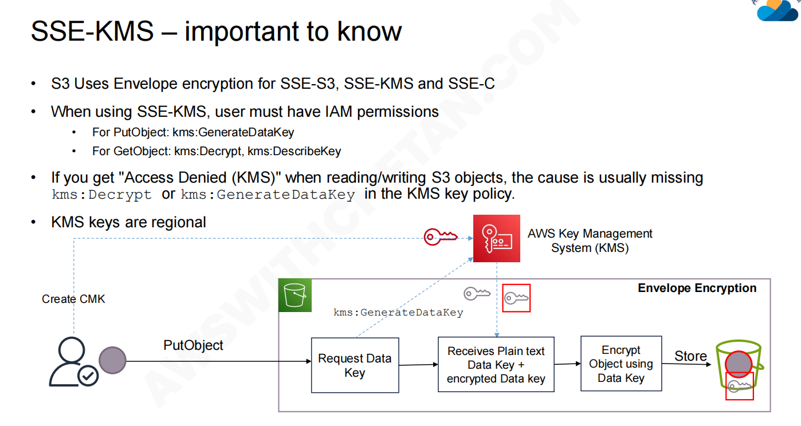

## Storage Classes

### 1. 频繁访问的对象 (Frequently Accessed Objects)

这是为经常需要读取和写入的数据设计的。

- **S3 Standard (通用型):** 最常用的默认存储类，适用于各种通用工作负载。
- **11 个 9 的持久性:** 图片强调了它提供 `99.999999999%` 的数据持久性，意味着数据丢失的概率极低。

### 2. 不常访问的对象 (Infrequently Accessed Objects)

适用于访问频率较低，但在需要时仍要求快速访问的数据。通常存储成本较低，但检索数据时会收取一定费用。

- **Standard-IA (标准-不频繁访问):** 数据存储在多个可用区，提供高可用性。
- **S3 One Zone-IA (单区-不频繁访问):** 数据仅存储在一个可用区中。成本比 Standard-IA 更低，但如果该可用区发生故障，数据可能会丢失。

### 3. 自动在存储类之间移动数据 (Automatically move Data across storage classes)

- **S3 Intelligent-Tiering (智能分层):** 这个存储类通过监控数据的访问模式，自动将数据移动到最经济的访问层（例如从频繁访问层移到不频繁访问层），从而在不影响性能的情况下优化成本。

### 4. 归档对象 – S3 Glacier (Archiving Objects)

专为长期数据归档设计的存储类，存储成本极低，但检索数据可能需要几分钟到几小时不等。

- **S3 Glacier Instant Retrieval (即时检索):** 用于需要毫秒级检索的长期归档数据。
- **S3 Glacier Flexible Retrieval (灵活检索):** 以前称为 S3 Glacier，提供从几分钟到几小时的灵活检索选项，免费批量检索。
- **S3 Glacier Deep Archive (深度归档):** 成本最低的存储类，用于极少访问且可以容忍几小时检索时间的长期保留数据（如合规性备份）

## S3 Security

### Bucket Policy



S3 存储桶策略是一种基于资源的 IAM（身份和访问管理）策略，你可以将它附加到特定的 S3 存储桶上，用来集中规定“谁”可以从“哪里”访问这个存储桶里的数据。

例如四种常见的利用 Bucket Policy 限制网络访问的场景：

- **Restrict access from specific VPC (限制来自特定 VPC 的访问):** 你可以配置策略，仅允许来自你指定的 Amazon Virtual Private Cloud (VPC) 内部的请求访问该 S3 存储桶，拒绝其他所有网络的访问。
- **Restrict access from specific VPC endpoint (限制来自特定 VPC 端点的访问):** VPC Endpoint 提供了一种让你的 VPC 私密连接到 S3 的方式，流量无需经过公共互联网。你可以设置策略，严格要求只能通过你配置的那个特定 VPC 端点（VPCe ID）来访问 S3。
- **Restrict access from VPC source IP ranges (限制来自 VPC 源 IP 范围的访问):** 更细粒度的控制，你可以指定 VPC 内部的某一段具体的 IP 地址（CIDR 块），只有这些 IP 发出的请求才被允许。
- **Restrict access from specific external IP (限制来自特定外部 IP 的访问):** 这用于公网访问控制。你可以设置一个白名单，例如只允许你公司办公室出口的公网 IP 地址或者特定客户端的 IP 地址来访问该 S3 存储桶。

### Encryption

#### 1. 服务端加密 (Server-side encryption)

在这种模式下，加密的重任交给了云服务商（S3）。

- **工作原理**：用户通过加密通道（HTTPS/TLS）将普通（未加密）的数据发送给 S3。S3 在将文件真正写入磁盘存储之前，会**自动对其进行加密**。当用户再次请求读取该文件时，S3 会在后台自动解密，然后将明文数据返回给用户。
- **支持的密钥类型**：
  - **SSE-S3**：使用 S3 完全托管的密钥。
  - **SSE-KMS**：使用 AWS Key Management Service (KMS) 托管的密钥，提供更好的审计和权限控制。
  - **SSE-C**：使用客户自己提供的密钥（Customer-provided keys），S3 只负责计算，不保存密钥。

#### 2. 客户端加密 (Client-side encryption)

在这种模式下，用户将加密的控制权完全掌握在自己手中。

- **工作原理**：数据在**离开用户的设备（客户端）之前，就已经被用户自己加密了**。加密后的密文通过网络（HTTPS/TLS）上传并直接原样保存在 S3 中。
- **隐私与安全**：因为加密是在客户端完成的，S3 对用户的加密算法和密钥**一无所知**。S3 只是把它当成普通的数据块存储起来，没有任何能力去解密这些对象。用户在下载后，也必须在自己的设备上进行解密。

#### SSE-KMS – important to know



- **SSE-KMS:** 服务器端加密。当你把文件上传到云端（比如 Amazon S3 存储桶）时，云服务器会自动帮你把文件加密存起来。它使用的是 AWS KMS（密钥管理服务）来管理这些加密钥匙。
- **Key ID / ARN:** 这是密钥的**“身份证号”**或**“对外名字”**。你的应用程序代码里写的就是这个名字。
- **Key Material (密钥材料):** 这是底层真正用来执行数学加密/解密运算的**“真实密码”**。

## S3 Versioning

## S3 Lifecycle  

**AWS S3（Amazon Simple Storage Service）生命周期规则** 的核心概念和限制条件。S3 生命周期规则用于自动管理对象的存储层级（例如将较少访问的数据转移到更便宜的“冷存储”层），以优化存储成本。

### Rule

### Replication

① 跨区域复制会产生数据传输费用

这属于 **Cross-Region Replication，跨区域复制**，会产生跨区域数据传输费用。

如果只是同一区域内两个 Bucket 复制，一般叫 **Same-Region Replication**。

------

② 加密对象需要额外权限

如果源 Bucket 里的对象用了加密，尤其是`SSE-KMS`那么复制时需要给 IAM Role 额外权限。

因为 S3 复制过程需要：

```
读取源对象
解密源对象
复制到目标 Bucket
可能还要用目标 KMS Key 再加密
```

所以需要相关的 KMS 权限，例如：

```
kms:Decrypt
kms:Encrypt
kms:GenerateDataKey
```

否则复制可能失败。

------

③ 可以使用过滤条件控制复制范围

不是所有对象都必须复制。可以根据：

```
对象前缀 prefix
对象标签 tags
```

来控制哪些对象参与复制。例如只复制日志目录

------

④ 不支持复制链式传递

如果对象从 Bucket A 复制到了 Bucket B，S3 不会再把这个“复制来的对象”继续自动复制到 Bucket C。

------

⑤ RTC 可以提供 15 分钟复制 SLA

RTC 是`Replication Time Control`它可以提供更强的复制时间保证。意思是开启 RTC 后，AWS 承诺大多数新对象会在 15 分钟内复制到目标 Bucket。

这个适合对复制延迟敏感的场景，例如：

```
跨区域灾备
金融合规数据
实时日志备份
重要用户上传内容
```

不过 RTC 通常会产生额外费用。

------

⑥ 可以用 CloudWatch 监控复制状态

S3 复制不是配置完就完全不用管，最好监控复制状态。可以通过 CloudWatch Metrics 查看：

| 指标                           | 含义               |
| ------------------------------ | ------------------ |
| Bytes pending replication      | 等待复制的数据量   |
| Replication latency            | 复制延迟           |
| Operations pending replication | 等待复制的操作数量 |
| Operations failed replication  | 复制失败的操作数量 |

还可以通过：`S3 Event Notification`接收复制失败通知。

## S3 Event Notification

需要附加基于资源的额策略

## S3 Event Scenarios(场景)

**1. 场景：** 每当用户将个人头像上传到 `images/` 文件夹时，立即生成图像缩略图。 

​    => **解决方案：** 使用 S3 事件通知（Event Notification）触发 Lambda，Lambda 可以处理该图像并创建缩略图。

**2. 场景：** 合规团队希望审计每一个 S3 API 调用（包括 PUT、DELETE、标签更改、接入点使用以及内部 S3 事件），并将它们路由到一个中央审计账户。

​     => **解决方案：** 使用 Amazon EventBridge 将所有的 S3 API 调用路由到集中的审计账户。

**3. 场景：** 视频处理流水线需要对上传的视频进行排队以进行后台处理，并使用可自动扩展的消费者集群（consumer fleet）。

​     => **解决方案：** 使用事件通知发送到简单队列服务 (SQS)，将视频（对象）的元数据（如路径、日期、大小等）发送到 SQS 队列。队列中的这些消息将由下游应   用程序（如 Lambda 或 ECS 任务）进行异步处理。

**4. 场景：** 新闻应用程序需要在新文章上传后，立即向多个订阅者扇出（fan-out）通知（电子邮件、短信、移动端推送）。 

​     => **解决方案：** 使用 S3 事件通知发送到简单通知服务 (SNS) 主题。该主题应由最终用户 / 移动设备订阅。

**5. 场景：** 财务团队希望每当有 `.csv` 报告放入 `reports/` 文件夹时，能够触发跨多个 AWS 账户的月度计费工作流。 

​    => **解决方案：** 使用 Amazon EventBridge 触发跨多个 AWS 账户的 AWS Step Functions 工作流。

**6. 场景：** 媒体归档系统希望在 Glacier 恢复完成时，自动使用 Lambda 处理归档文件。

​    => **解决方案：** 当生成 Glacier 恢复事件时，使用 S3 事件通知触发 Lambda。

## S3 performance optimization

### Amazon S3 性能优化策略

- **1. Prefix partitioning（前缀分区）—— GET/PUT 事务优化**

  - Amazon S3 具有极高的扩展性，它会在内部根据对象键（Object Key）的“前缀（Prefix，通常指文件路径中的目录部分）”来自动分布和管理你的数据。
  - **优化原理：** 如果你的应用程序需要极高的请求速率（例如，目标是每秒超过 3500 个写入请求或 5500 个读取请求），将文件分散存储在多个不同的前缀下，可以强制 S3 在后台使用多个分区来并行处理你的请求。这可以有效避免单个分区的性能瓶颈，从而最大化 I/O 吞吐量。

- **2. Multi-part Upload and byte-range fetches（分段上传和字节范围提取）—— 数据上传和检索优化**

  + **媒体流 (Media streaming):** 当用户观看在线视频时，播放器不需要下载完整个几 GB 的视频文件才能开始播放。它可以使用字节范围提取，提前下载接下来几秒钟或几分钟的视频数据块（缓冲），从而实现流畅的边下边播。

  + **大文件下载 (Large file downloads):** 利用上述的并行下载机制，通过多线程分块下载，显著提高超大文件的整体下载速度。

  + **需要部分读取的 ETL 工作负载 (ETL workloads needing partial reads):** 假设你有一个几十 GB 的日志文件或 CSV 文件，但你只想读取文件的头部元数据，或者如果你知道特定数据的精确字节偏移量，你可以直接提取那一部分，而无需将整个巨型文件拉取到你的处理服务器上。

  + **可恢复下载 / 断点续传 (Resumable downloads):** 如果用户在下载一个大文件时网络中断（例如下载到了 500MB 处断开），当网络恢复时，应用程序可以使用字节范围提取，请求从 500MB 之后的位置继续下载，而不需要从 0 开始重新下载。

- **3. S3 Transfer Acceleration（S3 传输加速）—— 长距离网络延迟优化**

  - 当用户与 S3 存储桶之间的地理距离很远（例如，跨大洲传输大文件）时，普通的互联网路由可能会导致高延迟和丢包。
  - **优化原理：** 此功能利用了 Amazon CloudFront 的全球边缘站点（Edge Locations）网络。客户端的数据会被路由到离他们最近的 AWS 边缘节点，然后再通过 AWS 内部经过优化的全球高速骨干网络传输到目标 S3 存储桶。这能大幅缩短长距离传输所需的时间。

- **4. Amazon CloudFront —— 使用缓存优化频繁访问的数据**

  - CloudFront 是 AWS 提供的内容分发网络 (CDN) 服务。
  - **优化原理：** 如果你的 S3 存储桶中包含被大量用户频繁读取的数据（如热门图片、视频、静态网页资产等），你可以将 S3 作为 CloudFront 的源（Origin）。CloudFront 会将这些数据**缓存**在全球各地的边缘节点上。当用户请求数据时，会直接由离用户最近的节点提供缓存内容，这不仅极大地降低了用户的访问延迟，还减少了直接向 S3 发起请求的次数，从而降低了 S3 的数据传出成本。

```shell
$aws s3api get-object --bucket amzn-s3-demo-bucket1 --key folder/my_data --range bytes=0-500 my_data_range.output

aws s3api get-object: 这是调用 S3 API 下载对象的标准命令。

--bucket amzn-s3-demo-bucket1: 指定目标 S3 存储桶的名称。

--key folder/my_data: 指定要下载的文件的具体路径和名称。

--range bytes=0-500: 这是实现优化的关键参数！ 它明确告诉 S3：“我只要这个文件从第 0 个字节到第 500 个字节的数据”。

my_data_range.output: 指定将下载下来的这 500 个字节的数据保存在本地的哪个文件里。
```

### s3 Transfer  Acceleration

#### AWS 边缘网络与服务 (AWS edge network and services)

通过让用户就近接入 AWS 的专用网络，从而减少网络延迟（Latency）。

**没有使用 AWS 边缘网络的情况 (Without AWS edge network )：**

- 想象你要把一个包裹从你的电脑（End user）寄到 AWS 的数据中心（Region）。
- 包裹会经过你当地的网络运营商（Local ISP），然后进入公共互联网。
- 在公共互联网上，包裹需要经过无数个中转站。每次中转都会消耗时间，而且路线曲折，网络拥堵时还容易变慢或丢失数据。

**使用了 AWS 边缘网络的情况 (With AWS edge network)：**

- AWS 在全球各地设立了很多“边缘节点”（**Edge Location**），就相当于建立在你家门口的“专属快递代收点”。
- 你的包裹只需很短的距离就能到达离你最近的边缘节点。
- 一旦包裹进入边缘节点，它就会走 AWS 自己铺设的高速公路——**AWS 骨干网 (AWS Backbone network)**。这是一条专线，没有其他公共网络的干扰，直线直达目标数据中心（Region），速度快且非常稳定。

利用此技术实现加速的 AWS 服务：

+ **Amazon CloudFront**（内容分发网络）
+ **AWS Global Accelerator**（全球加速器）
+ **AWS S3 Transfer Acceleration**（S3 传输加速）。

#### S3 传输加速 (S3 Transfer Acceleration, 简称 S3TA)

**它的核心作用：**

- **大幅提速：** 专门用于加速向 AWS S3上传或下载文件的速度。对于**长距离、大文件**的传输，速度可以提升 **50% 到 500%**。
- **底层原理：** 它正是利用了“边缘节点”和“AWS 骨干网”，外加一些网络协议的优化。

**具体案例演示 :**

- 假设一个**在日本的用户 (User in Japan)**，想要把一个大视频文件上传到位于**美国弗吉尼亚州北部的 S3 存储桶 (Bucket in N. Virginia)**。
- 如果走普通互联网，跨越太平洋会非常慢。
- 开启 S3TA 后，日本用户的电脑会先把文件传到**离他最近的日本边缘节点 (Edge Location)**。
- 接着，文件搭上高速且畅通无阻的 **AWS 骨干网 (AWS Backbone network)**，瞬间跨越半个地球，直接抵达美国弗吉尼亚的存储桶。

**如何使用：**

- 管理员可以在 S3 存储桶的设置里随时开启或关闭这个加速功能。
- 开启后，系统会提供一个专门的加速专属域名（例如 `bucket-name.s3-accelerate.amazonaws.com`），用户通过这个链接上传下载，就能享受专线加速了。

#### S3 with  amazon CloudFront

如果说S3 传输加速（S3TA）是为你专门开辟了一条“寄送包裹的直达高速专线”，那么 CloudFront 就像是“把热销商品提前存放在你家门口的本地分发仓库”。

+ **什么是 CloudFront (CDN)：** Amazon CloudFront 是一个 **CDN（Content Delivery Network，内容分发网络）** 服务。CDN 的目的就是把内容分发到全球各地离用户最近的节点上，让用户能以最快的速度打开网页或看视频。

+ **支持多种“源站” (Origins)：** “源站”也就是文件最原始存放的地方（可以理解为总仓库）。CloudFront 可以和多种源站配合使用，最常见S3 存储桶 。

+ **缓存静态内容 (Caching static contents)：** 这是 CloudFront 的核心魔法。它会把那些不会频繁变动的内容（静态内容，比如网站上的图片、视频、HTML 网页等），复制一份存放在全球各地的**边缘节点 (Edge locations)** 上。这就叫“缓存”。

+ **节省成本 (Reduced Data transfer out rate)：** 当用户直接从 S3 存储桶下载文件到公共互联网时，AWS 会收取一定的数据传出费用。但是，如果通过 CloudFront 传出数据，费用通常会更低，而且它每个月还提供 1TB 的免费传出额度。

### S3其他特性

#### S3 Batch Operations

提供了丰富的内置动作，并支持高度定制化：

- **复制对象：** 允许在不同的存储桶之间，或者在同一个存储桶内批量复制对象。在复制的同时，你还可以选择对数据进行重新加密。
- **标签管理：** 批量替换或删除大量对象的标签 (Tags)。
- **权限修改：** 批量修改大量对象的访问控制列表 (ACLs)。
- **归档恢复：** 批量恢复大量存储在 S3 Glacier 存储类中的冷数据或归档对象。
- **对象锁定：** 批量启动或更改 S3 对象锁定 (Object Lock) 的保留期限设置，通常用于满足合规性审查。
- **执行 AWS Lambda 函数：** 这是一个极其灵活的高级选项。如果内置的 API 操作无法满足你的特殊需求，你可以选择调用 AWS Lambda 函数。例如，你可以编写一段代码用来批量转码图片、压缩文件或提取数据，然后让 Batch Operations 自动触发该函数去处理清单中的每一个独立对象。

使用场景

- **批量更新或处理：** 结合 Lambda 函数，对海量文件进行统一的数据清洗或格式转换。
- **大型数据迁移：** 在不同的 AWS 区域或存储桶之间高效、可靠地转移数以亿计的文件。
- **元数据清理：** 周期性地统一修改大量文件的标签或访问权限，保持存储桶的整洁与安全。
- **对象锁定变更：** 为了满足法律或行业的合规性要求，大批量调整文件的防篡改保留期限。
- **从归档中恢复：** 快速唤醒大量沉睡在 Glacier 归档中的历史日志或媒体文件，以供大数据分析平台使用。

#### S3 CORS

##### 什么是 CORS 以及它的工作原理？

- **同源策略 (Same-Origin Policy)：** 默认情况下，浏览器门卫有一条铁律：只允许同一个小区（同源/同域名）的人互相串门。这就叫同源策略，是为了防止恶意的网站窃取你的数据。
- **跨源请求 (Cross-Origin)：** 当你网站的代码（比如运行在 `https://myapp.com` 上的 JavaScript）试图去访问属于另一个域名的资源（比如 `https://mybucket.s3.amazonaws.com`）时，这就叫“跨源请求”。
- **CORS 的作用：** CORS 是一种安全机制，它允许服务器（在这里是 S3 存储桶）告诉浏览器门卫：“嘿，我信任 `myapp.com` 这个小区的人，你可以放行他们的请求。”

**它是如何工作的？**

1. **预检请求 (Preflight Request - HTTP OPTIONS)：** 当浏览器发现这是一个跨源请求时，它不会立刻发送真正的数据。相反，它会先发送一个“探路”请求（OPTIONS 方法）给 S3 存储桶，询问：“`myapp.com` 想要用 PUT 方法上传文件，你允许吗？”
2. **S3 检查与响应 (CORS Response)：** S3 会检查自己配置的 CORS 规则。如果规则允许，S3 就会回复浏览器：“我允许 `myapp.com`，并且允许 PUT 和 GET 方法。”（对应图中的绿勾）。
3. **实际请求 (Actual Request)：** 浏览器门卫收到 S3 的许可后，才会真正发送你要执行的操作（比如 GET 下载、PUT 上传等）。
4. **如果被拒绝：** 如果 S3 没有配置相应的规则，或者明确拒绝，浏览器就会拦截这个请求，并且在控制台报错（对应图左下角的黄底红字提示：`Error: Blocked by CORS`）。

------

##### 如何在 S3 中配置 CORS？

- **S3 的 CORS 配置 (Sample S3 CORS configuration)：** 为了让上面的“预检请求”通过，你必须在 S3 存储桶里写明规则。图中展示了一个 XML 格式的配置示例：
  - `<AllowedOrigin>https://myapp.com</AllowedOrigin>`：明确指出只允许 `https://myapp.com` 这个域名来访问。如果你想允许所有域名，可以写成 `*`（但出于安全考虑，通常不建议在生产环境这么做）。
  - `<AllowedMethod>`：指定允许的操作，这里允许了 `GET`（读取）和 `PUT`（写入/上传）。
  - `<AllowedHeader>`：指定允许的 HTTP 请求头，这里使用了 `*` 表示允许所有请求头。
- **极其重要的注意事项 (Note 框里的内容)：**
  - **CORS 仅仅是浏览器的功能！** 这点非常关键。如果你使用命令行工具 (cURL, AWS CLI)、后端代码 (SDK, Python, Java)、API 测试工具 (Postman) 或 AWS Lambda 去访问 S3，**完全不会触发 CORS 检查**。因为这些工具没有“浏览器门卫”。
  - **什么时候会遇到 CORS？** 只有当你在**浏览器环境**中操作时才会遇到，例如：前端用 JavaScript (Ajax/Fetch) 直接上传文件到 S3、在浏览器中使用 S3 预签名 URL、或者访问 S3 托管的静态网站时。
