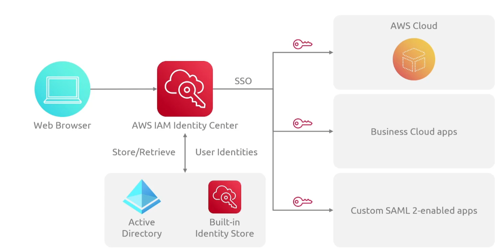
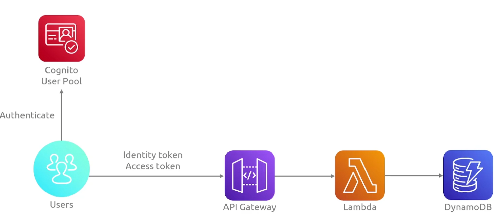
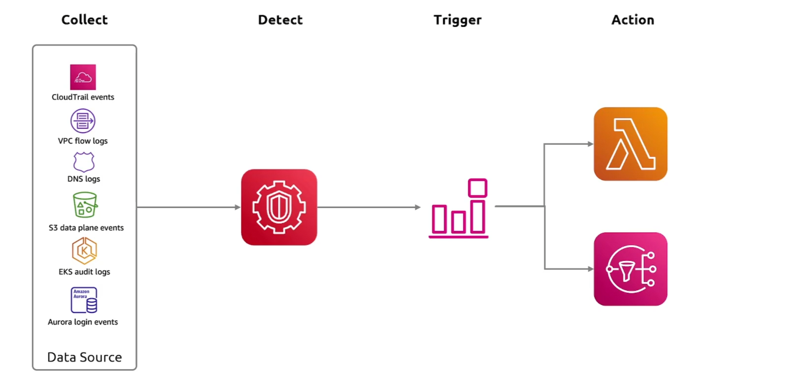

### IAM

身份管理，管理用户的认证和授权

### IAM Identity Center(sso)

想象一下，我们的组织有多个 AWS 账户。所以我们有第一个账户，在这个账户里，我们会有一些需要访问这个账户的用户，然后是我们在这个账户中创建的所有资源。如果我们创建另外一个账户，我们就像做完全相同的事情。我们需要在那个账户中创建用户，然后是该账户内的资源。

### Cognito

管理用户身份和应用认证

### CloudTrail

记录API操作活动

### AWS Config

跟踪AWS资源变动的配置

### GuardDuty

检测未经授权的访问、被攻陷的实例，以及潜在有害的网络流量

### Inspector

AWS Inspector 是一个安全功能，它会自动扫描在 AWS 上运行的工作负载中的软件漏洞和不希望的网络暴露。因此 Inspector 实际上会发现并扫描 EC2 实例、Elastic Container Registry 中的容器镜像，以及 AWS Lambda 函数。现在，很棒的一点是，它持续评估你的环境，贯穿于资源的生命周期。