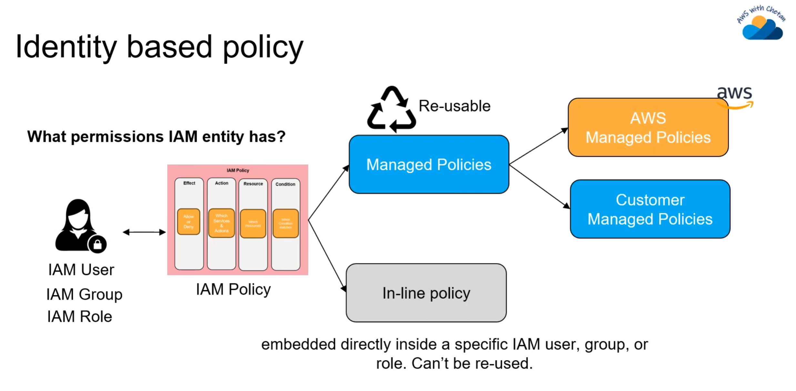
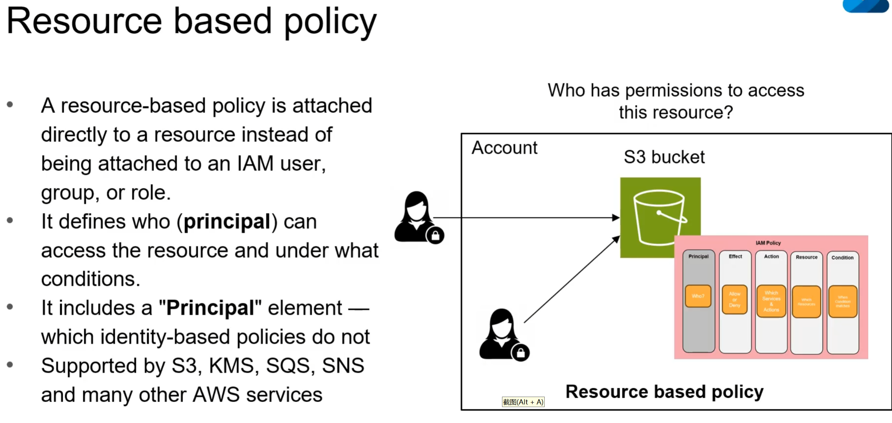
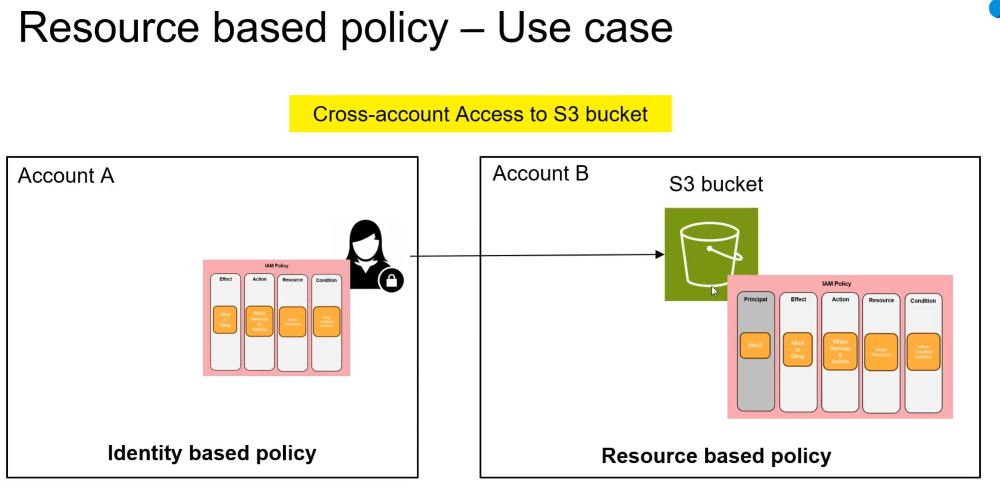
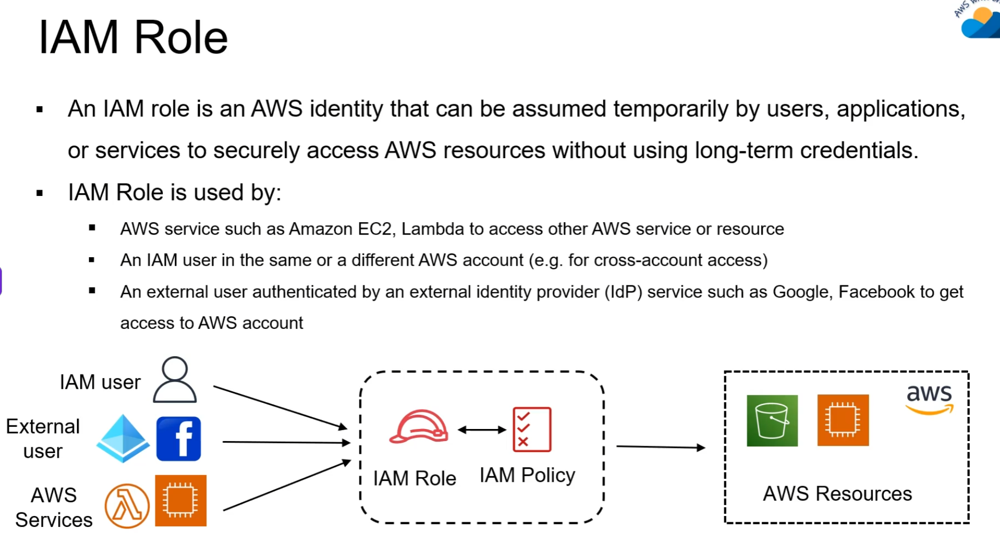
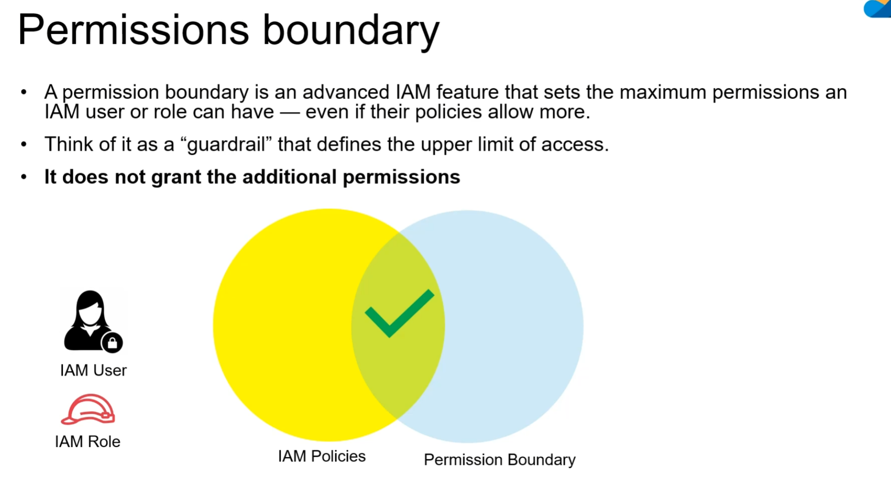
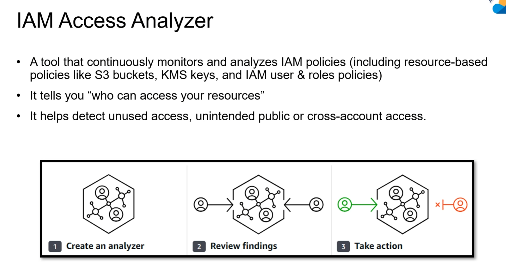
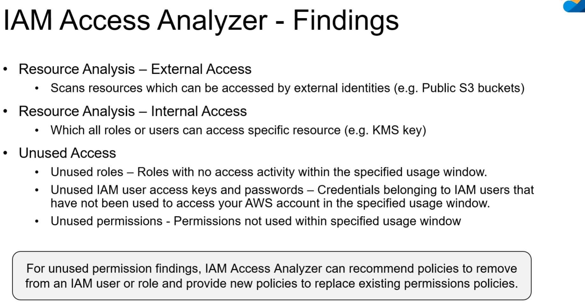

## 基于身份的访问策略

内联策略是附加到某个用户上的，用户删除，策略也就消失了

## 基于资源的访问策略

## 示例

需要在两端分别配置策略

## IAM ROLE 

## Permissions boundary

## IAM Access Analyzer

这个工具可以帮你找出账户中哪些资源被无意中公开到了互联网，或者被授权给了其他外部 AWS 账户。

确保你编写的策略既安全又能正常工作，避免语法错误或安全漏洞。

它可以分析 CloudTrail 中记录的历史访问活动，智能地帮你生成符合“最小权限原则”的 IAM 策略模板。

## IAM Policy Simulator 

## 模拟器的工作流程

使用模拟器通常分为以下四个步骤：

1. **选择主体 (Select Entities)**：选择你要测试的用户、组或角色。
2. **选择策略 (Select Policies)**：你可以测试已经附加在身上的策略，也可以**直接粘贴一段还没发布的 JSON 代码**进行测试（这在开发阶段非常有用）。
3. **选择操作与资源 (Select Actions & Resources)**：
   - **Actions**：比如 `ec2:RunInstances`。
   - **Resources**：输入具体的 ARN（例如特定的 S3 Bucket ARN）。
4. **指定上下文 (Context Inputs)**：这是最强大的部分。你可以模拟特定的环境条件，例如：
   - 源 IP 地址是多少？
   - 是否开启了 MFA（多因素认证）？
   - 请求的时间是什么时候？

## IAM Policy Generator 

