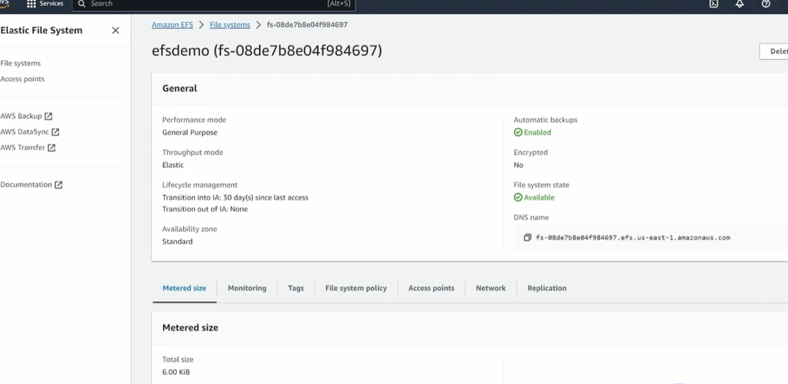

## EBS

块存储的工作方式是将数据分成块，然后将这些块作为独立的部分存储，每个块都有一个唯一的标识符。这些块可以存储在多个物理设备上。现在，一组块可以作为一个卷呈现给操作系统，并在其上创建文件系统。块存储的好处是不仅将这些存储块作为卷呈现给操作系统,还可以将其作为硬盘呈现。所以我们可以在其上安装操作系统.所以**块存储既可以挂载文件系统，也可以启动。**

Elastic Block Store 的好处是它们是独立于 EC2 实例的。所以我们可以将块存储从一个 EC2 实例，再移到另一个 EC2 实例。所以你可以有数据信息从一个 EC2 实例移动到另一个，只要数据存储在 Elastic Block Store 里，就不会有任何问题。

通常，EBS 卷只能附加到一个 EC2 实例。然而，某些类型允许多重附加，多个实例可以附加同一个卷。但是，如果你这样做，你的应用程序必須谨慎，以确保不会有多个 EC2 实例同时写入同一数据，因为这最容易会导致数据损坏。常见的例子是，如果你有一个数据库集群。通常，当你配置一个数据库集群，它们都是跨节点的，并有一个主节点负责读写数据。然后它们会通过选举，确保只有一个数据库实例会去写入存储。

现在，一个 Elastic Block Store volume 被配在一个 availability zone 中。同时EBS volumes 在一个 availability zone 内具有弹性。这样它可以应对物理设备的故障。但是如果整个 availability zone 失机，数据就是会丢失。
EC2 instance 和 EBS volume 必须在同一个 availability zone 内，不能将一个在一个 availability zone 内的 EC2 instance 连接到另一个 availability zone 内的 EBS volume。

我们可以通过创建快照，将数据存储在s3中。将这个快照卷连接到ec2实例


### Volume Type

+ General purpose SSD gp2/gp3

  也就是基于固态硬盘的卷。因此，它们在价格和性能之间取得了平衡，并且非常适合各种工作负载。这包括虚拟桌面等。中型实例数据库，对迟延敏感的交互式应用程序，以及开发和测试环境

+ Provisioned IOPS SSD volumes

  最高性能的EBS

  + Provisioned IOPS SSD (io2) volumes
  + Provisioned IOPS SSD (io2) Block Express volumes
  + Provisioned IOPS SSD (io1) volumes

+ Throughput Optimized HDD volumes

  机械硬盘构成的

+ Cold HDD volumes

+ Magnetic

### Demo

#### 卷挂载

1. 假设我们有四台EC2

   + us-east-1a 两台
   + us-east-1b 一台
   + us-east-2a 一台

   我们接下来模拟数据的复制和迁移（不同zone和region）

2. 在us-east-1a中创建volumes

   选择Actions-->Attach volume-->选择同一可用区的是某个实例

3. 登录到这ec2上。

   + 运行lsblk

   + file -s  /dev/xxxx

     看到data，说明目前还没有任何的文件系统

   + 创建文件系统 mkfs  -t  xfs  /dev/xxxx
   + 查看文件系统类型 blkid  /dev/xxx
   + 挂载到某个目录 mount /dev/xxxx   /tmp/ebsdemo
   + 获取设备的uuid blkid /dev/xxxx
   + 永久挂载  UUID=XXXX   /tmp/ebsdemo   xfs   defaults,nofail

#### 附加到相同可用区另一个实例

1. umount  /tmp/xxxx
2. 找到卷--Action--Detach Volume 
3. 附加到us-east-1a中的另一台
4. 现在已经有了文件系统了，直接挂载到一个目录下就可以了

#### 附加到另一个可用区实例

1. umount  /tmp/xxxx
2. 找到卷--Action--Detach Volume 

3. 创建快照--Action--Create Snapshot.等待快照处于可用状态
4. 在us-east-1b中创建新的volume--crerate  volume freom snapshot
5. 已经有了文件系统，直接挂载即可

#### 复制到另一个region

1. Snapshots-->Copy snapshot 
2. 到另一个us-east-2a中等待快照可用

## Instance Storage

现在有一个问题，当你的EC2实例宕机的时候。它可能在另一个主机上Host上拉起来，此时之前的数据是找到不到了（公网IP 会发生变化）

### Demo

1. 选择支持实例存储的EC2类型

2. 登录

   ```
   [e2-user@ip-172-31-43-128 ~]$ lsblk  
   NAME        MAJ:MIN RM   SIZE RO TYPE MOUNTPOINTS  
   nvme1n1    259:0    0  69.8G  0 disk  
   nvme0n1    259:1    0     8G  0 disk  
   ├─nvme0n1p1 259:2    0     8G  0 part /  
   ├─nvme0n1p127 259:3  0     1M  0 part  
   └─nvme0n1p128 259:4  0    10M  0 part  
   [e2-user@ip-172-31-43-128 ~]$ sudo file -s /dev/nvme1n1  
   /dev/nvme1n1: data
   ```

   目前是没有文件系统的

3. 执行Stop instance ---> start instance 可能移动到不同的Hots,数据会丢失

## EFS

EFS 支持 NFSv4（网络文件系统第4版）协议。这意味着，任何使用 NFSv4 协议的应用程序都可以与 EFS 无缝对接。


可以在多个EC2实例上同时挂载一个EFS文件系统，数据可以在多个EC2实例之前共享

EFS有不同的类型，请参考官方说明

在使用EFS的时候，可以安装dnf -y install  amazon-efs-utils,然后我们可以在特定的目录下中挂载一个EFS文件系统

```
mount.efs efs:id  /directory
```

### Demo

1. 在两台EC2(us-east-1a, us-east-1b)
2. 同一个efs挂载到两台机器上，并且可以同时进行读写操作
3. 在控制台根据提示进行操作，需要注意的是**设置安全组**
   + 放行为EC2实例设置的安全组，就是放行了EC2本身

4. 准备号创建的EFS后，登录EC2实例

   

5. 两台服务器执行相同的操作

   ```
   sudo mkdir /efsdemo  
   sudo dnf -y install amazon-efs-utils
   sudo mount.efs fs-08de7b8e04f984697 /efsdemo 
   ```

## FSx


| 特性                 | FSx for NetApp OnTap  | FSx for Windows       | FSx for Lustre  | FSx for OpenZFS       |
| -------------------- | --------------------- | --------------------- | --------------- | --------------------- |
| Client compatibility | Windows, Linux, macOS | Windows, Linux, macOS | Linux           | Windows, Linux, macOS |
| Protocol support     | SMB, NFS, iSCSI       | SMB                   | Custom protocol | NFS                   |
| latency              | <1ms                  | <1ms                  | <1ms            | <0.5s                 |
| Max throughput       | 4-6 GB/s              | 12-20 GB/s            | 1000 GB/s       | 10-21 GB/s            |
| Max file system size | Virtually unlimited   | 64 TiB                | Multiple PBs    | 512 TiB               |

## AWS Buckup

**Disaster Recovery**

+ S3
+ EBS Snapshots
+ AWS Buckup

1. 管理 AWS 服务的单一、统一控制台
2. 自动执行备份调度和保留策略
3. 不同地区和不同账户

### 组成部分

+ Buckup Vault

  里边保存着所有的备份，可以在不同的区域或账户中拥有多个vault

+ Buckup Plan

+ Recovery Point


## Elastic Disaster Recovery(DRS)


1. A fully managed disaster recovery service for physical, virtual, and cloud-based servers.
2. Customers can use AWS as a recovery site instead of investing in on-premises disaster recovery infrastructure.
3. Source servers represent the servers/data that we want to replicate.
4. The staging area is the location where AWS will receive the replicated data.
5. A launch template is used to configure the specifications of the recovery servers (size, region/subnet, security group).

## Storage Gateway

这是一种混合云存储服务。它充当你本地存储环境和云存储之间的桥梁，让你能够将本地应用程序与云存储资源集成。因此 AWS Storage Gateway 可以用于以下目的。

+ 作为本都存储需求的扩展
+ 将所有的本地数据复制到云端
+ 同时也是disaster恢复的工具，可以辅助本地数据到云端


### Volume

#### Volume Stored


假设你有一个本地数据中心，我们有一个堆服务器，这些服务器连接到网络附加存储，使用像ISCSI协议向服务器提供原始块存储，并在这个网络附加存储上创建一个文件系统。在上图中服务器并不知道他们连接是storage gateway,看起来像使用的普通的网络附加存储，此时数据是存储在本地的。然后通过**存储网关端点数据作为EBS快照复制到S3中**

1. Data is stored locally on-prem
2. Data is replicated asynchronously to AWS S3
3. Provides convenient backup of data
4. Assists with disaster recovery  Create EBS volumes from snapshots
5. Doesn't increase datacenter storage capacity

#### Volume Cached

所有数据是存储在S3中的，在本地环境中存储的就是经常访问的文件


### File


本地不存储任何文件。是存储在S3中

### Tape

