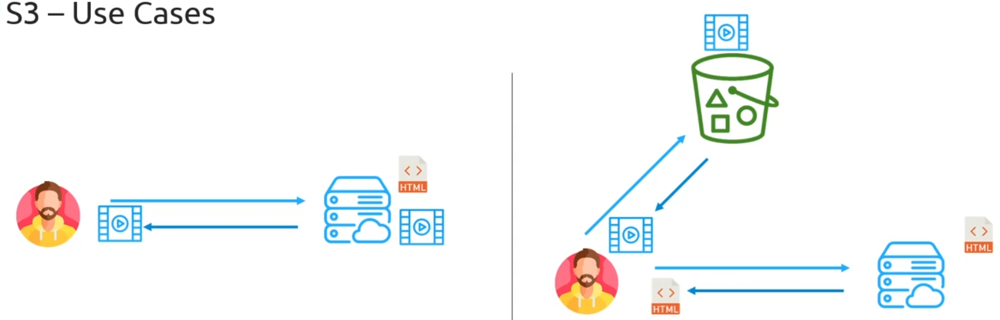
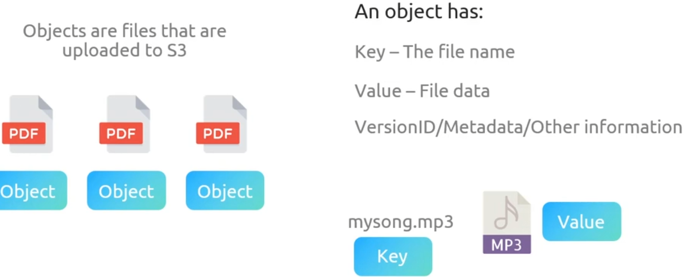

## Simple Storage Service (S3)

可以与IAM策略和角色很好的集成在一起

S3 也可以通过控制台、CLI、SDK 以及 REST API 进行访问

### 使用案例

首先，你会有一个网络服务器坐落在某个数据中心。你的网页所有相关文件都会在那个 web 服务器上。有几种不同的文件，但主要会有一个 HTML 文件，对吧？所以当你在网络浏览器中请求一个网站时，它实际上是是在访问一个 web 服务器并请求一个 HTML 文件，然后将其渲染到你的屏幕上。你还会有几个其他文件，比如 CSS 和 JavaScript 文件。但除此之外，你还需要存储与该网站相关的所有媒体。这些包括网站上的图片、任何音乐或视频，以及你的站点可能需要使用的视频。

现在，当你向网站发送请求时，发生的事件是那个 web server 会把网站的 HTML 发回来，对吧？那将包含这个网站的所有结构。这个 HTML文件将会包含一个链接，，指向它需要的所有图片和视频以方便渲染。这些链接将会指向在网络服务器上存储的资源。所以接下来你作为用户会向网络服务器发送请求，获取这些图片和视频。这个就是传统网站的工作方式。

这个设定的问题是，想象一下如果这是一个像 YouTube 或 Netflix 这样的站点，他们的服务器上存储着越来越大的视频对吧？在你的网络服务器上存储视频是非常昂贵的。而且要记住，你可能有一台网络服务器，而你实际上可以扩展到全球分布的数十个网络服务器。如果你有数个服务器，每一个服务器都需要存储 Netflix 或 YouTube 这样的视观。而这个只是一个非常高昂的扩展方案。这就是传统设置的问题

### 名词解释

### Demo

1. bucket name
2. 选择region
3. 复制已经存在的bucket（可选）
4. 默认情况下是私有的，只有创建者的账号才可以访问