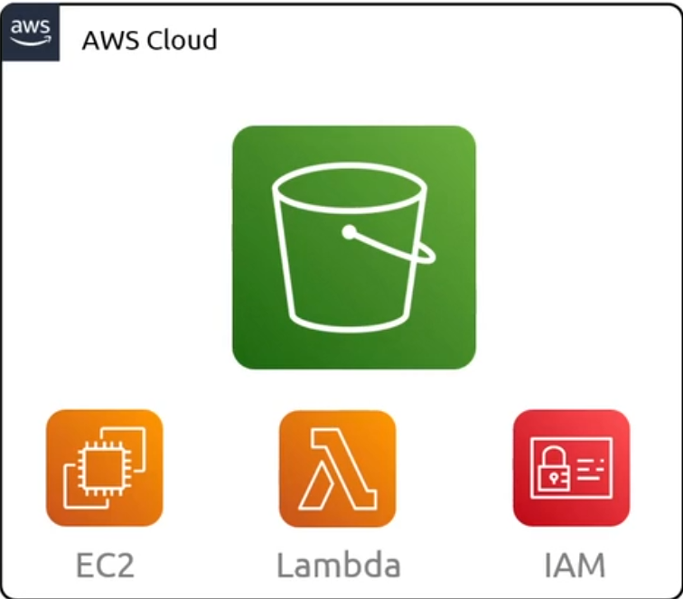
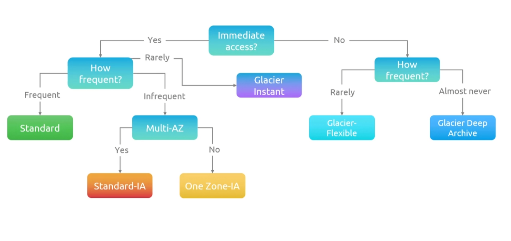
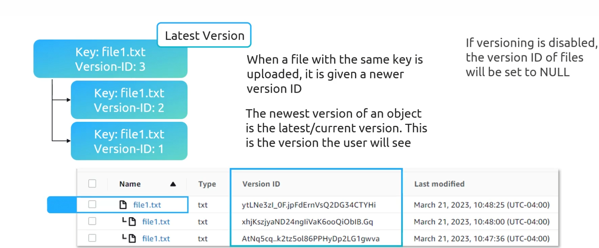
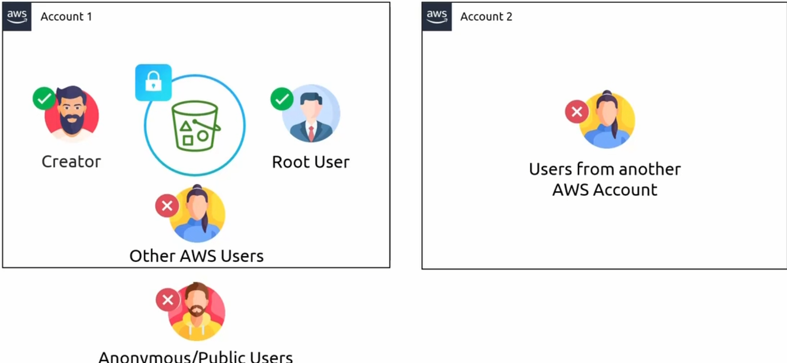
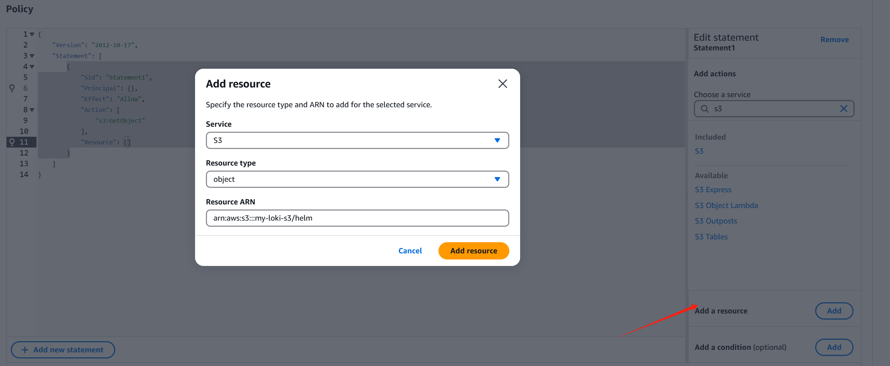
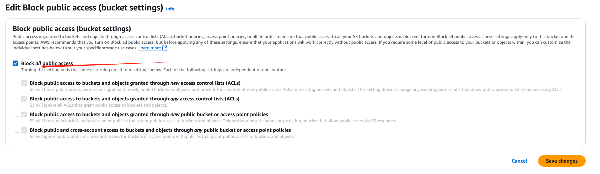
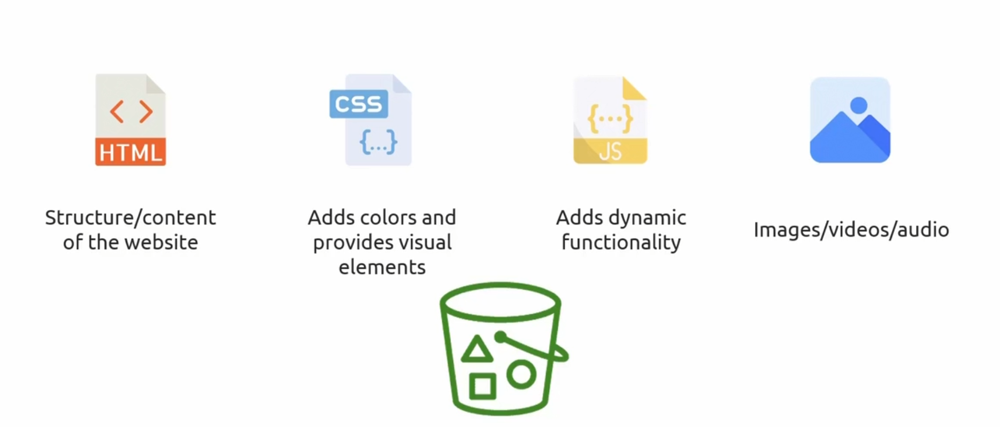
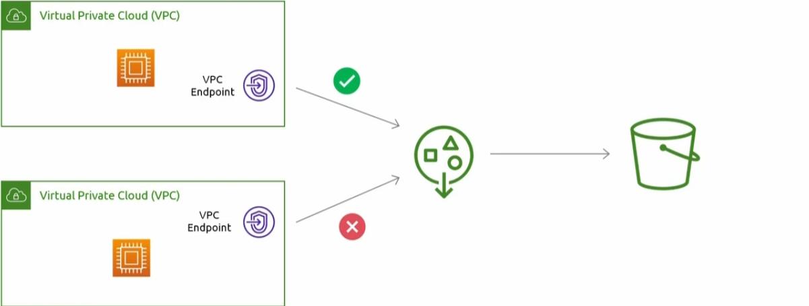

## Simple Storage Service (S3)



可以与IAM策略和角色很好的集成在一起

S3 也可以通过控制台、CLI、SDK 以及 REST API 进行访问

### 使用案例


首先，你会有一个网络服务器坐落在某个数据中心。你的网页所有相关文件都会在那个 web 服务器上。有几种不同的文件，但主要会有一个 HTML 文件，对吧？所以当你在网络浏览器中请求一个网站时，它实际上是是在访问一个 web 服务器并请求一个 HTML 文件，然后将其渲染到你的屏幕上。你还会有几个其他文件，比如 CSS 和 JavaScript 文件。但除此之外，你还需要存储与该网站相关的所有媒体。这些包括网站上的图片、任何音乐或视频，以及你的站点可能需要使用的视频。

现在，当你向网站发送请求时，发生的事件是那个 web server 会把网站的 HTML 发回来，对吧？那将包含这个网站的所有结构。这个 HTML文件将会包含一个链接，，指向它需要的所有图片和视频以方便渲染。这些链接将会指向在网络服务器上存储的资源。所以接下来你作为用户会向网络服务器发送请求，获取这些图片和视频。这个就是传统网站的工作方式。

这个设定的问题是，想象一下如果这是一个像 YouTube 或 Netflix 这样的站点，他们的服务器上存储着越来越大的视频对吧？在你的网络服务器上存储视频是非常昂贵的。而且要记住，你可能有一台网络服务器，而你实际上可以扩展到全球分布的数十个网络服务器。如果你有数个服务器，每一个服务器都需要存储 Netflix 或 YouTube 这样的视观。而这个只是一个非常高昂的扩展方案。这就是传统设置的问题

### 名词解释


### Demo

1. bucket name
2. 选择region
3. 复制已经存在的bucket（可选）
4. 默认情况下是私有的，只有创建者的账号才可以访问

### Storage Classes



+ standard(default)

  频繁访问的数据，出站流量收费

+ standard-IA

  不需要频繁访问的数据，除了出站费用，会有一个检索费用，而且不是一堆小文件，比默认的存储类别更好

+ One-Zone-IA

  几乎与standard-IA相同，就是单可用区的

+ Glacier-Instant

  很少访问的归档数据，检索数在毫秒内完成，检索费用高，90天的数据

+ Glacier-flexible

  当我们请求一个数据时，不能立即在毫秒内响应，

+ Glacier Deep Archive

  不能被公开访问，最便宜的存储类

+ Intelligent-Tiering

  如果你不知道使用哪种存储类别，可以选择

  但是需要支付监控自动化费用

存储类别在上传时通过设置 x-amz-storage-class 请求头进行设置，但也可在上传后更改。

### Versioning



一旦启用了版本控制，你永远不能禁用它，只能暂停它

上边的三个版本都需要你为其付费

#### Multi-Factor Authentication (MFA) Delete

+ When the feature is enabled, MFA is required to change the versioning state of the bucket.
+ MFA is required to delete versions and can only be enabled using CLI.

### ACL and Resource Policies



我们接下来将讨论桶策略（谁可以访问这个bucket，以及可以做哪些操作）

```json
{  
  "Version": "2012-10-17",  
  "Statement": [  
    {  
      "Sid": "AllowRule",  
      "Principal": {  
        "AWS": [  
          "arn:aws:iam::111122223333:user/JohnDoe"  
        ]  
      },  
      "Effect": "Allow",  
      "Action": ["s3:GetObject"],  
      "Resource": ["arn:aws:s3:::DOC-EXAMPLE-BUCKET/*"]  
    }  
  ]  
}
```

+ Sid为规则起一个名字
+ Principal策略适用于谁
+ Effect是允许还是拒绝

```json
{  
  "Id": "PolicyId2",  
  "Version": "2012-10-17",  
  "Statement": [  
    {  
      "Sid": "AllowIP",  
      "Effect": "Allow",  
      "Principal": "*",  
      "Action": "s3:*",  
      "Resource": [  
        "arn:aws:s3:::DOC-EXAMPLE-BUCKET",  
        "arn:aws:s3:::DOC-EXAMPLE-BUCKET1/*"  
      ],  
      "Condition": {  
        "IpAddress": {  
          "aws:SourceIp": [  
            "192.0.2.0/24"  
          ]  
        }  
      }  
    }  
  ]  
}
```

#### Demo1

+ 账号1 用户1执行操作

  1. 按照默认的方式创建一个bucket

  2. 上传文件（验证open选项）

     1. 现在切换到同一个账号1的另一个用户2(IAM如下)

     ```json
     {  
       "Version": "2012-10-17",  
       "Statement": [  
         {  
           "Sid": "VisualEditor0",  
           "Effect": "Allow",  
           "Action": [  
             "s3:ListAllMyBuckets",  
             "s3:ListBucket"  
           ],  
           "Resource": "*"  
         }  
       ]  
     }
     ```

     2. open选项内容是无法查看的

+ 回到用户1，创建存储桶策略

  用户1和用户2的账号ID是相同的841806927337

  

  ```json
  {  
    "Version": "2012-10-17",  
    "Statement": [  
      {  
        "Sid": "user2AllowLogs",  
        "Principal": {  
          "AWS": "arn:aws:iam::841806927337:user/user2"  
        },  
        "Effect": "Allow",
        ## 可以搜索 AWS  S3 API Reference
        "Action": ["s3:GetObject"],  
        "Resource": [
            "arn:aws:s3:::my-loki-s3/helm/*"
        ]  
      }  
    ]  
  }
  ```

+ 切回到用户2 ，可以执行open

+ **需要注意的是，如果允许匿名用户访问，需要关闭默认选项**

  

#### Demo2

+ 现在到另一个账号下，执行aws s3 ls s3:// <example bucket>

+ 切换回存储桶的创建用户（账号1用户1）

+ 创建策略

  aws s3 rm s3:// <example bucket>/media/xx.txt

  ```json
  {  
    "Sid": "AllowAccount2UserAdmin",  
    "Principal": {  
      "AWS": "arn:aws:iam::840497317401:user/admin"  
    },  
    "Effect": "Allow",  
    "Action": [  
      "s3:ListBucket",  
      "s3:DeleteObject"  
    ],  
    "Resource": [  
      "arn:aws:s3:::kk-resource-policies",  
      "arn:aws:s3:::kk-resource-policies/media"  
    ]  
  }
  
  ```

### Static Website Hosting(静态站点托管)

这个 HTML 文件代表了网站。一个网站不过只是一个 HTML 文件，由你的网页浏览器渲染组成的屏幕上。现在，还有几个文件是让你的网站看起来像一个真正的网站所必须的。我们有一个 HTML 文件，它是网站的结构和内容。你有了CSS，这让你的网站看起来很漂亮，你添加了所有的颜色和这些东西。你有 JavaScript，它为网站添加了动态的功能。



上边都是你可能涉及到的内容，我们可以把他们放在s3 bucket中，所以 S3 有一个功能，可以让你通过 URL 访问你所有的 HTML、CSS 和 JavaScript 文件在一个 S3 bucket 上来提供静态网站。所以你可以优先通过 HTTP 访问网站。一旦你使用它，S3 会给你一个 URL。
现在，请记住，这仅适用于静态网页。如果您的网站需要任何类型的服务器端支持，那么 S3 是无法满足它的，它需要它可能是 EC2 实现，或者可能是 ECS，或者 Lambda 上。其实没有关系，但你能使用 S3。记住，如果想要一个自定义域名用于你的网页，S3 会给你一个 URL。

在定价方面，当你启用静态网站功能的时候，你需要支付额外的费用，每次请求网站的时候都会被收费

#### Custom Domain Name

你Route53的域名是example.com，那么你的存储桶必须是相同的名字

#### Demo

1. 按照默认的选项创建存储桶

2. 上传静态网站资源

3. 启用静态网站功能

   + 提供索引文档和错误文档（404页面）
   + 

4. 取消锁定public access

5. 设置资源访问策略

   ```json
   {  
       "Version": "2012-10-17",  
       "Statement": [  
           {  
               "Sid": "AllowPublic",  
               "Principal": "*",  
               "Effect": "Allow",  
               "Action": [  
                   "s3:GetObject"  
               ],  
               "Resource": [  
                   "arn:aws:s3:::kk-static-demo/*"  
               ]  
           }  
       ]  
   }
   ```

### Pre-Signed URLs

假设我们有我们的 AWS 账户，并且我们有一个 S3 bucket，目前设置为私有的 bucket，现在作为一个 IAM 认证用户，有权限和必须的权限来访问这个 bucket 中的对象，还可以上传对象等，因为它是确实保密的。

每当你需要给某个公共的用户访问对象时的权限限制，签名 URL 就非常有用。所以，再一次，我们的存储桶设置为私有的。作为认证的 IAM 用户，你可以做的是你可以发出一个请求来创建 S3 的 presign URL，它包含了我的所有认证信息内嵌在URL中，
然后它会将URL返回

#### 用例

假设你正在运行某种视频托管网站，作为付费用户，你可以向web服务器发送请求，然后网络服务器可以生成一个**预签名的URL**作为一个特定的用户

**Note:**

- When creating pre-signed URLs, an expiration date must be provided.
- Expiration duration of a maximum of 7 days using an IAM user is provided.
- If an IAM user does not have access to an S3 bucket, a pre-signed URL can still be generated using that account.
- The pre-signed URL does not give you access to a bucket; however, it allows you to send a request to S3 as the user that generated the URL.

### Access Points

当有大量的对象被多个组，用户，角色，访问的时候，创建策略是繁琐的

当访问者访问存储桶的对象的时候，不会直接指向s3存储桶本身，或者S3的ARN,他们回指向访问点的ARN



只有vpc中的一个EC2实例才能与我们存储桶中的一个对象进行交互

#### Demo

1. 创建存储桶

2. 创建两个access point

3. 创建bucket policy（桶的创建用户执行）

   ```json
   {  
     "Version": "2012-10-17",  
     "Statement": [  
       {  
         "Effect": "Allow",  
         "Principal": {  
           "AWS": "*"  
         },  
         "Action": "*",  
         "Resource": [  
           "arn:aws:s3:::kk-access-point",  
           "arn:aws:s3:::kk-access-point/*"  
         ],  
         "Condition": {  
           "StringEquals": {  
             "s3:DataAccessPointAccount": "841860927337"  
           }  
         }  
       }  
     ]  
   }
   ```

4. 回到访问点，创建策略

   ```json
   {
     "Version": "2012-10-17",
     "Statement": [
       {
         "Effect": "Allow",
         "Principal": {
           "AWS": "arn:aws:iam::841860092733:user/user2"
         },
         "Action": [
           "s3:GetObject",
           "s3:PutObject",
           "s3:ListBucket"
         ],
         "Resource": [
           "arn:aws:s3:us-east-1:841860092733:accesspoint/developers/object/*",
           "arn:aws:s3:us-east-1:841860092733:accesspoint/developers"
         ]
       }
     ]
   }
   ```
